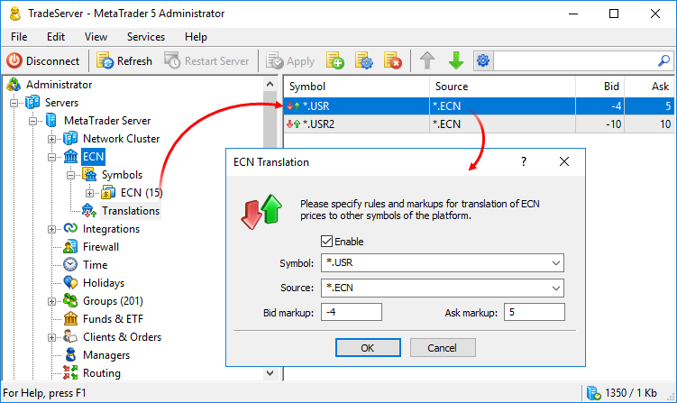
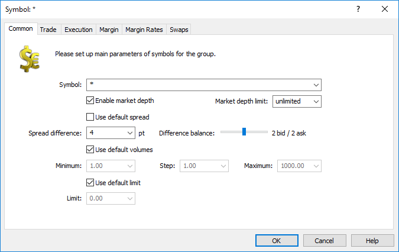
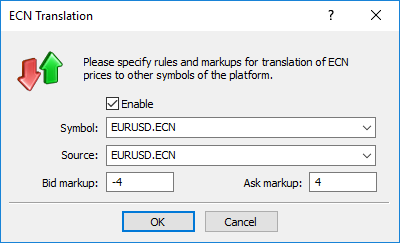
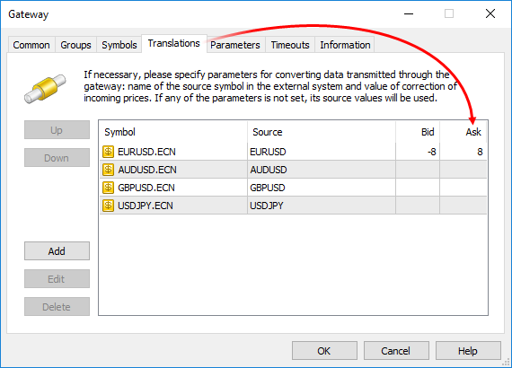
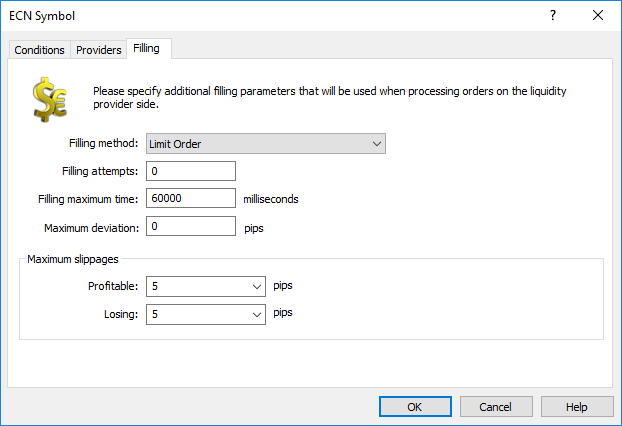

[🏠 Document Start](../../../README.md) / [MetaTrader 5 Trading Platform](../../../MetaTrader-5-Trading-Platform.md) / [Platform Setup](../../Platform-Setup.md) / [ECN](../ECN.md) / Price Translations

[Previous](Order-Execution.md) | [Next](Matching-History.md)

# Price Translations (#price-translations)

In the "Translations" section, you can configure translation of ECN symbol prices to other symbols. Markup settings can be automatically applied to such prices. This enables liquidity providing brokers to implement different ECN trading conditions for different client groups.

[Similar to gateways](../Gateways/Symbol-and-Price-Translation.md), the ECN converts prices and trading requests.

For example, EURUSD.ECN data are forwarded to EURUSD.USR with the markups of -2/+2. Clients trade EURUSD.USR at converted prices. When forwarding orders from these clients back to external systems, the ECN will use original unchanged prices.

  * The gateway passes original prices from the external system to the ECN symbol EURUSD.ECN: 1.15651 / 1.15659
  * Translation of prices from EURUSD.ECN into EURUSD.USR with the conversion of -2/+2 is set up in ECN. Prices are converted to 1.15649 / 1.15661
  * The client places the EURUSD.USR Buy order at a price of 1.15661
  * The order is passed to the ECN for processing
  * The ECN converts the price to the original one 1.15659 and passes it to the external system
  * If the order is successfully executed in the external system, the ECN sends a response to the client, informing that the order was executed at the requested (converted) price of 1.15661

The broker earns the profit of 2 pips in this case.

The following settings are available:

  * Symbol — the symbols, to which data from the ECN symbol will be passed. Any non-ECN symbol or the source symbol can be specified here. If an ECN symbol has a translation setting, in which this symbol is specified as a target, a marked up price stream will be provided for such a symbol. If there are no such settings, the source price stream will be provided for the ECN symbol.
  * Source — the ECN symbol, which data will be passed.
  * Bid, Ask — the number of markup points to convert appropriate prices. A positive value increases the price, a negative one decrease it. The values ​​are specified in the source symbol price points. 

You may use the mask "*" in the source symbol names for mass translations and conversions. In this case, the translation affects all source-target pairs, in which the asterisk replaces the same set of characters. For example:

  * If symbols EURUSD.ECN, EURJPY.ECN, EURJPY.USR and EURGBP.USR exist in the platform, the rule EUR*.ECN -> EUR*.USR will create the translation EURJPY.ECN -> EURJPY.USR.
  * If symbols EURUSD.ECN, EURJPY.ECN, EURUSD.USR and EURJPY.USR exist in the platform, the rule *.ECN -> *.USR will create translations EURUSD.ECN -> EURUSD.USR and EURJPY.ECN -> EURJPY.USR.

If several symbols meeting one group rule have different number of decimal places in prices, different price markups will be applied to them in accordance with their specific accuracy. For example, if a symbol has 4 decimal places, the markup of "1" will change prices by 0.0001; for symbols with 5 decimal places the markup will be equal to 0.00001.

  * If several rules are configured for one target symbol, only the first rule in the list will be applied to it.
  * Price markup settings are not applied for the ECN symbol, when translated to other symbols. For example, the rule is EURUSD.ECN -> EURUSD.ECN, Bid -1, Ask +1. If EURUSD.ECN is used as a source in other translation rules, original prices without the markup will be translated from it.
  * Translation rules can be changed without server restart. Changes take effect immediately after saving. If the rules for a specific symbol have changed, the Market Depth of such a symbol will be reset in accordance with the new settings.
  * Translation rules only apply to data from gateways and datafeeds. Trade orders for source symbols placed by clients within the cluster are not passed to target symbols. In order to show cluster orders in the target symbol, set it as an ECN symbol and configure [aggregation rules (#aggregation-rules)](Forming-Market-Depth.md#aggregation-rules) for it.

  
---  
  

## Features of trading operations (#features)

If only one translation parameter or no parameters at all are set for the ECN, trades are conducted without any peculiarities since the ECN is able to match symbols on its side with the ones in the external trading system.

If more than one translation parameter is set for the ECN, the platform attempts to match the symbols correctly. For example, the two translation parameters are set for the ECN:

  * EURUSD.ECN -> EURUSD.USR1
  * EURUSD.ECN -> EURUSD.USR2

If an order is placed on the platform side, a symbol in the external system response is defined by the original order ticket. For example, a trader places an order #145269 Buy 1.00 EURUSD.USR.2. It is sent to the external system as #145269 Buy 1.00 EURUSD. When receiving a response, the ECN converts the symbol back to EURUSD.USR2 by the original order ticket.

However, there are some trading operations/events that are not preceded by placing an order on the trading platform side. For example, charging a variation margin in an external system. In that case, the ECN cannot clearly define which of the two symbols the event is related to: EURUSD.USR1 or EURUSD.USR2.

In this situation, the ECN attempts to select the correct symbol by its availability to certain accounts the event is related to. For example, if only EURUSD.USR2 is available for an account, the ECN performs an operation for it. Availability of symbols for clients is defined on the ["Symbols" tab of the group settings (#symbols)](../Groups/Group-Settings.md#symbols).

If both symbols are available for the account, the operation is performed for the first one in the translation list. It is EURUSD.USR1 in our example.

Thus, if there are multiple translation settings, the following rule is used: trading operations are performed for the first symbol available for a client group. All subsequent translation settings are used only to pass price data.

## The general price translation scheme for ECN trading (#general)

The placing and execution price of the orders sent to the ECN is affected not only by the above translation settings. The following platform settings also affect the prices:

  * [Symbol spread settings (#spread)](../Symbols/Symbol-Settings/Common.md#spread): both general settings and those specific of separate [client groups](../Groups/Group-Symbol-Settings.md).
  * [Translation settings (#translation)](../Gateways/Configuration-of.md#translation) specified in the gateways.
  * [Slippage settings (#filling)](Order-Matching.md#filling) specified in the matching rules.

Consider an example of all price translations:

### 1\. The Client (#1-the-client)

The user creates a request based on the prices displayed in the terminal. For example, Buy Limit at 1.14059:

2019.01.04 11:26:57.369 Trades '2002': buy limit 1.00 EURUSD.ECN at 1.14059  
2019.01.04 11:26:57.370 Trades '2002': accepted buy limit 1.00 EURUSD.ECN at 1.14059  
---  
  

### 2\. The Trade server (#2-the-trade-server)

The Trade Server receives the request and forwards it to the ECN, in accordance with the [routing rule (#routing)](Order-Matching.md#routing):

2019.01.04 12:15:40.530 192.168.0.1 '2002': buy limit 1.00 EURUSD.ECN at 1.14059 (1.14028 / 1.14050)   
2019.01.04 12:15:40.530 192.168.0.1 '2002': request transferred to dealers, rule 'ECN' (buy limit 1.00 EURUSD.ECN at 1.14059)  
---  
  

### 3\. The Trade server (#3-the-trade-server)

[Spread balance](../Groups/Group-Symbol-Settings/Common.md) settings specified for the client group are applied to the request price. For example, the value of 2 bid / 2 ask is specified:

The price of 1.14059 is reduced by 2 points, to 1.14057.

### 4\. The Trade server (#4-the-trade-server)

Also, [ECN price markup settings](Price-Translations.md) are applied to the request price. For example, Bid Markup = -4, Ask Markup = 4.

The price of 1.14057 is reduced by two more points, to 1.14053. A request with this price is sent to the ECN.

2019.01.04 12:15:40.531 ECN '2002': request received (#417761 buy limit 1.00 EURUSD.ECN at 1.14053)  
---  
  
> In this case, the Trade server performs the back translation — it reduces the Ask price instead of increasing it, because the client is already using the adjusted prices. 1.14053 is the initial price for the ECN.

### 5\. The ECN (#5-the-ecn)

The ECN places and order to be matched, at the price of 1.14053, confirms it and sends trade executions to the server, for creating the order in the database (similar to gateways):

2019.01.04 12:15:40.532 ECN '2002': order #417761 buy limit 1.00 EURUSD.ECN at 1.14053 added   
2019.01.04 12:15:40.534 ECN '2002': request answered - Placed (#417761 buy limit 1.00 EURUSD.ECN at 1.14053)   
2019.01.04 12:15:40.536 ECN '2002': execution sent - request new order #417761   
2019.01.04 12:15:40.538 ECN '2002': execution sent - added order #417761, buy limit 1.00 at 1.14053 [based on order '']  
---  
  

### 6\. The Trade server (#6-the-trade-server)

After receiving a request from the ECN, the trade server increases its price back to the client price of 1.14059. To the price of 1.14053, the server ads 2 points of the "Spread balance" specified in symbol settings for the client group and 4 points from ECN markup settings.

Thus, in the trade database and on the client side the order has the price adjusted in accordance with the group and ECN settings (1.14059). It corresponds to the quotes delivered to the client. However, the ECN itself uses the translated price (1.14053). 

2019.01.04 12:15:40.535 192.168.0.1 '2002': order placed for execution [#417761 buy limit 1.00 EURUSD.ECN at 1.14059], time 4.22 ms   
2019.01.04 12:15:40.536 '2002': order #417761 buy limit 1.00 EURUSD.ECN at 1.14059 request new due execution [request new order #417761],  
total time: 5.84 ms [route: 0.26 ms, ecn: 5.26 ms, ecn place: 0.00 ms, ecn match: 0.00 ms, ecn fill: 0.00 ms, apply: 0.04 ms]   
2019.01.04 12:15:40.538 '2002': order #417761 buy limit 1.00 EURUSD.ECN at 1.14059 placed due execution [added order #417761, buy limit 1.00 EURUSD.ECN at 1.14059 [based on order '']],  
total time: 7.67 ms [route: 0.26 ms, ecn: 7.15 ms, ecn place: 0.00 ms, ecn match: 0.00 ms, ecn fill: 0.00 ms, apply: 0.04 ms]  
---  
  

### 7\. The ECN (#7-the-ecn)

Using the converted price of 1.14053, the ECN matches the client order with an opposite request received from the gateway.

2019.01.04 12:15:40.539 ECN '2002': matched 1.00 at 1.14044, #417761 buy limit 1.00 EURUSD.ECN at 1.14053 vs sell limit 10.00 at 1.14044 on 'MetaTrader 5 Gateway ECN', by rule 'MetaTrader 5 Gateway ECN'   
2019.01.04 12:15:40.541 ECN '2002': filling order #417761 on 'MetaTrader 5 Gateway ECN' - request added (buy limit 1.00 EURUSD.ECN at 1.14053)  
---  
  

### 8\. Gateway (#8-gateway)

The gateway receives the trade request from the ECN and adjusts it in accordance with the translation settings:

The order price 1.14053 is reduced by 8 points to 1.14045. A request at this price is sent to the external system.

2019.01.04 12:15:40.550 Gateway '141156': request #3090901 received (#18446744072000000129 buy limit 1.00 EURUSD at 1.14045)  
---  
  
> In this case, the gateway performs the back translation — it reduces the Ask price instead of increasing it, because the ECN is already using the adjusted prices. 1.14045 is the initial price for the external system.

### 9\. Gateway (#9-gateway)

After sending an order to the external system, the gateway generates an appropriate confirmation and a trade execution for the trading platform. The request price is again translated during this operation — it is increased by 8 points, to 1.140453 (the external system price is translated into MetaTrader 5 prices).

2019.01.04 12:15:40.552 Gateway '18446744073709551615': request #3090901 answered - Placed (#18446744072000000129 buy limit 1.00 EURUSD at 1.14045)   
2019.01.04 12:15:40.567 Gateway execution sending complete - request new order #18446744072000000129   
2019.01.04 12:15:40.567 Gateway execution sending complete - added order #18446744072000000129, buy limit 1.00 EURUSD at 1.14045 [based on order '417762']  
---  
  

### 10\. The ECN (#10-the-ecn)

The ECN receives from the gateway the confirmation and trade executions having the price of 1.14053:

2019.01.04 12:15:40.552 ECN '2002': filling order #417761 on 'MetaTrader 5 Gateway ECN' - request confirmed: Placed (buy limit 1.00 EURUSD.ECN at 1.14053)   
2019.01.04 12:15:40.553 ECN '2002': filling order #417761 on 'MetaTrader 5 Gateway ECN' - order #18446744072000000129 buy limit 1.00 EURUSD.ECN at 1.14053 placed for execution, time: 11.89 ms   
2019.01.04 12:15:40.567 ECN '2002': filling order #417761 on 'MetaTrader 5 Gateway ECN' - order #18446744072000000129 buy limit 1.00 EURUSD.ECN at 1.14053 request new due execution  
[request new order #18446744072000000129], time: 0.07 ms   
2019.01.04 12:15:40.568 ECN '2002': filling order #417761 on 'MetaTrader 5 Gateway ECN' - order #18446744072000000129 buy limit 1.00 EURUSD.ECN at 1.14053 placed due execution  
[added order #18446744072000000129, buy limit 1.00 EURUSD.ECN at 1.14053 [based on order '417762']], time: 0.46 ms  
---  
  

### 11\. Gateway (#11-gateway)

Suppose, the gateway received a notification from the external system that the order was actually executed at the price of 1.14043 (2 points lower than the initially requested price of 1.14045). The following execution is formed in this case:

2019.01.04 12:15:41.833 Gateway execution sending complete - filled order #18446744072000000129, buy 1.00 EURUSD at 1.14043 [based on deal '129506']  
---  
  

### 12\. The ECN (#12-the-ecn)

The ECN matches the order at the price of 1.14051: the actual deal execution price (1.14043) is widened by 8 points in accordance with the gateway settings.

2019.01.04 12:15:41.841 ECN '2002': filling order #417761 on 'MetaTrader 5 Gateway ECN' - order #18446744072000000129 buy limit 1.00 / 1.00 EURUSD.ECN at 1.14053 filled due execution  
[filled order #18446744072000000129, buy 1.00 EURUSD.ECN at 1.14051 [based on deal '129506']], time: 6.87 ms  
---  
  
  * If several translation settings are specified for the same symbol in the gateway configuration and the gateway cannot determine which one to use for a particular request, the platform will try to determine it itself. For more information, see the ["Price and symbol translation" (#features)](../Gateways/Symbol-and-Price-Translation.md#features) section.
  * Some gateways may not support trading operation price conversion options. This feature is determined by the developer. In this case, the price conversion settings will only affect the displayed quotes.

  
---  
  

### 13\. The ECN (#13-the-ecn)

When executing the order, the platform checks allowable [slippage in ECN symbol settings (#filling)](Order-Matching.md#filling). Suppose, the values of 5 are set both for the profitable and losing slippage:

The deal price of 1.14051 is 2 points better than 1.14053, which is within the allowable profitable slippage. In this case the order is executed at its initial price in the ECN, i.e 1.14053 (point 5):

2019.01.04 12:15:41.834 ECN '2002': order filled 1.00 at 1.14053 on 'MetaTrader 5 Gateway ECN', #417761 buy limit 1.00 EURUSD.ECN at 1.14053   
2019.01.04 12:15:41.836 ECN '2002': execution sent - filled order #417761, buy 1.00 EURUSD.ECN at 1.14053 [based on deal '']  
---  
  
If the deal price exceeded the deviation, the ECN would execute the order in the platform at that specific price (1.14051).

### 14\. The Trade server (#14-the-trade-server)

After request processing in the ECN, the price of 1.14053 is translated into the client price. The trade server increases it by 2 points in accordance with the "Spread balance" parameter of the client group and by 4 more points in accordance with the ECN translation settings (points 3 and 4). The resulting deal in the database will be formed at the price of  1.14059:

2019.01.04 12:15:41.836 '2002': deal performed [#129507 buy 1.00 EURUSD.ECN at 1.14059]   
2019.01.04 12:15:41.836 '2002': order performed buy 1.00 at 1.14059 [#417761 buy limit 1.00 EURUSD.ECN at 1.14059]   
2019.01.04 12:15:41.836 '2002': order #417761 buy limit 1.00 EURUSD.ECN at 1.14059 filled due execution [filled order #417761, buy 1.00 EURUSD.ECN at 1.14059 [based on deal '']], time: 0.25 ms  
---  
  

### 15\. The Client (#15-the-client)

The client receives a deal at the price of 1.14059:

2019.01.04 12:15:40.539 Trades '2002': order #417761 buy limit 1.00 / 1.00 EURUSD.ECN at 1.14059 done in 8.385 ms   
2019.01.04 12:15:41.836 Trades '2002': deal #129507 buy 1.00 EURUSD.ECN at 1.14059 done (based on order #417761)  
---  
  
Thus, the price undergoes the following transformations during the entire order execution process:

  * 1.14059 — the order price on the client and trade server sides
  * 1.14053 — the order price in the ECN, which resulted from the order price conversion in accordance with the "Spread balance" specified for the trade group and the ECN markup
  * 1.14045 — the order price at the gateway, which resulted from the reduction of the order price in ECN by the translation value specified in the gateway settings
  * 1.14043 — the deal price at the gateway
  * 1.14051 — the deal price in the ECN, which resulted from the increase of the actual deal execution price in the external system by the translation value specified in the gateway settings
  * 1.14053 — the deal price at the gateway adjusted to the order price in accordance with the slippage settings
  * 1.14059 — the deal price on the trade server and client side, which resulted from deal price increase by the "Spread balance" specified for the trade group and the ECN markup

The client placed an order at the price of 1.14059 and received its execution at the requested price. The real order execution price in the external system was 1.14043. The broker's profit was 16 points.
