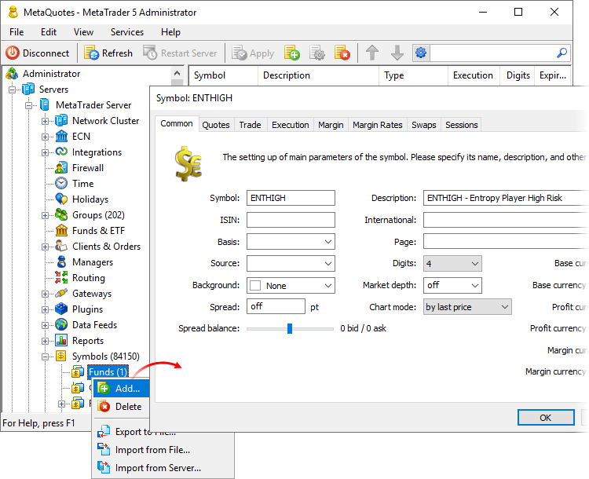
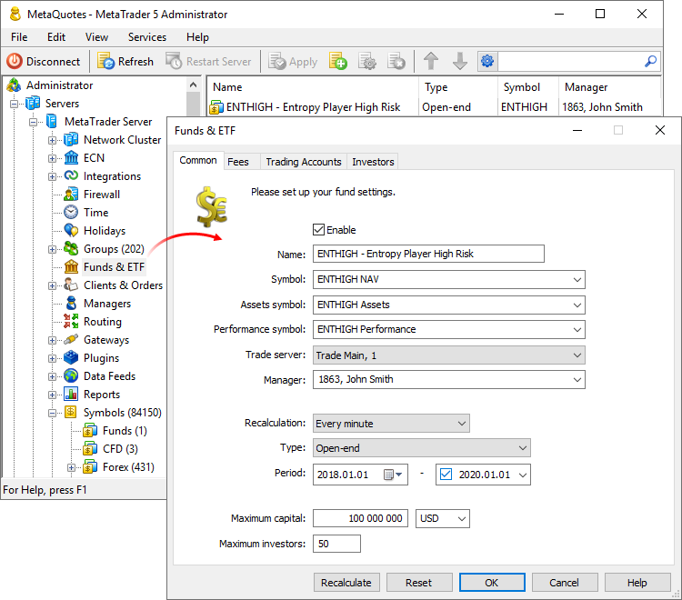
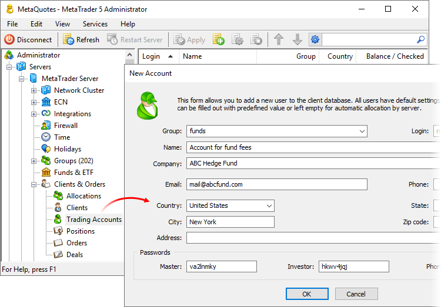
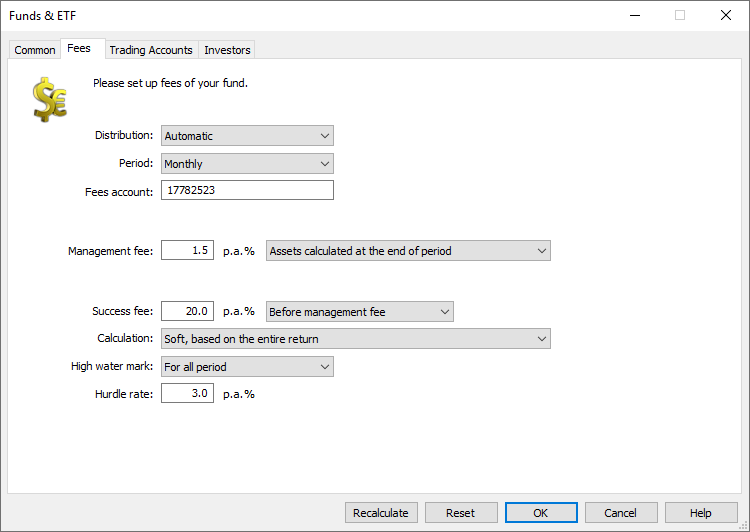
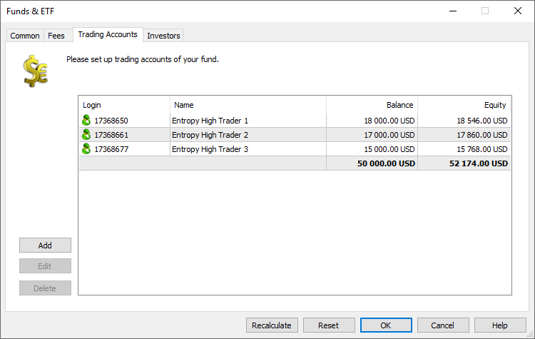
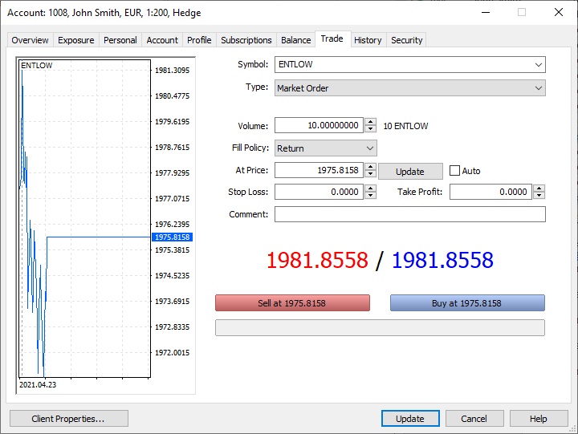
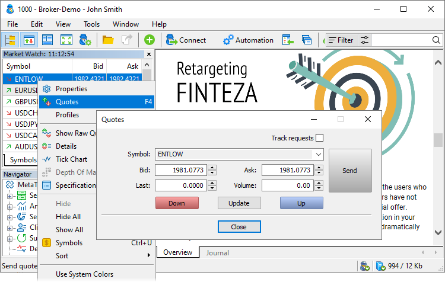
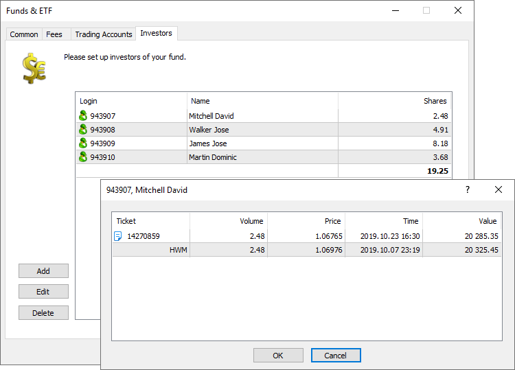

[🏠 Document Start](../../README.md) / [MetaTrader 5 Trading Platform](../../MetaTrader-5-Trading-Platform.md) / [Platform Setup](../Platform-Setup.md) / Funds & ETF

[Previous](Routing/Example-of-Rules.md) | [Next](Symbols.md)

# Funds and ETFs (#funds-and-etfs)

An investment fund is a way of investing money, in which investors do not have to trade in the market themselves. They entrust their money to an organization, which then manages the funds, for example by investing them in certain securities. The profit obtained from the funds turnover is further distributed among investors, while the fund receives a certain fee for the investment and management activities.

MetaTrader 5 enables the automation of fund and ETF operation:

  * Manage investors and keep detailed records of investments. Fund management is performed according to a traditional scheme adopted in the platform: you create investor accounts, add relevant investment amounts to their balances and add these accounts to a special fund investors section.
  * Work with the fund managers. Similarly to investors, managers are added in the system in the form of regular trading accounts. Invested assets are credited to these accounts and are further used to perform trading operations.
  * Automatically build AUM (Assets Under Management) charts. The money invested is credited to regular trading accounts, in which it is used by the fund managers for trading (management). The platform automatically builds the AUM charts based on the account equity data and taking into account applicable management and success fees. Investors can view this chart in the desktop, mobile and web terminals by connecting using their trading accounts, similar to regular traders.
  * Automate the calculation of fees and payments to investors. You do not need to use third-party accounting systems. The platform provides flexible fund settings, which include the hurdle rate, fees, fee calculation frequency and payment mode among others.
  * Provide real-time fund performance information to investors. Investors can view the fund charts and the current value of the shares by simply connecting to the trading account via the MetaTrader 5 desktop, mobile or web terminal.
  * Receive [fund performance reports](Reports/Fund-Overview.md).

## Create symbols to display the fund yield (#symbols)

For each fund, you should create three financial instruments: to display [NAV (Net Asset Value) (#nav-formula)](Funds-&-ETF.md#nav-formula) chart, [AUM (Assets Under Management) (#aum-formula)](Funds-&-ETF.md#aum-formula) chart and [fund performance (#performance-formula)](Funds-&-ETF.md#performance-formula). In the future, NAV displaying symbols will also be used for buying shares, i.e. it will be possible to invest by simply opening a regular trading position via the client terminal.

Add a separate funds section under the ["Symbols" section](Symbols.md) and create financial instruments. They do not require any specific settings.

## Create funds and configure general settings (#common)

Create a configuration for each fund under the "Funds and ETF" section:

Set up the following parameters under the Common section:

  * Name — the fund name.
  * Symbol — the name of the trading symbol, in which the [NAV (Net Asset Value) (#nav-formula)](Funds-&-ETF.md#nav-formula) will be reflected.
  * Assets symbol — the name of the trading symbol, in which a change in the [AUM (Assets Under Managements) (#aum-formula)](Funds-&-ETF.md#aum-formula) will be shown.
  * Performance symbol — the name of the trading symbol, which will reflect the [fund performance (#performance-formula)](Funds-&-ETF.md#performance-formula) chart.
  * Trade server — the [trade server](Network-cluster/Configuring-Servers/Trade-Server.md), on which the fund will be managed. Only accounts opened on the selected server can be used to created [investors (#investors)](Funds-&-ETF.md#investors) and fund [managers (#trade-accounts)](Funds-&-ETF.md#trade-accounts). They cannot be created on different servers.
  * Manager — the account of the [manager](Managers.md), who will administer the fund. Currently the field is not used. In the future, the field will be used to grant separate permissions to access the fund reports, as well as to change the lists of investors and managers.
  * Recalculation — [fund charts calculation (#fund-parameters)](Funds-&-ETF.md#fund-parameters) mode:

  * Every minute — the fund chart is recalculated every minute, after which appropriate quotes are added to the symbols' price stream.
  * Every hour — the fund chart is recalculated every hour, after which appropriate quotes are added to the symbols' price stream.
  * Daily — the fund chart is recalculated at the end of each trading session, after which appropriate quotes are added to the symbols' price stream.
  * Manually — the platform does not calculate fund performance variables and does not generate charts. This mode should be used when broadcasting fund data from external sources via [gateways](Gateways.md) or [data feeds](Data-Feeds.md).
  * Type — fund type:

  * Open-end — the shares of such a fund can be purchased or sold at any day. The assets of the fund can be freely increased or decreased.

  * Closed-end — unlike the previous type, the capital of such a fund cannot be changed. The fund issues a limited number of shares, which will not change in the future.
  * Period — the fund lifetime. The platform performs any operations concerning the fund (such as calculations, charting, fee charging, etc.) only within the specified period.
  * Maximum capital — the maximum allowable amount of investments within the fund. Investors and their shares are managed [under a separate section of fund settings (#investors)](Funds-&-ETF.md#investors). When the investment amount reaches the specified value, the platform will prevent from further adding of new investors or from increase of shares of existing investors.
  * Currency — the currency in which all the fund variables are calculated: prices, commissions, etc. For example, AUM (Assets under Management) is calculated based on the funds on [trading accounts (#trade-accounts)](Funds-&-ETF.md#trade-accounts). If the trading account deposit currency is GBP, while the fund currency is USD, the funds will be converted at the current GBPUSD rate when calculating AUM.
  * Maximum investors — the maximum number of investors who can purchase the fund shares (specified [under a separate section of fund settings (#investors)](Funds-&-ETF.md#investors)).

## Configure payments and fees (#fees)

The MetaTrader 5 trading platform enables the automation of all calculations concerning the fund: management fees and payments of returns.

Before configuring payments, you should [create a separate trading account](Accounts/Creating-Account.md) for each fund: all relevant payments will be performed in this account ("Fees account"). It is recommended to [create a separate group](Groups.md) for such accounts, while this enables more convenient work with accounts (including granting of appropriate access permissions to managers).

### Management fees (#management-fee)

The company which manages the fund, charges investors a certain fee for the services. This is usually equal to a percentage of the [Assets Under Management (AUM) (#aum-formula)](Funds-&-ETF.md#aum-formula). This is referred to as the "Management fees". All relevant calculation parameters are specified under the fund's "Fees" section:

  * Distribution — fee distribution mode. If "Automatic", the fee will be calculated by the platform. The "Report" mode enables manual calculation using external data.
  * Period — fee calculation and distribution frequency: daily, monthly, quarterly or yearly.
  * Fees account — a special trading account, to which fund management fees will be credited.
  * Management fee — the fund management fee as a percentage of [AUM (#aum-formula)](Funds-&-ETF.md#aum-formula). The calculation can also be based on assets values as of the beginning of the calculation period, end of period, or as an average value over a period. For example, if you select quarterly or period beginning calculation, the specified percentage will be calculated based on AUM as of the end of the previous quarter.

Management Fee is calculated using the following formula:

Management Fee = (Fund Equity * Days * Management Fee Percent/100)/365

where:

  * 'Fund Equity' is the fund value at the time of calculation
  * 'Days' is the calculation period
  * 'Management Fee Percent' is the management fee in percent

On a selected basis, the platform will calculate the management fees and will transfer the relevant amount to the special account, which is specified in the fund settings ("Fees account"). The accrual is performed as a balance operation of Commission type, with a comment "MF '[Fund Name]'". For example, "MF 'ENTHIGH'".

The fees account balance is taken into account when [calculating fund values (#fund-parameters)](Funds-&-ETF.md#fund-parameters), including its AUM. Actually, each management fee transfer reduces the fund's AUM by an appropriate amount. Nothing is deducted from [investor accounts (#investors)](Funds-&-ETF.md#investors).

### Success fee (#success-fee)

In the case of successful fund management (i.e. profitable trading), the company may charge an additional fee, the so-called "Success fee". If during the selected period the AUM value increases by the amount, which is equal to or exceeds the threshold value (Hurdle rate), additional commission will be deducted from the fees account. All related calculation parameters are specified under the "Fees" section.

  * Distribution, Period, Fees accounts — these parameters are common for [management fee (#management-fee)](Funds-&-ETF.md#management-fee) and access fee.
  * Success fee — fee as a percentage of the total returns for the current period or of the profit above the Hurdle Rate (defined in the "Calculation" field). The returns are determined separately for each share: actually it is performed by the [position on the investor account (#investors)](Funds-&-ETF.md#investors). The success fee calculation mode is also specified here: before or after management fee calculation. The management fee affects the AUM value, which is taken into account during performance calculation. Therefore the success fee value is affected by its calculation time.
  * Calculation — determines the amount based on which success fee will be calculated: the total yield amount for the current period or the amount above the hurdle rate.
  * High water mark — the fund management success can be determined using different methods. Currently only the most popular method is supported in the platform: "High water mark". In accordance with this method, management in the calculation period is considered successful if the increase per share (positions on the investor account) exceeds the hurdle rate. You can select how the excess shall be determined: over the entire fund management period, the last year or the last quarter.
  * Hurdle rate — is the threshold rate of return. If exceeded during the selected period (specified in "High water mark"), the fund management is considered successful and a commission fee will be charged.

The calculated success fee is deducted from investor accounts as a balance operation of "Commission" type with a comment "SF '[Fund Name]'". For example, "SF 'ENTHIGH'". Further this amount is transferred to the "[Fees account (#fees-account)](Funds-&-ETF.md#fees-account)" as a Commission operation. A comment for this operation is specified as "SF '[Fund Name]'-'[Investor account from which the commission has been debited]'". For example, "SF 'ENTHIGH'-'1235966'".

For each position on investor accounts, the platform performs the following actions:

  * Determines the Hurdle rate of the share (position): "Maximum share value (NAV) over the High water mark period" + "NAV Hurdle Rate". The platform calculates the maximum position value over the entire time, over the last year or over the last quarter, depending on the "High water mark" parameter. The position value is calculated as volume multiplied by [NAV (#nav-formula)](Funds-&-ETF.md#nav-formula), its maximum value is searched in the price history of the appropriate symbol. Then "Hurdle rate" percentage of this amount is calculated and added to the total value.
  * Then the platform checks if share profit exceeded the hurdle rate: "NAV at the end of the period" - "Hurdle rate". It means that the platform uses the position value as at the calculation time (before or after charging the management fee) and deducts the hurdle rate calculated at the previous stage, from the position value.
  * The share value (NAV) is determined: "NAV at the end of the period" - "Maximum NAV over the High water mark period". The values are calculated as shown in previous points.
  * If the share profit is negative (loss), zero, or it does not exceed the Hurdle Rate, the success fee is not charged.
  * If the share profit exceeds the Hurdle Rate, the success fee is calculated in accordance with the Calculation field value:
  * Soft: Profit per share * Success fee. The fee is calculated as percentage of share profit calculated above.
  * Hard: Profit beyond the Hurdle Rate * Success fee.

  * The "Fees account" balance is taken into account when calculating the [AUM (#aum-formula)](Funds-&-ETF.md#aum-formula). Thus, charging of any management fees reduces the AUM value.
  * Use a separate trading account for each fund's "Fees account". Do not perform any other operations on this account.

  
---  
  

## Set up trading accounts for fund managers (#trade-accounts)

Common trading accounts are used for managing invested funds. You distribute funds between these accounts and then the managers connect to these accounts and perform trading operations.

[Create a separate trading account](Accounts/Creating-Account.md) for each fund manager. It is recommended to [create a separate group](Groups.md) for such accounts, while this enables more convenient work with the accounts (for example, generation of relevant reports). Then transfer the investors' funds to these accounts, for example, by performing balance operations using the Manager terminal.

Once you have prepared the accounts, specify them in the fund settings, under the "Trading Accounts" section:

The current balances and equity amounts will be instantly shown for each of the manager accounts.

The [current fund AUM value (#fund-parameters)](Funds-&-ETF.md#fund-parameters) is calculated based on the equity amounts available on the trading manager accounts.

## Set the investors (#investors)

The fund investors are also managed using trading accounts.

[Create a separate trading account](Accounts/Creating-Account.md) for each investor. It is recommended to [create a separate group](Groups.md) for such accounts. Make sure to use [hedging position accounting (#risk)](Groups/Group-Settings.md#risk) for an investor group. Once the share purchaser invests the required funds, distribute them between the trading accounts of the [trading managers (#trade-accounts)](Funds-&-ETF.md#trade-accounts). Next, to allocate a share, open on the investors’s account a long trading position for the [fund symbol (#symbols)](Funds-&-ETF.md#symbols), while the position size should be equal to the relevant share. For example, if the share size is 1000, then the position size on the investor’s account should be 1000 lots (provided that the symbol contract size is 1).

Thus, the investor will be able to monitor their investments by connecting to the trading account via the client terminal. The investor will have access to [three fund charts (#fund-parameters)](Funds-&-ETF.md#fund-parameters), as well as to their share state, which is displayed as a trading position. The trading position state will be updated in accordance with the current total fund value (the update frequency depends on the "[Recalculation (#recalculation)](Funds-&-ETF.md#recalculation)" parameter).

To open positions on investor accounts, use the Manager terminal:

If there are no prices for the fund yet, drop the first price into the stream, otherwise an attempt to open a position will cause the terminal ot display the "no prices" error. Once all the shares have been allocated and the relevant funds have been added to the fund managers' accounts, the prices will be calculated automatically.

Once you have prepared the accounts, specify them in the fund settings, under the "Investors" section:

By clicking on the investor name you can view the current state of the investor's share (position). Also, maximum share value (High water mark) over [the current calculation period (#recalculation)](Funds-&-ETF.md#recalculation) is shown for each share.

  * The volume of shares is calculated only for positions which are opened for the symbol corresponding to the current fund. No other positions opened on these accounts are taken into account in this section.

  * Investor accounts should be located in [hedging position accounting (#risk)](Groups/Group-Settings.md#risk) groups. Otherwise, calculations in the fund may be performed incorrectly.

  
---  
  

## Allocation of additional shares (#allocation-of-additional-shares)

If you need to allocate additional shares within an already running fund, please pay attention to the following:

  * After allocating shares for new investors (opening positions on their accounts) and adding investors to the list, do not forget to distribute their invested funds between relevant managers' accounts. Otherwise, the NAV chart will be incorrect as the number of units has increased, while the management funds have not. Funds are distributed between managers at your discretion.
  * To avoid incorrect NAV values before you distribute funds between manager accounts, you can temporarily disable the fund. This will pause the calculation of charts. After completing the setup, turn the fund back on.
  * If incorrect prices were still added to the fund charts, you can delete such prices via the "1 Minute History Chars" and "Bid/Ask/Last Ticks" sections.

## Assets Under Management and Net Asset Value; fund performance chart (#fund-parameters)

The trading platform allows tracking the fund yield dynamics in real time, similarly to tracking of common symbol quotes.

As described above, [ordinary trading instruments (#symbols)](Funds-&-ETF.md#symbols) are created for the fund. The platform automatically records the changes in NAV (Net Asset Value), the AUM value (assets under management) value and profitability into the price history of these symbols.

These charts are calculated at intervals, specified in the "[Recalculation (#recalculation)](Funds-&-ETF.md#recalculation)" field. After each calculation, a quote with the appropriate fund value is added to the symbols' price history.

### Assets Under Management (AUM) (#aum-formula)

The current fund value is used for calculating the fund [management fee (#management-fee)](Funds-&-ETF.md#management-fee) and the [success fee (#success-fee)](Funds-&-ETF.md#success-fee), as well as for calculating all other charts. It is calculated according to the following formula:

(The total amount of equity on the fund's trading accounts - management fees)

The platform sums the equity of all [trading accounts of the fund (#trade-accounts)](Funds-&-ETF.md#trade-accounts) and deducts the amount of charged management fees. The trading account deposit currency differing from the [fund currency (#currency)](Funds-&-ETF.md#currency) is converted at the current rate.

### Net Asset Value (NAV) (#nav-formula)

The value is calculated according to the following formula:

AUM / Number of fund shares

AUM value calculated by the previous formula is divided by the [current number of shares (#investors)](Funds-&-ETF.md#investors) allocated by the fund to its investors.

### Fund Performance (#performance-formula)

The value is calculated according to the following formula:

Previous-period Performance + log(Current-period AUM / Previous-period AUM)

Here:

  * Previous-period Performance — for the first value on the chart this formula element is ignored. For the first period, the previous period performance will be zero.
  * Current-period AUM is calculated according to the AUM formula specified above.
  * Previous-period AUM is also calculated according to the above AUM formula, but for the previous period. The amount of funds deposited during the calculation period is added to this value (i.e. the money [distributed (#trade-accounts)](Funds-&-ETF.md#trade-accounts) at the beginning of the calculation period between managers).

Period refers to the chart calculation periodicity, specified in the [Recalculation (#recalculation)](Funds-&-ETF.md#recalculation) field. If charts are recalculated once a minute, the previous period is equal to the previous minute.

## Reset the Fund State (#reset)

The fund state can be reset using two commands in the settings dialog:

  * Recalculation — full recalculation of fund charts: NAV, AUM and performance. The platform reproduces the entire fund history based on manager and investor accounts: investment operations, share purchases and other operations. The graph history is calculated and recorded based on this data.
  * Reset — resetting accumulated statistics used for the calculation of fund parameters, including commissions. Use this option if you need to restart the fund and exclude previously accumulated values from further calculations. For example, this operation may be needed after testing.

> Use these commands with caution. Deleted values cannot be recovered.
