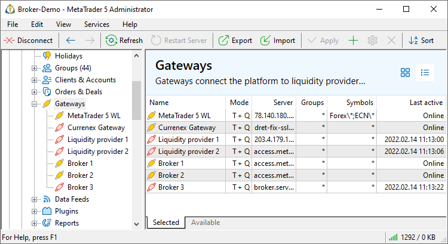
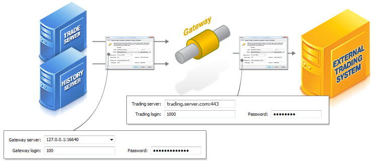

[🏠 Document Start](../../README.md) / [MetaTrader 5 Trading Platform](../../MetaTrader-5-Trading-Platform.md) / [Platform Setup](../Platform-Setup.md) / Gateways

[Previous](Positions.md) | [Next](Gateways/Configuration-of.md)

# Gateways (#gateways)

Gateways integrate MetaTrader 5 with external trading systems. With this integration, you can provide the possibility for your traders to execute trading operations on almost any exchange. They will receive quotes and will execute trades in their familiar terminal while all their operations will be forwarded to an external system.

The platform offers a variety of built-in [turnkey gateways](../Platform-Components/Gateways.md) for integration with exchanges and trading systems. You can test them right away. Additional third-party solutions are featured in the [App Store](https://support.metaquotes.net/en/market/mt5/aggregation). Using the [Gateway API](https://support.metaquotes.net/en/docs/mt5/api/gatewayapi), you can create your own gateways for integration with any trading systems.

In the Gateway section, available solutions can be viewed in two modes: product showcase and configuration list. You can switch between them using buttons  and .

The product showcase provides basic information: gateway name, connection status and the amount of transmitted Market Depth and tick data. The Selected tab displays all gateways for which you have configurations. The Available tab features all gateway modules available on the History server. You can configure them at any time.

The list mode enables the management of existing gateway configurations. It provides quick access to the main parameters:

  * Name — gateway name.
  * Mode — gateway operation mode: receives quotes (Q), processes operations (T), or both.
  * Server — the address of the external trading system server to which the gateway connects.
  * Groups — [groups (#groups)](Gateways/Configuration-of.md#groups) available to the gateway.
  * Symbols — [symbols (#symbols)](Gateways/Configuration-of.md#symbols) available to the gateway.
  * Last active — data and time of the last successful connection of the gateway to the external system.
  * ID — gateway identifier used to identify trade requests processed by this gateway.
  * Status — connection status and the number of trading operations processed by the gateway/total transmitted ticks and Market Depth changes.

Using the context menu, you can adjust the set of displayed data.

## How Gateways Work (#how-gateways-work)

The interaction of gateways and servers is performed through the special library MT5APIGateway.dll.

For receiving quotes and news, the gateway connects to the [history server](../Platform-Components/History-Server.md). At that the priority of transmission of quotes for a symbol is determined in the same way as for [data feeds](Data-Feeds.md) — by the position of configuration of the gateway in the list. This is described in more details in a [separate section](../Platform-Components/History-Server/Interaction-with-Quote-Providers.md).

To perform trade operations, all [trade servers](../Platform-Components/Trade-Server.md) of the platform connect to the gateway.

## Switching between Gateway (#switching)

The position of a gateway in the list defines its priority in the delivery of data: the higher the position is, the higher the priority of the gateway is. However, a server is permanently receiving information from all gateway at once. Such a solution allows to immediately switch to another gateway in case of problems. For example, several gateways deliver quotes of the same symbol from different financial companies - the priority defines what gateway should be used. If the required data are not received from the selected gateway for a certain period of time, the server automatically switches to the next gateway that provides information on the same symbol. However, as soon as data from the gateway with higher priority are received, the server will switch back to it.

  * The idle timeout of a gateway is set up on the history server settings in ["Datafeeds timeout" (#timeout)](Network-cluster/Configuring-Servers/History-Server.md#timeout).
  * For symbols with the depth of market enabled the current data source (a gateway of a [data feed](Data-Feeds.md)) is determined by the first quote that comes after starting the history server.

  * Switching of gateways for a symbol can be tracked in the ["Ticks" (#datafeed)](BidAskLast-Ticks.md#datafeed) section.

  * Flow of quotes for a symbol coming from a gateway has a higher priority than a flow from a [data feed](Data-Feeds.md). Switching to quotes from a data feed occurs in case the data flow from the gateway has stopped.

  * Switching of gateways is performed independently for each symbol.

  
---  
  
The process of activation of a quotes flow from a certain gateway is reflected in the history server [journal](Network-cluster/Journal.md). To find such records, use the keyword "activation".

### Possible delay in the delivery of Market Depth prices after switching gateways (#possible-delay-in-the-delivery-of-market-depth-prices-after-switching-gateways)

To consume less resources, the history servers does not store the best prices and Market Depth values for each symbol and each available data source. For the same purpose, the Market Depth is passed from the data feed to the server in the form of changes relative to the previous state. Additionally, the full Market Dept snapshot is sent to the server no more than once every 30 seconds.

Therefore, if the main price feed is stopped and the server switches to the reserve one, the server has to wait for the first Market Depth snapshot from the data feed. During this time (up to 30 seconds), the Market Depth data is not updated.

## Setting Up Gateways (#setting-up-gateways)

The gateways are configured in two steps:

  * [Configuration of a gateway](Gateways/Configuration-of.md) — configuration of the gateway itself;
  * [Setting up the routing](Gateways/Setup-of-Routing.md) — setting up the routing of trade requests to be processed by the gateway.

To view the logs of gateways, select it in the tree-like list in the left part of the terminal and go to the ["Journal"](Gateways/Journal-of.md) tab.  
---  
  

## Context Menu (#context)

The context menu of the "Gateways" section contains the following commands:

  *  Add — add a new gateway;
  *  Edit — edit the selected gateway;
  *  Delete — delete the selected gateway;
  *  Move Up — move the selected gateway up relative to others;
  *  Move Down — move the selected gateway down relative to others;
  *  Sort Alphabetically — sort configurations alphabetically. Please note that sorting is done on the server, not in the local terminal.
  *  Enable — enable the selected configuration.
  *  Disable — disable the selected configuration.
  * Automation triggers — create an [automation](Automations.md) task for the selected event or edit an existing one. The menu displays only the triggers and tasks associated with the current section.
  * Automation actions — add an automation action to an existing task or create a new task based on the action. The menu displays only the actions associated with the current section.
  *  Export to File — [export](General-Information/ImportExport-Settings.md) the settings of gateways to a file.
  *  Import from File — [import (#import)](General-Information/ImportExport-Settings.md#import) the settings of gateways to a file.
  *  Journal — request [logs](Network-cluster/Journal.md) according to the selected configuration. This will open the trade server logs section, with the name of the selected configuration automatically specified in the query field. You will only need to press the request button.
  *  Find — open the [Search](../MetaTrader-5-Administrator/User-Interface/Search.md) window;
  * Auto Arrange — if this option is enabled the size of columns is selected automatically;
  * Grid — this option shows/hides field separators in the table with the gateways.

