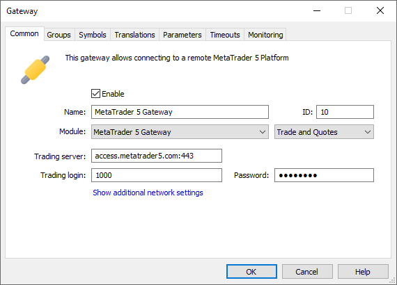
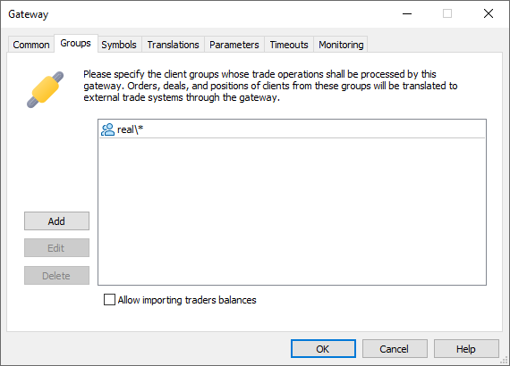
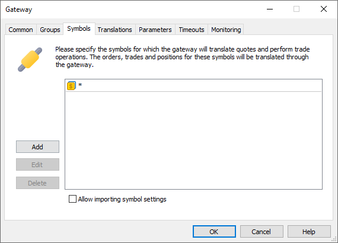
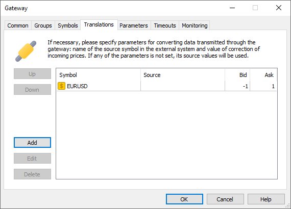
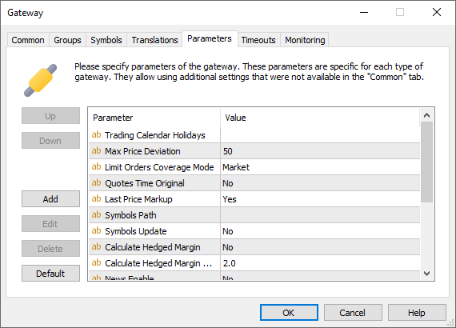
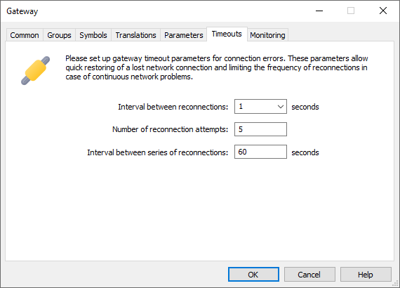
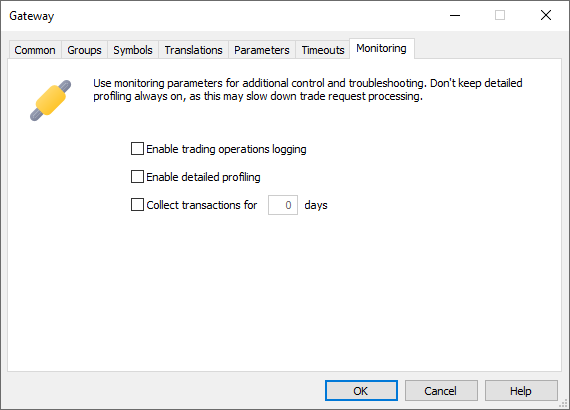

[🏠 Document Start](../../../README.md) / [MetaTrader 5 Trading Platform](../../../MetaTrader-5-Trading-Platform.md) / [Platform Setup](../../Platform-Setup.md) / [Gateways](../Gateways.md) / Configuration of

[Previous](../Gateways.md) | [Next](Status.md)

# Configuration of Gateways (#configuration-of-gateways)

In order to add or modify a gateway, in the [Gateways](../Gateways.md) section click " Add" or " Edit", respectively. In order to delete a gateway, click " Delete". These commands are also available in the [Edit](../../MetaTrader-5-Administrator/User-Interface/Main-Menu/Edit.md) menu, on the [toolbar](../../MetaTrader-5-Administrator/User-Interface/Toolbar/Standard.md) and in the context menu.

> Additional general information about working with configuration records is given in the ["Working with Instructions"](../General-Information/Working-with-Instructions.md) section.

## Common (#common)

This tab is used for setting up main parameters of the gateway:

  * Enable — enable/disable the gateway. For the gateways running [as a service](Setup-as-Service.md) via the "Remote gateway" module, unchecking "Enable" will lead to disconnection of platform servers from the gateway service, while the service itself will not be stopped.
  * Name — name of the gateway. Use of special characters (?, *, <, > etc.) is not allowed, as this may cause issues while working with the gateway log files.
  * ID — in this field you should specify a unique identifier of the gateway. This exact identifier will be written to the ["Dealer" (#dealer)](../Deals.md#dealer) field of deals processed by the gateway. This identifier is also used when creating the [rules of routing](Setup-of-Routing.md) of trade requests to the gateways.  
The ID cannot be changed in an existing gateway configuration. To change it, create a new configuration and delete the old one.
  * Module — name of the executable file of the gateway. In this field you should select one of the available executable files of gateways found in the /gateways directory of the [history server](../../Platform-Components/History-Server.md). The unlimited number of configurations with different settings can be created for each module. In the field to the right, you can select one of the modes of operation supported by the gateway:

  * Trade and Quotes — in this mode, the gateway translates quotes and processes trade operations.
  * Trade Only — in this mode, the gateway only processes trade operations. This mode can be used when working with an external trading system through several accounts in it. At that there are several corresponding configurations of the same gateway. In this case, quotes are provided by one configuration, and the others work only with trade operations.
  * Trading server — address of server of an external trade system the gateway will connect to.
  * Trading login — login of an account for connection to the external trade system.
  * Password — password to an account for connection to the external trade system.

  * ID of the gateway must not coincide with any of the [manager accounts](../Managers.md). When adding a new gateway or editing an existing one, the system checks availability of the identifier of the gateway. If the value is not allowed, the settings of the gateways won't be saved or modified respectively.

  * When you change any of the parameters, the gateway automatically restarts to apply the changes.

  
---  
  

### Advanced Network Settings (#additional-network)

Additional network settings include history/trade server to gateway connection parameters. These settings are designed to provide the security of operation between the server and the gateway. In most cases, the settings are hidden and do not require configuration (the history server sets the required address and connection parameters).

These parameters need to be specified in two cases: when working in the [remote gateway](Setup-as-Service.md) mode, and if the address/port selected for the gateway is busy. In the second case, the following message is written to the log: gateway address 'Gateway name' already used, please setup another address for gateway.

  * Gateway sever — address at which the gateway will receive connections from the history and trade servers. The system automatically determines available addresses of network interfaces of the history server and displays them in this field. The list includes a special address history.server:port. For example, history.server:12345. Peculiarities of using such address:

  *     * The gateway will accept connections on the specified port of all the IP addresses the history server works on (they are specified in the list of listen addresses on the ["Network" (#bind)](../Network-cluster/Configuring-Servers.md#bind) tab of the history sever).
    * The gateway will accept connections from the trade servers on the public access points of the history server (they are specified in the list of public addresses on the ["Network" (#public)](../Network-cluster/Configuring-Servers.md#public) tab of the history server).
    * If the list of list addresses of the history server includes 0.0.0.0, then the gateway will use this address for operation. 0.0.0.0 means listening on all addresses.

  *     * Specifying the address in this way allows automatic [switching the history server (#auto)](../../Platform-Components/Backup-Server/Switching-to.md#auto) with set up local gateways to a backup server without need to set up the addresses of the gateways manually.

  *     * An address in this format cannot be used for [remote gateways](Setup-as-Service.md) since they do not know the platform environment.
  * Gateway login — login that will be used for authorization of the history and trade servers on the gateway. Only a positive number can be specified as a login.
  * Password — password that will be used for authorization of the history and trade servers on the gateway. The password must fulfill the security requirements (at least 6 characters long with two of three types of symbols: upper case letters, lower case letters and digits).

You can also specify the address 127.0.0.1 or localhost for the gateway server. This is the so-called [Loopback](https://en.wikipedia.org/wiki/Loopback) or a virtual network interface, which is not linked to any hardware. Such addresses are used by default when the gateway, the history server and trade servers operate on the same computer. For such addresses, the platform performs additional checks to ensure proper operation:

  1. The platform receives lists of addresses listened by the history and trade servers
  2. If at least one trade server does not have the same address as the history server, it is considered that at least one platform component is installed on another physical computer.
  3. In this case, the gateway will not be run on localhost (127.0.0.1), but on a set of listening addresses of the history server. The port specified in the "Gateway server" parameter is used for the port. For example, if the address 127.0.0.1:16387 is specified for a gateway, and the server operates on 192.168.0.1:442, the gateway will run on 192.168.0.1:16387.
  4. When connecting to the gateway, the trade server also determines which address to connect to (as in points 1 and 2): Loopback or a set of addresses. The port specified in the "Gateway server" parameter is used for the port. The following addresses are used for the set of addresses (in the order of priority):

  * Public addresses of the history server
  * Local addresses listened by the history server, which coincide with its public points (located on the same subnet).

> If you install the [gateway as a service](Setup-as-Service.md) on the Loopback address and then move any of the platform components to a different computer, the gateway will become unavailable for that component.

## Groups (#groups)

At this tab you should specify the groups of clients whose trade operations will be processed by the gateway. Orders, deals and positions of clients from these groups will be translated to external trade systems through the gateway. The following commands are available for managing groups:

  * Add — add a group. After you press this button, a new field will appear. A click on this field will open a list where you should specify a group or a subgroup from those available on the server. For more details please read ["Specifying Symbols and Groups"](../General-Information/Specifying-Symbols-and-Groups.md);
  * Delete — delete a selected group;
  * Edit — modify a selected group. The same action can be performed by a double click on an entry.

### Allow importing traders balances (#allow-importing-traders-balances)

Using this option you can allow or restrict the gateway to change and correct the balance of traders. For this option to be active, the corresponding functional must be supported by the gateway.

This functional is required when an external trading system on its own performs the accounting of the financial results for trade accounts (for example, it can calculate and correct the balance at the end of a trade day).

## Symbols (#symbols)

In this section, specify the symbols that will be available to the gateway. For these symbols, the gateway will:

  * Receive and update (if [import is allowed (#import)](Configuration-of.md#import)) settings
  * Deliver quotes

Unlike group settings, the list of available symbols does not affect the trade requests which the gateway can receive. The way in which the gateway will handle such requests depends on the gateway implementation. To avoid unexpected behavior, it is recommended to correctly configure request [routing](../Routing.md) to the gateway, specifying only the necessary symbols in the rules.

Click "Add" and select the desired symbol or group of symbols. They can also be specified manually: one or multiple symbols separated by commas.

You can additionally use mask "*" and the negation sign "!". For example, Cboe FX\*,!Cboe FX\EURUSD — all symbols from the Cboe FX group except EURUSD. The exception does not work for a single "*" mask. It always allows all symbols:

  * Forex\*,!Forex\EURUSD — all symbols in the Forex subgroup, except EURUSD.
  * *,!Forex\EURUSD — all symbols. The EURUSD symbol will not be excluded.

For details, please visit the [Specification of Symbols and Groups](../General-Information/Specifying-Symbols-and-Groups.md) section.

If the symbol row in the table is highlighted in red, then this symbol no longer exists. It may have been moved or deleted. Open the entry and edit the symbol path.

> The priority of a gateway is always higher than that of a [data feed](../Data-Feeds.md) when it is used as a source of quotes.

### Allow to import symbol settings (#import)

Using this option you can enable/disable import of settings of [symbols](../Symbols.md), which data the gateway translates and for which perform trade operations. For this option to be active, the corresponding functional must be supported by the gateway.

Import of symbol settings via the gateway has a number of features:

  * If a symbol does not present in the platform, it will be created in the Preliminary [group (#groups)](../Symbols.md#groups).
  * All newly added symbols are imported with [trading disabled (#trade-disabled)](../Symbols/Symbol-Settings/Trade.md#trade-disabled). The administrator must manually enable trading after checking the settings.
  * If a symbol is already available in the platform, then only its trading settings will be updated.

The automatic import of symbol setting greatly simplifies the work of the platform administrator. Instead of adding and specifying the settings manually, now it is only necessary to move symbols from the Preliminary group to the required one and enable trading.

When a gateway changes symbol settings, the "symbol config updated" entry appears in the Main Trade Server [journal](../Network-cluster/Journal.md). The gateway name is specified as the IP address of the entry source (the IP field).

> When the "Allow importing symbol settings" option is enabled, the gateway can add and edit any symbols in the Preliminary\* group, even if it is not indicated in the list above.

## Translations (#translation)

Information that is received from the gateway can be converted:

  * Symbol — name of a symbol at the MetaTrader 5 server.  
If another source of quotes is set in the specified symbol (in the ["Source" (#source)](../Symbols/Symbol-Settings/Common.md#source) field) or the option ["Allow realtime quotes from data feeds"](../Symbols/Symbol-Settings/Quotes.md) is disabled, then the translation setting will only apply to trade requests sent through the gateway. The symbol name and prices will be translated in the requests. The translation setting will not affect the streamed symbol quotes.
  * Source — name of a symbol in the external trade system (initial name of the symbol). This parameter is intended for adjust the names of symbols in the external trade system in accordance with the names of symbols in the platform;
  * Bid — in this field you can specify a number of points to change the Bid prices by.
  * Ask — in this field you can specify a number of points to change the Ask prices by.

If any of the parameters is not set, its source values will be used. For example, if the name of symbol in the external trade system is not specified, it is considered that the symbol name in the external system is the same as the symbol name in the platform.

If more than one translation settings match the same symbol on the platform side, only the one located higher in the list will be applied. For example, the following settings are available:

  * EURUSD.GW | EURUSD | Bid -1 | Ask +1
  * *.GW | * | Bid -2 | Ask +2

In this case, EURUSD prices will be changed by -1/+1, and the prices of all other symbols will be changed by -2/+2.

  * When translating prices, make sure the prices are correct. Usually a negative (or zero) value is indicated for the Bid price, and a positive (or zero) value is indicated for Ask. Otherwise, you may get a negative spread.

  * Translations also affect the depth of market. Consider an example, when the Bid value is set to -10 and the Ask value is set to 10. There are sell requests at the price 120 and 110, and buy requests at the price 90 and 80. As a result of conversion, the price of the sell requests will be changed to 130 and 120, and the price of buy requests will be changed to 80 and 70.

  * Find out more in the ["Symbol and Price Translation"](Symbol-and-Price-Translation.md) section.

  
---  
  

## Parameters (#parameters)

This tab allows to specify additional parameters of a gateway that are not implemented at the "Server" tab. Presence of this parameters is stipulated by a necessity of passing additional settings to a gateway for its correct operation. The parameters are described in these fields:

  * Parameter — name of a parameter; 
  * Value — value of a specified parameter.

This tab contains the following commands for managing the parameters:

  * Add — add a new parameter. A new line will appear in this window as soon as you press it. In the "Parameter" field enter the name of the parameter, in "Value" - the necessary value to assign to this parameter;
  * Edit — modify a selected parameter. The same action can be performed by double clicking on the selected field;
  * Delete — delete a selected parameter.
  * Default — set default parameters.

### Standard Parameters (#param-standard)

All gateways have a standard set of supported parameters:

  * NewsCategory — news categories. As its value you can specify the title of the news category that is received from this data feed. Further this category name can be used to specify news to be received by separate [groups](../Groups.md).
  * Quotes Delay — delay of transmitted quotes in seconds. The maximum duration of quotes delay is 20 minutes (1200 seconds). The flow of delayed quotes is neither thinned out, nor changed. A quote is passed to MetaTrader 5 History Server only after the expiration of delay period since the quote has arrived to Gateway API. If the temporary delay parameter is not defined, the quote delay is not used. Changes in depth of market and price statistics are delayed together with the quotes flow.
  * Quotes Tickstats Sample — the minimum frequency of sending price statistics in milliseconds. This parameter allows thinning out updates of price statistics reducing the traffic.
  * Quotes Ticks Sample — the minimum frequency of sending quotes in milliseconds. This parameter allows thinning out updates of quotes reducing the traffic. This parameter is recommended for use on demo servers only.
  * Quotes Books Sample — the minimum frequency of depth of market updates in milliseconds. This parameter allows thinning out updates of the depth of market reducing the traffic. This parameter is recommended for use on demo servers only.
  * Trading Calendar Holidays — trade systems/exchange can have their own schedule of working and non-working days that is different from the [time](../Time.md) and [holidays](../Holidays.md) settings of MetaTrader 5. This parameter allows redefining working and non-working for the gateway.  
To add a non-working day, specify it in the following form: +DDMMM. Day is specified with two digits, month is specified as the first three letters of the month name. For example, +01JAN.  
To add a working day, specify it in the following form: -DDMMM, for example, -07FEB. You can specify several days separated via semicolon, for example, +01JAN;-07FEB. If the working day you are adding does not fall within the [platform working time](../Time.md) or within [trading/ quoting sessions of instruments](../Symbols/Symbol-Settings/Sessions.md), you should updated appropriate settings.

The parameters for thinning out of price data can be used together with Quotes Delay. Allowed values are from 100 to 3000 milliseconds.

If a parameter value is incorrect, it won't be used.

## Timeouts (#timeouts)

This tab describes the behavior of gateways in case data receipt is stopped.

  * Interval between reconnections — time period between the attempts to reconnect to the external server;
  * Number of reconnection attempts — a number of reconnection attempts is specified in this field. If a series of reconnection attempts doesn't result in establishing a connection, attempts will be stopped for a time period specified in the field below;
  * Interval between series of reconnections — if a series of specified number of reconnection attempts doesn't result in establishing a connection, attempts will be stopped for a time period specified in this field. After this time period another series of reconnections will be performed.

> An example of working with timeouts is given in a [separate section](../../Platform-Components/History-Server/Interaction-with-Quote-Providers.md).

## Monitoring (#monitoring)

From this section, you can access gateway monitoring settings. Use them for additional control and debugging.

  * Enable trading operations logging — enable printing of [additional information (#extended)](Journal-of.md#extended) about the gateway operation to the [journal](Journal-of.md).
  * Enable detailed profiling — collect advanced metrics related to request processing. The platform monitors the performance of gateways similarly to [cluster server](../Network-cluster/Monitor.md) monitoring. It logs various metrics, such as CPU load and memory consumption, among others. You can find them by the "Monitoring" keyword. If you enable detailed profiling, the platform will log additional parameters. Enable this mode only when debugging or testing, since it can slow down request processing. The feature is under development.
  * Collect transactions for [x] days — the feature is under development.

