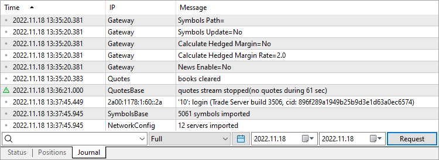

[🏠 Document Start](../../../README.md) / [MetaTrader 5 Trading Platform](../../../MetaTrader-5-Trading-Platform.md) / [Platform Setup](../../Platform-Setup.md) / [Gateways](../Gateways.md) / Journal of

[Previous](Status.md) | [Next](Positions.md)

# Journal of Gateways (#journal-of-gateways)

In order to view the journal of operation of [gateways](../Gateways.md), select it in the tree-like list in the left part of the terminal and go to the "Journal" tab.

Working with the journal of gateways is the same as with the server [journal](../Network-cluster/Journal.md). To request logs, specify a keyword, time period and click "Request".

## Extended Logging (#extended)

Extended logging mode can be enabled in ["Monitoring" (#monitoring)](Configuration-of.md#monitoring) tab of the gateway settings. This allows receiving more detailed data on the gateway operation.

### Measuring gateway operation speed (#measuring-gateway-operation-speed)

Result of measuring the speed of processing trade operations by the gateway is an important data displayed in the gateway journal in extended logging mode. Data on each request processing speed is shown in three journal lines:

order #100103556 \- process time: 78.855 ms (request process: 12.088 ms, order execute: 66.767 ms)  
order #100103556 \- gateway API overhead: 0.254 ms (request lock: 0.037 ms, request confirm: 0.027 ms, execution process: 0.190 ms)  
order #100103556 \- trade server response: 10.410 ms, gateway response: 68.195 ms (request response: 1.591 ms, execution response: 66.604 ms)  
---  
  
"Source" field of these messages contains "Monitor" indication. Order index, relative to which the measurement is performed, is shown after # mark. Let us examine each message separately.

order #100103556 \- process time: 78.855 ms (request process: 12.088 ms, order execute: 66.767 ms)  
---  
  
The following information is displayed here:

  * process time — total time of trade operation processing at the gateway. The value is calculated as the time passed from the moment when a request was transferred to the gateway up to the moment when a trade server received a notification on placing the order in an external trading system. Processing time consists of two components shown in parentheses:
  * request process — time for making a decision on how the order will be processed (for example, before receiving IMTConfirm confirmation with MT_RET_REQUEST_PLACED response code meaning that the order will be processed in an external system).
  * order execute — time for placing an order in an external system (arrival of the appropriate IMTExecution trade execution).

order #100103556 \- gateway API overhead: 0.254 ms (request lock: 0.037 ms, request confirm: 0.027 ms, execution process: 0.190 ms)  
---  
  
The following information is displayed here:

  * gateway API overhead — time spent for processing data in Gateway API. This parameter consists of three components shown in parentheses:
  * request lock — time spent by Gateway API for locking the request from the trade server's queue.
  * request confirm — time for the request confirmation processing in Gateway API (processing IMTConfirm confirmation received from the gateway).
  * execution process — time for processing the trade execution in Gateway API (processing IMTExecution trade execution received from the gateway).

order #100103556 \- trade server response: 10.410 ms, gateway response: 68.195 ms (request response: 1.591 ms, execution response: 66.604 ms)  
---  
  
The following information is displayed here:

  * trade server response — time between sending Gateway API request for locking the trade request and receiving Gateway API server notification on locking it.
  * gateway response — total time spent waiting for a response from an external system. This parameter consists of two components shown in parentheses:
  * request response — time spent waiting for a request confirmation (for example, waiting for a confirmation that the order has been placed in an external system).
  * execution response — time spent waiting for a trade request execution (for example, filling the order in an external trading system).

  * All parameters are in milliseconds.
  * More information about IMTConfirm confirmation object and IMTExecution trade execution object can be found in MetaTrader 5 Gateway API documentation.

  
---  
  

## Context Menu (#context)

The context menu of the journal of gateways contains the following commands:

  *  Request — request logs;
  * Copy — this command allows copying information from the journal to the clipboard;
  * Export — export the requested logs in a CSV or HTML file;
  *  Find — search through requested logs;
  * Auto arrange — If this option is enabled, the size of columns is selected automatically;
  * Grid — show/hide grid to separate fields;
  * Columns — show/hide columns of IP and Message in the Journal.

