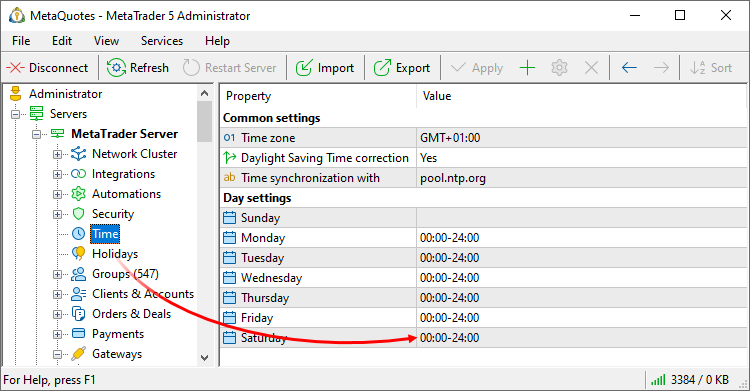
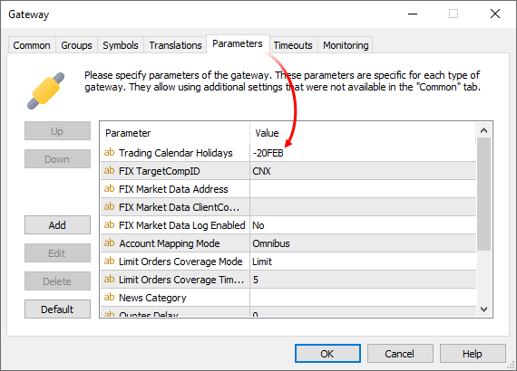
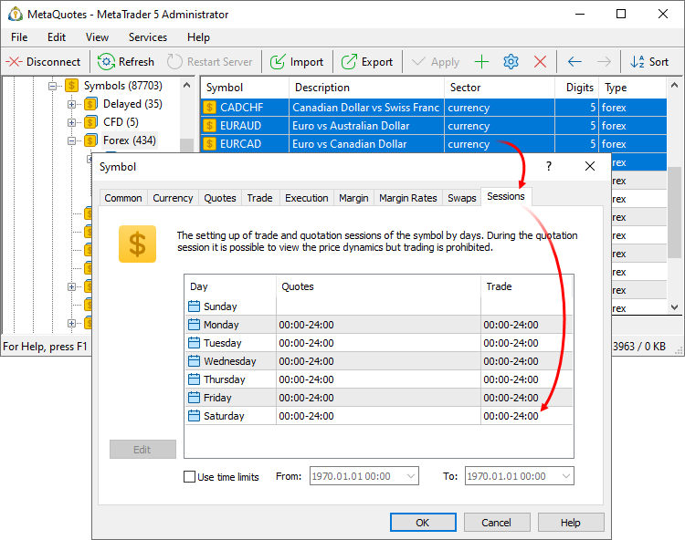

[🏠 Document Start](../../../README.md) / [MetaTrader 5 Trading Platform](../../../MetaTrader-5-Trading-Platform.md) / [Platform Setup](../../Platform-Setup.md) / [Gateways](../Gateways.md) / Operation on Weekend

[Previous](Setup-as-Service.md) | [Next](Symbol-and-Price-Translation.md)

# Operation on Weekend

There may be cases when the gateway should work during the weekends, for example, on Saturday. In order to allow this, implement the necessary changes to the trading platform and the gateway settings.

## Configure the platform working time

Allow the platform operation during a weekend in the [Time](../Time.md) section:

> Change the platform working time settings back at the end of the trading day.

## Configure the gateway working time

Trading Calendar Holidays parameter used for re-defining working/non-working time is supported at all gateways on Gateway API level.

To add a non-working day, specify a value of the form +DDMMM. The date is specified as two digits, the month is specified as the first three letters of the month name in English. For example, +01JAN. To add a working day on Saturday or Sunday, specify a value of the type -DDMMM, for example, -07FEB. You can specify multiple working/non-working days, separated by semicolons, for example, + 01JAN;-07FEB.

> Delete this parameter at the end of the trading day.

Some gateways may ignore the 'Trading Calendar Holidays' parameter. It depends on their implementation and trading venue specifics:

  * The [MetaTrader 4](../../Platform-Components/Gateways/MetaTrader-4.md) and [MetaTrader 5](../../Platform-Components/Gateways/MetaTrader-5.md) gateways remain active on holidays and weekends regardless of the parameter. Their working hours are determined by the platform settings.
  * Gateways to liquidity providers, such as [Integral](../../Platform-Components/Gateways/Integral.md), [Currenex](../../Platform-Components/Gateways/Currenex.md) and others are disabled on holidays and weekend regardless of the parameter. It is believed that liquidity from these providers is always unavailable on weekends and holidays.
  * The [MOEX Derivatives](../../Platform-Components/Gateways/MOEX-Derivatives.md) gateways receives an operation schedule directly from the exchange and it ignores the parameter.
  * The [MOEX Securities](../../Platform-Components/Gateways/MOEX-Securities.md) and [MOEX FX](../../Platform-Components/Gateways/MOEXFX.md) gateways operate only on weekdays by default. The parameter can be used for these gateways.

For further details please read the relevant gateway documentation.

## Configure trade symbol working time

Add trade and quotation sessions on a weekend for trade symbols. You can edit multiple symbols simultaneously. To do that, select them in the list while holding Ctrl or Ctrl+Shift.

> Change the settings back at the end of the trading day.
