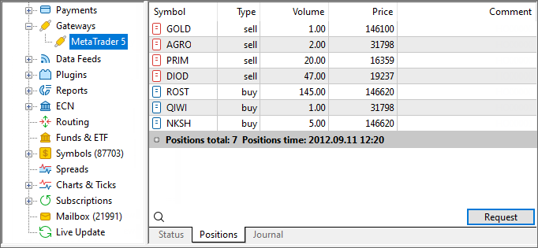

[🏠 Document Start](../../../README.md) / [MetaTrader 5 Trading Platform](../../../MetaTrader-5-Trading-Platform.md) / [Platform Setup](../../Platform-Setup.md) / [Gateways](../Gateways.md) / Positions

[Previous](Journal-of.md) | [Next](Setup-of-Routing.md)

# Positions (#positions)

The tab is used to request the current state of positions from the trading accounts used by the gateway in an external system. Depending on the gateway tab, positions can be displayed via one or several accounts.

> This tab may be absent if the ability to request external system positions is not supported by the gateway. Also, the tab is not displayed if the gateway configuration is [disabled (#common)](Configuration-of.md#common).

Click "Request" to view positions.

The following information is displayed for each position:

  * Symbol — [symbol](../Symbols.md), for which the position is opened;
  * Type — position type, buy or sell;
  * Volume — position volume in lots;
  * Price — opening price;
  * Comment — a comment to a position.

The total line below shows the total number of positions and the time the states of positions have been fixed. Depending on the gateway (and external trading system), states of positions can be submitted either in real time mode or only at the end of a trading session.

## Context Menu (#context)

The context menu of this section allows performing the following commands:

  *  Request — execute positions request;
  * Copy — this command is used for copying data on positions to clipboard;
  *  Export — [export](../General-Information/Data-Export.md) requested positions as *.HTM, *.HTML files or *.CSV file;
  *  Find — open the [search](../../MetaTrader-5-Administrator/User-Interface/Search.md) window;
  * Auto Arrange — if this option is enabled, the size of columns will be selected automatically;
  * Grid — show/hide grid to separate fields in the table with positions;
  * Comment — show/hide "Comment" column.

