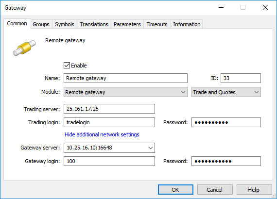

[🏠 Document Start](../../../README.md) / [MetaTrader 5 Trading Platform](../../../MetaTrader-5-Trading-Platform.md) / [Platform Setup](../../Platform-Setup.md) / [Gateways](../Gateways.md) / Setup as Service

[Previous](Setup-of-Routing.md) | [Next](Operation-on-Weekend.md)

# Gateway Installation as a Service (#gateway-installation-as-a-service)

Gateways may run on any remote servers. They are not restricted to the server machine containing the history server.

In order to configure this gateway, you will need to copy the gateway .exe file and the GatewayAPI64.dll library (available in [history server installation directory]\Gateway) to the target server. Then launch the executable file and configure connection to the gateway in the [remote mode (#setting)](Setup-as-Service.md#setting).

In order not to run the gateway file every time when starting the server, you can install the gateway as a service. In that case, the gateway is launched automatically every time the operating system download starts.

> Operation as a service is supported in all [gateways developed by MetaQuotes](../../Platform-Components/Gateways.md). Support for this mode in third-party gateways is not guaranteed, while it depends on the gateway developers.

## Service Setup (#service-setup)

Copy the gateway .exe file and the GatewayAPI64.dll library (available in [history server installation directory]\Gateway) to the target server. Save both files to the same directory.

To install the gateway as a service, run its executable file with the /install key. The following parameters may be additionally specified:

  * /name:<name> — name of the service to be registered in the system.
  * /display:<display_name> — service full name.
  * /desc:<description> — service description.

All parameters are optional. If they are not specified, the default values are used.

Sample setup command:

DGCXGateway64.exe /install /name:dgcx  
---  
  
Service Start

After the setup is complete, launch the gateway service. Run the executable file with the /start key. The gateway launched in such a manner waits for the history server connection. If the history server interrupts connection (for example, in case of a restart), the gateway waits for the next connection. There is no need to restart it.

Sample launch command:

DGCXGateway64.exe /start  
---  
  
  * If you need to migrate the gateway to another server, do not forget to additionally migrate the GatewayAPI64.dll library. The gateway will not work without this library.
  * A gateway that runs on the remote server, as well as the GatewayAPI64.dll library, are not updated automatically when new versions of the platform are released. You will need to update these files manually.

  
---  
  

## Configuring the Service (#config)

To configure the gateway service, create a text .cfg settings file having the same name and located in the same directory as the gateway executable file. For example, if the gateway executable file is named DGCXGateway64.exe, then the settings file should be named DGCXGateway64.cfg. The file should contain the following parameters:

  * name=<name> — gateway name to be displayed in the log.
  * address=<address>:<port> — address and port where the gateway waits for the history server connection. The address cannot be specified in the format of [history.server:[port]](Configuration-of.md#additional-network) since the remote gateway does not know the platform environment.
  * login=<login> — login used by the history server when connecting to the gateway.
  * password=<password> — password used by the history server when connecting to the gateway.
  * timezone — time zone in minutes. The default time used for the remote gateway log is GMT+00:00. If the trade server is working in a [different time zone (#time-zone)](../Time.md#time-zone), the time of server logs and gateway logs will be different. To avoid this, specify the time zone of the trade server in the gateway settings. The time zone should be specified in minutes. For example, the value of 60 corresponds to GMT +01:00, and -60 corresponds to GMT -01:00.
  * timecorrect — daylight saving time mode: 0 — DST is not used, 1 — enable DST change. It is recommended to set the mode used on the [trade server (#daylight-saving)](../Time.md#daylight-saving).

Sample settings file:

name=DGCX Gateway  
address=10.1.55.159:16100  
login=100  
password=apxjjz3  
---  
  

## Configuring the Gateway Connection on the Server Side (#setting)

[Create the gateway configuration](Configuration-of.md) via the Administrator terminal. 

Specify the following parameters:

  * Module — Remote gateway,
  * Gateway server — address and port where the gateway waits for the history server connection (set in the [configuration file (#config)](Setup-as-Service.md#config)). 
  * Gateway login — gateway connection login set in the configuration file.
  * Password — gateway connection password set in the configuration file.

All other parameters are specified the same way as for a gateway running in normal mode.

## Stop and Uninstall (#stop-and-uninstall)

To stop the gateway service, run its executable file with the /stop key. The current connection to the history server is interrupted and the service is stopped. Example:

DGCXGateway64.exe /stop  
---  
  
To uninstall the previously installed service, run the executable gateway file with the /uninstall key and [/name:<name>] parameter. The "name" parameter specifies the name of the uninstalled service. If the service was installed with the default name (without the "name" parameter), the /name parameter is not specified. Example:

DGCXGateway64.exe /uninstall /name:dgcx  
---  
  
> If you uncheck "Enable" in a gateway configuration, the platform servers will be disconnected from the gateway service, while the service itself will not be stopped.
