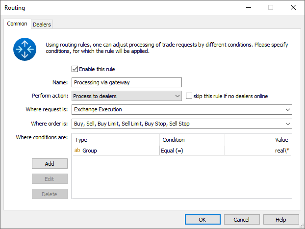
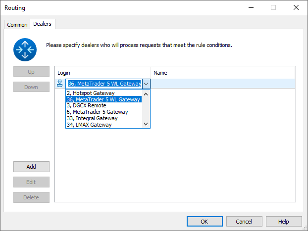

[🏠 Document Start](../../../README.md) / [MetaTrader 5 Trading Platform](../../../MetaTrader-5-Trading-Platform.md) / [Platform Setup](../../Platform-Setup.md) / [Gateways](../Gateways.md) / Setup of Routing

[Previous](Positions.md) | [Next](Setup-as-Service.md)

# Setup of Routing

For a gateway to start processing trade requests, you should set up their [routing](../Routing.md) in the corresponding section of the administrator terminal.

## Common

The key options among those at the "Common" tab of the routing rule created for a gateway is the "Perform action: Process to dealers".

Once the other [parameters of the routing rule (#common)](../Routing.md#common) are set, you should proceed with the "Dealers" tab.

## Dealers

At this tab you should select the gateway as a dealer that processes the requests:

In addition to the manager logins, the list of dealers contains the gateways (ID and name specified at the ["Common" (#common)](Configuration-of.md#common) tab).

After the rule is set up, you should place it in a necessary position in the list, since the rules are [executed (#execution)](../Routing.md#execution) from the first one to the last one.
