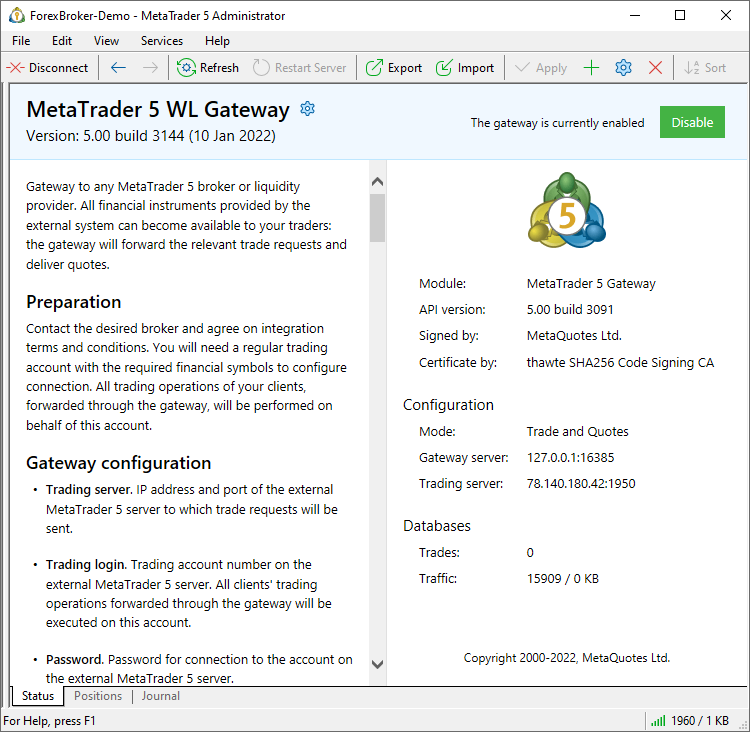

[🏠 Document Start](../../../README.md) / [MetaTrader 5 Trading Platform](../../../MetaTrader-5-Trading-Platform.md) / [Platform Setup](../../Platform-Setup.md) / [Gateways](../Gateways.md) / Status

[Previous](Configuration-of.md) | [Next](Journal-of.md)

# Status

This page features general information about the gateway: description, version, settings and statistics. From the same page, you can quickly enable and disable the gateway.

To access this section, select a gateway in the tree or click on it in the product showcase.

## Basic Data

Basic information about the gateway is shown at the top of the window:

  * Module — the name of the gateway executable file.
  * API Version — version and data of the Gateway API, which was used for creating the gateway.
  * Signed by — the company by which the gateway executable is signed.
  * Certificate issued by — the certification authority that issued the certificate to the above company.

## Configuration

Basic gateway settings are shown in this block:

  * Mode — gateway operation mode (execution of trading operations and/or transmission of quotes).
  * Gateway server — the address at which the gateway accepts connections from the history and trade servers.
  * Trading server — the address of the external trading system server to which the gateway is connected.

To move to [detailed setup](Configuration-of.md), please click next to the gateway name.

## Databases

Gateway statistics is shown in this block:

  * Trades — the number of trading operations processed by the gateway.
  * Traffic — incoming and outgoing gateway traffic.

