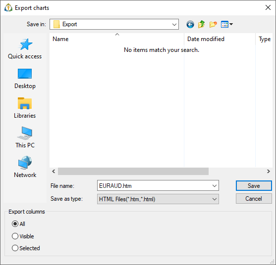
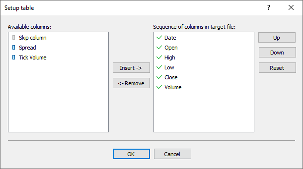

[🏠 Document Start](../../../README.md) / [MetaTrader 5 Trading Platform](../../../MetaTrader-5-Trading-Platform.md) / [Platform Setup](../../Platform-Setup.md) / [General Information](../General-Information.md) / Data Export

[Previous](Specifying-Symbols-and-Groups.md) | [Next](ImportExport-Settings.md)

# Data Export

The administrator terminal can export data to *.HTM, *.HTML and *.CSV files. Data can be exported from the following sections:

  * [Accounts](../Accounts.md)
  * [Clients](../Clients.md)
  * [Orders](../Orders.md)
  * [Deals](../Deals.md)
  * [Positions](../Positions.md)
  * [Charts](../1-Minute-History-Charts.md)
  * [Ticks](../BidAskLast-Ticks.md)

Request data in the appropriate section to execute an export operation. Then click "Export in the context menu of this section. After that the window where one should specify a folder to save the file to will appear. Its lower part contains the block of the export settings:

The following export variants are available here:

  * All — export all information regardless of the currently selected columns;
  * Visible — export only the columns that are enabled at the moment;
  * Selected — open the window of manual selection of columns to be exported, which is described below.

In order to export the information, one should specify the name of the end file and press the "Save" button.

### Selecting Columns for Export

The left part contains the available columns and the right part contains the chosen ones. The window contains the following commands:

  * Insert — add the selected column to the list of chosen ones;
  * Remove — remove the selected columns from the chosen ones. Some fields are obligatory for exporting, they cannot be deleted;
  * Up — move the added column up relatively to the others. The order of selected columns determines the sequence of data in the exported file;
  * Down — move the added column down relatively to the others;
  * Reset — restore the default settings of columns.

It is also possible to move the columns by a double-click with the left mouse button on them.

> There is a special entry "Skip column" in the list of available columns. Using it, one can create empty columns separated with the selected separator in the exported file.
