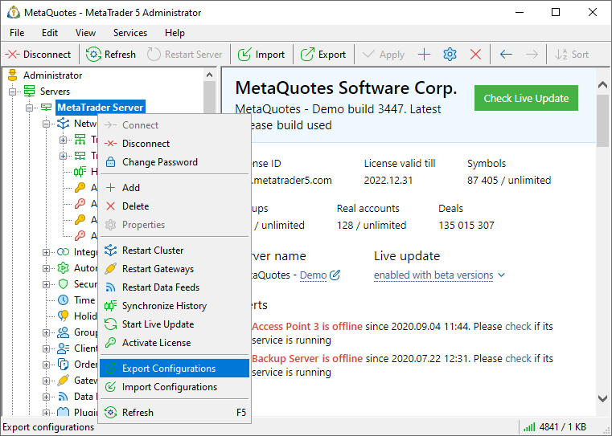
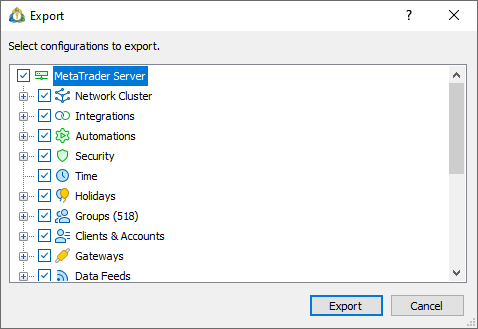
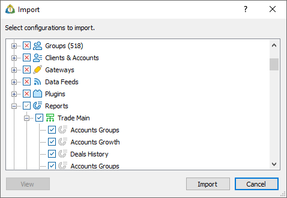
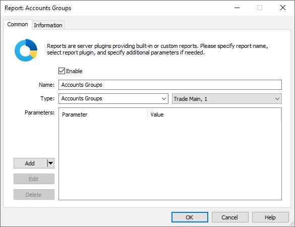

[🏠 Document Start](../../../README.md) / [MetaTrader 5 Trading Platform](../../../MetaTrader-5-Trading-Platform.md) / [Platform Setup](../../Platform-Setup.md) / [General Information](../General-Information.md) / ImportExport Settings

[Previous](Data-Export.md) | [Next](../Start-Page.md)

# Import and Export Settings (#import-and-export-settings)

The administrator terminal allows to quickly export and import almost all settings of the trade platform. This functionality can be useful, for example, if you need to set up a test platform with the settings similar to your work platform.

## Export (#export)

The platform settings are exported in a text file in the JSON format. To start the export, open the context menu of the platform and click " Export":

The dialog where you can select the settings to be exported appears:

Select the necessary settings and click "Export". Then specify a folder to save the file with settings.

## Import (#import)

To import the settings, open the platform context menu as described above and click " Import".

Select settings that should be imported. All non-selected items are skipped, while the appropriate platform settings remain unchanged. Using the "View" button you can check any imported configuration and change it if needed:

After changing the settings in the preview mode, click "OK" and then "Import".

If an imported configuration does not exist in the platform, it will be created. If an imported configuration matches an existing configuration in the trade platform, the existing configuration settings will be updated. Configurations are compared by their key parameters, for example, group name, manager login (account number), routing rule name, etc.

Configurations of reports, plugins and funds are bound to specific servers in the cluster. When you export their settings, server IDs are also saved in JSON files. During import, the system checks the ID specified in the file and binds the configuration to the appropriate server. If the platform with the specified ID does not have a server with the specified identifier, the configuration will be bound to the main trade server. If necessary, you can change binding in the preview mode.

  * Be careful when importing the settings. It can seriously affect the operation of the trade platform.

  * Settings files use the UTF-16 Little Endian encoding. Files in other encodings cannot be imported.

  * Starting with the platform build 1930, all volume settings are exported in two versions: with standard and extended accuracy. For example, [the minimum symbol volume (#volumes)](../Symbols/Symbol-Settings/Trade.md#volumes) is exported as "VolumeMin" : "100" and "VolumeMinExt" : "1000000" (lots are obtained by dividing the values by 10000 and 100000000, respectively). Extended volume accuracy has a higher priority during import. If it is not specified (for example, if settings are exported by an older terminal version), the value with standard accuracy will be used.

  
---  
  

## Export and Import via Command Line (#command-line)

To automate the configuration process, as well as to automate the transfer of platform settings without having to develop additional plugins and applications in C++, you can use command line export and import.

Close the Administrator terminal before executing commands in console mode. Otherwise, the commands will not be executed because the second copy of the application cannot be run in parallel.

In order to start MetaTrader 5 Administrator in the console mode, use the /console key:

/console /server:<Trade Server Address:Port> /login:<Login> /password:<Password> /action:<Command> [Command Arguments]  
---  
  
Specify platform connection details in the 'server', 'login' and 'password' parameters. Specify the type of performed action in the 'action' parameter:

### Server Restart (#server-restart)

Command /action:restart [/name:<server name>]. Optionally specify the server name (History, Access...). If the name is specified, the appropriate sever will be searched for (case insensitive). If the name is not specified, the command will be performed for the current connected server.

### Export of a Configuration to JSON (#export-of-a-configuration-to-json)

Command /action:export /file:<path> [/type:<type> /config:<mask>]. If no optional arguments are specified, the entire configuration of the connected server will be exported.

Argument /file:<path> sets the destination file path. Argument /type:<type> is used for exporting a selected configuration branch, the argument may have the following values:

common  
network  
firewall  
time   
holidays  
groups  
managers  
routing  
gateways  
plugins  
feeders  
reports  
symbols  
spreads  
historysync  
---  
  
Argument /config:<mask> sets a search criterion to search for a particular configuration structure by a string mask (can contain *,!). Search by mask can be used for the configurations of servers, groups, managers, trade requests, gateways, plugins, data feeds, reports, and symbols. The following rule applies to the rest of configurations: if a mask is set, the configuration should be skipped, if no mask is specified, the configuration should be processed.

### Import of a Configuration (#import-of-a-configuration)

Command /action:import /file:<path> [/type:<type> /config:<mask>]. All arguments are similar to those applied to exports, except for the /type argument. Branch common (common platform settings) cannot be imported.
