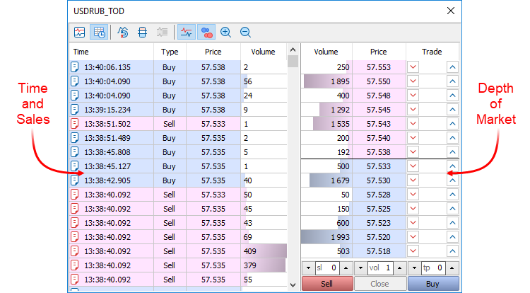
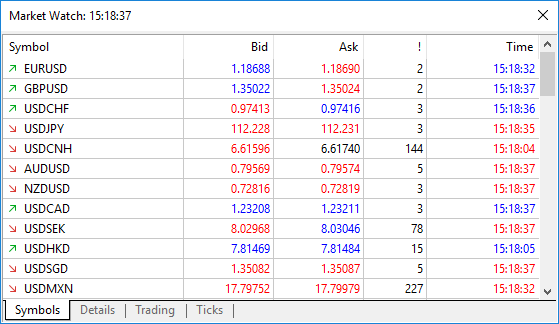
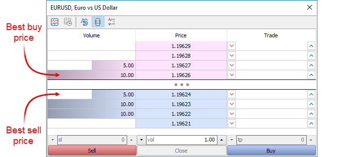
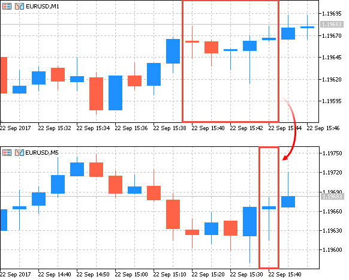

[🏠 Document Start](../../../README.md) / [MetaTrader 5 Trading Platform](../../../MetaTrader-5-Trading-Platform.md) / [Platform Setup](../../Platform-Setup.md) / [General Information](../General-Information.md) / Price Data

[Previous](Trading-System.md) | [Next](Working-with-Instructions.md)

# Price Data in the MetaTrader 5 Platform (#price-data-in-the-metatrader-5-platform)

Three basic prices of a financial instrument are used in the trading platform:

  * Bid is the highest price at which a trader can sell a financial instrument. It is the best price at which a financial symbol can be sold.
  * Ask is the lowest price at which a trader can buy a financial instrument. It is the best price at which a financial symbol can be bought.
  * Last is the price of the last deal executed on a financial instrument.

A financial symbol can be traded on the exchange and over-the-counter (OTC) market. Different approaches to symbol quote and charting are used depending on the market.

## Exchange Market with the Market Depth (#exchange-market-with-the-market-depth)

The only source of quotes in the exchange market is the Exchange itself. Buyers and sellers meet on the exchange, which keeps records of all executed deals. Orders of all market participants comprise a single Market Depth.

A Market Depth option featuring real orders of market participants is available in the trading platform for exchange traded symbol. Based on the best orders, the Bid and Ask prices are formed in the Market Depth (these prices are shown in the Market Watch window). Also, the exchange provides prices and volumes of last executed deals (Last and Volume). Last prices are used for creating price charts and for displaying the Time & Sales tape:

Although symbol charts are based on Last prices, traders execute deals at Bid and Ask prices (actual prices available in the market).

## Over-The-Counter Market (#over-the-counter-market)

Participants of the OTC market are big market players, such as banks and prime brokerages. They form networks to trade with each other. Medium market participants, such as banks, management companies and hedge funds connect to large participants. Market participants aggregate prices of their counterparties or they set their own prices based on counterparties' prices, and provide these prices to their clients.

Only Bid and Ask stream quotes are used in OTC market trading, without data on actual executed deals. Charts are based on Bid prices.

## Over-The-Counter Market with the Market Depth (#over-the-counter-market-with-the-market-depth)

Unlike the previous variant, the broker provides traders information on volumes in addition to Bid and Ask prices, which allows displaying the Market Depth. The exchange Market Depth consists of limit orders of market participants, while OTC Market Depth is formed based on the broker's quotes. The broker provides different prices depending on the buying and selling volume.

The exchange does not participate in trading and does not keep record of performed trades, therefore no Last prices are available in this mode. Charts are based on Bid prices.

## How Price Charts Are Formed (#charts)

One-minute bars are formed based on symbol quotes (or ticks). This bar represents a set of price characteristics of one minute:

  * 4 prices: Low and High price during this minute, as well as the beginning and the end of the bar, i.e. the Open and Close prices
  * Spread, which is the minimum difference between Bid and Ask recorded during one minute
  * Tick volume, which shows the number of ticks received during bar formation
  * Volume, i.e. the real volume of deals performed during bar formation (may be not available for OTC markets)
  * Date and time, i.e. the minute to which this bar corresponds

One-minute bars are based on Bid prices for OTC symbols, and are based on Last prices for exchange instruments.

In addition to one-minute bars, price charts in the trading platform can be displayed as larger time intervals. The time included in one bar or candlestick on the chart, is called a timeframe. The platform supports 21 timeframes from 1 minute to a 1-month period.

The trading platform only stores 1-minute bars. All higher timeframes are created based on these bars. This approach ensures compliance of data at all periods, as well as allows to significantly save traffic and disk space.

