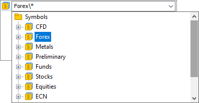

[🏠 Document Start](../../../README.md) / [MetaTrader 5 Trading Platform](../../../MetaTrader-5-Trading-Platform.md) / [Platform Setup](../../Platform-Setup.md) / [General Information](../General-Information.md) / Specifying Symbols and Groups

[Previous](Working-with-Instructions.md) | [Next](Data-Export.md)

# Specifying Symbols and Groups (#specifying-symbols-and-groups)

A standard way of specifying [symbols](../Symbols.md) and [groups](../Groups.md) is used in different sections of the server administration:

The mask ("*" symbol) and paths to financial instruments and groups are used here, since they can have certain hierarchy in the system. For example, there is a group of instruments "Forex" that has symbols in it divided into the "Majors" and "Crosses" sections. In order to specify all the symbols from the "Majors" group, the following entry is necessary — "Forex\Major\*". This kind of paths are substituted automatically if a group or symbol is chosen from the list. The "*" symbol means all the instrument/groups from the specified group.

## "*" Mask and "!" Negation Sign (#mask)

The "*" mask and the '!' negation sign are used for making extended requests. For example, they can be used when specifying symbols to be translated from a [data feed (#symbols)](../Data-Feeds/Configuration-of.md#symbols) or a [gateway (#translation)](../Gateways/Configuration-of.md#translation), when specifying symbols for the [synchronization of price data (#symbols)](../Synchronization.md#symbols) and when [configuring holidays (#symbols)](../Holidays.md#symbols). Here are several examples of specification:

  * ,*, — all the symbols;
  * ,EUR* — all the symbols where EUR is the base currency;
  * ,EUR*,!EURUSD — all the symbols where EUR is the base currency except EURUSD;
  * ,EURUSD,GBPUSD — only specified symbols. One can specify any number of symbols separated by comma;
  * ,*USD — all the symbols where USD is the quoting currency.

To exclude symbols using "!" on data feeds and gateways, you should specify the full path of these symbols. For example, to specify all symbols from the Cboe FX subgroup, except for the EURUSD symbol located in the same subgroup, use the string "Cboe FX\*,!Cboe FX\EURUSD". The string "Cboe FX\*,!EURUSD" will be invalid. Also, the exception does not work for a single "*" mask. It always allows all symbols:

  * Forex\*,!Forex\EURUSD — all symbols in the Forex subgroup, except EURUSD.
  * *,!Forex\EURUSD — all symbols. The EURUSD symbol will not be excluded.

