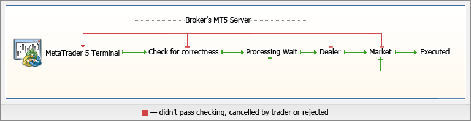
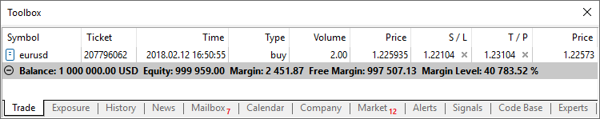
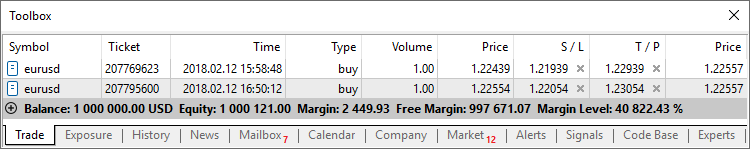
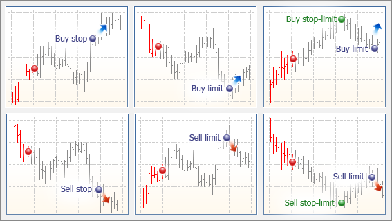
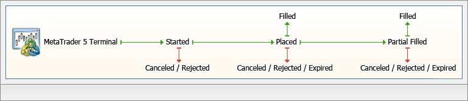

[🏠 Document Start](../../../README.md) / [MetaTrader 5 Trading Platform](../../../MetaTrader-5-Trading-Platform.md) / [Platform Setup](../../Platform-Setup.md) / [General Information](../General-Information.md) / Trading System

[Previous](../General-Information.md) | [Next](Price-Data.md)

# Trading System (#trading-system)

Before you proceed with administration of the platform, please get acquainted with the basics of its trading system.

## Trade Operation Types (#trade-operation-types)

The platform has three types of trade operations: [order](../Orders.md), [deal](../Deals.md) and [position](../Positions.md). There is a separate section to manage each of them in the administrator terminal.

  * An order is an instruction given to a broker to buy or sell a financial instrument. There are two main [types of orders (#order-type)](Trading-System.md#order-type): Market and Pending. In addition, there are special [Take Profit (#take-profit)](Trading-System.md#take-profit) and [Stop Loss (#stop-loss)](Trading-System.md#stop-loss) levels.
  * A deal is the commercial exchange (buying or selling) of a financial security. Buying is executed at the demand price (Ask), and Sell is performed at the supply price (Bid). A deal can be opened as a result of market order execution or pending order triggering. Note that in some cases, execution of an order can result in several deals.
  * A position is a trade obligation, i.e. the number of bought or sold contracts of a financial instrument. A long position is financial security bought expecting the security price go higher. A short position is an obligation to supply a security expecting the price will fall in future.

## Interrelation of orders, deals and positions (#interrelation-of-orders-deals-and-positions)

The platform allows you to easily track how a position was opened or how a deal was performed. Each trading operation has its unique ID called a "ticket". Each order and deal receive a ticket relating to their relevant position. Each deal receives a ticket of an order, by which it was concluded.

If a position was affected by multiple deals, for example in the case of a partial closing or increasing volumes, each of the deals feature the position's ticket. This makes it easy to track the entire history of the position as a whole.

If trading operations are sent to an exchange or a liquidity provider, they additionally feature an ID from an external system. This allows additional tracking of the interrelation of operations away from the platform.

## A General Scheme of Trading Operations (#a-general-scheme-of-trading-operations)

  * From the client terminal, an order is sent to a broker to execute a deal with the specified parameters;
  * The correctness of an order is checked on the server (correctness of prices, availability of funds on the account, etc.);
  * Orders that have passed the check wait to be processed on the trade server. Then the order can be:

  * executed (in one of automatic [execution (#execution-type)](Trading-System.md#execution-type) modes or by a dealer)
  * canceled upon expiry
  * rejected (e.g. when money is not enough or there is no suiting offer in the market; or rejected by the dealer)
  * canceled by a trader;
  * A deal is the result of the execution of a market order or triggering of a pending order;
  * If there are no positions for a symbol, conclusion of a deal results in opening of a position. If there is a position for the symbol, the deal can increase or reduce the position volume, close the position or reverse it.

## Position Accounting System (#position-type)

Two position accounting systems are supported in the trading platform: Netting and Hedging. The system used is determined by the [client group settings (#risk)](../Groups/Group-Settings.md#risk).

### Netting System (#netting)

With this system, you can have only one common position for a symbol at the same time:

  * If there is an open position for a symbol, executing a deal in the same direction increases the volume of this position.
  * If a deal is executed in the opposite direction, the volume of the existing position can be decreased, the position can be closed (when the deal volume is equal to the position volume) or reversed (if the volume of the opposite deal is greater than the current position).

It does not matter, what has caused the opposite deal — an executed market order or a triggered pending order.

The below example shows execution of two EURUSD Buy deal 0.5 lots each:

Execution of both deals resulted in one common position of 1 lot.

### Hedging System (#hedging)

With this system, you can have multiple open positions of one and the same symbol, including opposite positions.

If you have an open position for a symbol, and execute a new deal (or a pending order triggers), a new position is additionally opened. Your current position does not change.

The below example shows execution of two EURUSD Buy deal 0.5 lots each:

Execution of these deals resulted in opening two separate positions.

### Impact of the System Selected (#impact-of-the-system-selected)

Depending on the position accounting system, some of the platform functions may have different behavior:

  * [Stop Loss and Take Profit inheritance (#sltp-inherit)](Trading-System.md#sltp-inherit) rules change.
  * To close a position in the netting system, you should perform an opposite trading operation for the same symbol and the same volume. To close a position in the hedging system, explicitly select the "Close Position" command in the context menu of the position.
  * A position cannot be reversed in the hedging system. In this case, the current position is closed and a new one with the remaining volume is opened.
  * In the hedging system, a new condition for margin calculation is available — [Hedged margin (#hedged)](../Symbols/Symbol-Settings/Trade/Margin-Calculation/Retail-Forex-CFD-Futures-—-Hedging.md#hedged).

## Types of Orders (#order-type)

The trading platform allows to prepare and issue requests for the broker to execute trading operations. In addition, the platform allows to control and manage open positions. Several types of trading orders are used for these purposes. An order is a trader's instruction to the broker to perform a trade operation. In the platform, orders are divided into two main types: market and pending. In addition, there are special [Stop Loss (#stop-loss)](Trading-System.md#stop-loss) and [Take Profit (#take-profit)](Trading-System.md#take-profit) orders.

### Market Order (#market-order)

A market order is an instruction given to a brokerage company to buy or sell a financial instrument. Execution of this order results in the execution of a deal. The price at which the deal is executed is determined by the [type of execution (#execution-type)](Trading-System.md#execution-type) that depends on the symbol type. Generally, a security is bought at the Ask price and sold at the Bid price.

### Pending Order (#pending-order)

A pending order is the trader's instruction to a brokerage company to buy or sell a security in future under pre-defined conditions. The following types of pending orders are available:

  * Buy Limit — a trade request to buy at the Ask price that is equal to or less than that specified in the order. The current price level is higher than the value specified in the order. Usually this order is placed in anticipation of that the security price will fall to a certain level and then will increase;
  * Buy Stop — a trade order to buy at the "Ask" price equal to or greater than the one specified in the order. The current price level is lower than the value specified in the order. Usually this order is placed in the anticipation that the price will reach a certain level and will continue to grow; 
  * Sell Limit — a trade order to sell at the "Bid" price equal to or greater than the one specified in the order. The current price level is lower than the value specified in the order. Usually this order is placed in anticipation of that the security price will increase to a certain level and will fall then;
  * Sell Stop — a trade order to sell at the "Bid" price equal to or less than the one specified in the order. The current price level is higher than the value in the order. Usually this order is placed in anticipation of that the security price will reach a certain level and will keep on falling.
  * Buy Stop Limit — this type is the combination of the first two types, being a stop order to place a Buy Limit order. As soon as the future Ask price reaches the stop-level indicated in the order (the Price field), a Buy Limit order will be placed at the level, specified in Stop Limit price field. A stop level is set above the current Ask price, while Stop Limit price is set below the stop level.
  * Sell Stop Limit — this order is a stop order to place a Sell Limit order. As soon as the future Bid price reaches the stop-level indicated in the order (the Price field), a Sell Limit order will be placed at the level, specified in Stop Limit price field. A stop level is set below the current Bid price, while Stop Limit price is set above the stop level.

  * For symbols with Exchange Stocks, Exchange Futures and Futures Forts [calculation modes (#calculation)](../Symbols/Symbol-Settings/Trade.md#calculation), all types of pending orders are triggered according to the rules of the exchange where trading is performed. Usually, Last price (price of the last performed transaction) is applied. In other words, an order triggers when the Last price touches the price specified in the order. But note that buying or selling as a result of triggering of an order is always performed by the Ask and Bid prices respectively.
  * In the "Exchange execution" mode, the price specified when placing limit orders is not verified. It can be specified above the current Ask price (for the Buy Limit orders) and below the current Bid price (for the Sell Limit orders). When placing an order with such a price, it triggers almost immediately and turns into a market one. However, unlike market orders where a trader agrees to perform a deal by a non-specified current market price, a pending order will be executed at a price no worse than the one specified.
  * If during pending order activation the corresponding market operation cannot be executed (for example, the free margin on the account is not enough), the pending order will be canceled and moved to history with the "Rejected" status.

  
---  
  

 | — current market state |  | — forecast  
---|---|---|---  
 | — current price |  | — order price  
 |  — price, reaching which a pending order will be placed  
 |  — expected growth |  | — expected fall  
  

### Take Profit (#take-profit)

The Take Profit order is intended for gaining the profit when the security price reaches a certain level. Execution of this order results in the complete closing of the entire position. It is always connected to an open position or a pending order. The order can be requested only together with a market or a pending order. This order condition for long positions is checked using the Bid price (the order is always set above the current Bid price), and the Ask price is used for short positions (the order is always set below the current Ask price).

### Stop Loss (#stop-loss)

This order is used for minimizing losses if the security price moves the wrong direction. If the security price reaches this level, the entire position is closed automatically. Such orders are always associated with an open position or a pending order. They can be requested only together with a market or a pending order. This order condition for long positions is checked using the Bid price (the order is always set below the current Bid price), and the Ask price is used for short positions (the order is always set above the current Ask price).

> If during Take Profit or Stop Loss activation the corresponding market operation cannot be executed (for example, it is rejected by the exchange), the order will not be deleted. It will trigger again at the next tick corresponding to the order activation conditions.

### Rules of Stop Loss and Take Profit inheritance ([netting (#netting)](Trading-System.md#netting)): (#rules-of-stop-loss-and-take-profit-inheritance-nettingtrading-systemmdnetting)

  * When a position volume is increased or the position is reversed, Take Profit and Stop Loss are placed according to its latest order (market or triggered pending order). In other words, stop levels in each subsequent order of the same position replace previous ones. If zero values are specified in the order, Stop Loss and Take Profit of a position will be deleted.
  * If a position is partially closed, Stop Loss and Take Profit are not changed by the new order.
  * If a position is fully closed, the Stop Loss and Take Profit levels are deleted, because they are associated with an open position and cannot exist without it.
  * When a trade operation is executed for a symbol, for which there is a position, the current Stop Loss and Take Profit of the open position are automatically inserted in the order placing window. This is aimed to prevent accidental deletion of current stop orders.
  * During one click trading operation (from a panel on the chart or from the Market Watch) for the symbol, for which there is a position, the current values of Stop Loss and Take Profit are not changed.
  * On the OTC markets (Forex, CFD, Futures), when a position is moved to the next trading day (the swap), including swap through re-opening, the levels of Stop Loss and Take Profit remain unchanged.
  * On the exchange market, when a position is moved to the next trading day (the swap), as well as when moved to another account or during delivery, the levels of Stop Loss and Take Profit are reset.

### Stop Loss and Take Profit inheritance rule ([hedging (#hedging)](Trading-System.md#hedging)): (#stop-loss-and-take-profit-inheritance-rule-hedgingtrading-systemmdhedging)

  * If a position is partially closed, Stop Loss and Take Profit are not changed by the new order.
  * If a position is fully closed, the Stop Loss and Take Profit levels are deleted, because they are associated with an open position and cannot exist without it.
  * t0>During one click trading operation (from a panel on the chart or Depth of Market), the Stop Loss and Take Profit levels are not set.

These rules apply both when trading manually and when placing orders from Expert Advisors (MQL5 programs).

  * Activation of Take Profit or Stop Loss results in the complete closing of the entire position.
  * For symbols with Exchange Stocks, Exchange Futures and Futures Forts [calculation modes (#calculation)](../Symbols/Symbol-Settings/Trade.md#calculation), Stop Loss and Take Profit orders are triggered according to the rules of the exchange where trading is performed. Usually, Last price (price of the last performed transaction) is applied. In other words, a stop-order triggers when the Last price touches the specified price. However note that buying or selling as a result of activation of a stop-order is always performed by the Bid and Ask prices.

  
---  
  

## State of Orders (#order-state)

After an order has been formed and sent to a trade server, it can undergo the following stages:

  * Started — the order correctness has been checked, but it hasn't been yet accepted by the broker;
  * Placed — a dealer has accepted the order;
  * Partially filled — the order is filled partially;
  * Filled — the entire order is filled;
  * Canceled — the order is canceled by the client;
  * Rejected — the order is rejected by a dealer;
  * Expired — the order is canceled due to its expiration.

You can view the state of orders in the [corresponding section (#state)](../Orders.md#state).

## Types of Execution (#execution-type)

Four [order execution modes](../Symbols/Symbol-Settings/Execution.md) are available in the trading platform:

  * Instant Execution  
In this mode, an order is executed at the price offered to a broker. When sending an order to be executed, the platform automatically adds the current prices to the order. If the broker accepts the prices, the order is executed. If the broker does not accept the requested price, a "Requote" is sent — the broker returns prices, at which this order can be executed.
  * Request Execution  
In this mode, a market order is executed at the price previously received from a broker. Prices for a certain market order are requested from the broker before the order is sent. After the prices have been received, order execution at the given price can be either confirmed or rejected.
  * Market Execution  
In this order execution mode, a broker makes a decision about the order execution price without any additional discussion with a trader. Sending an order in such a mode means advance consent to its execution at this price.
  * Exchange Execution  
In this mode, trade operations conducted in the trading platform are sent to an external trading system (exchange). Trade operations are executed at the prices of current market offers.

## Fill Policy (#fill-policy)

In addition to common rules of order execution set by a broker, a trader can indicate additional conditions. The available fill policies are determined by the [symbol settings (#fill-policy)](../Symbols/Symbol-Settings/Trade.md#fill-policy).

  * Fill or Kill (FOK)  
This fill policy means that an order can be filled only in the specified volume. If the necessary amount of a financial instrument is currently unavailable in the market, the order will not be executed. The required volume can be filled by several offers available in the market at the moment.
  * Immediate or Cancel (IOC)  
In this case a trader agrees to execute a deal with the volume maximally available in the market within that indicated in the order. In case the order cannot be filled completely, the available volume of the order will be filled, and the remaining volume will be canceled. The possibility of using IOC orders is determined on the trade server.
  * Book or Cancel (BOC)  
The BOC policy indicates that the order can only be placed in the Depth of Market (order book). If the order can be filled immediately when placed, this order is canceled. This policy guarantees that the price of the placed order will be worse than the current market. BOC is used to implement passive trading: it is guaranteed that the order cannot be executed immediately when placed and thus it does not affect current liquidity. This fill policy is only supported for limit and stop limit orders.
  * Return  
This policy is only used for market (Buy and Sell), [limit and stop limit orders (#pending-order)](Trading-System.md#pending-order). If filled partially, an order with the remaining volume is not canceled, and is processed further. For market orders, the Return policy is used only in the Exchange Execution [mode (#execution-type)](Trading-System.md#execution-type), while for limit and stop limit ones, it is applied in the Market Execution and Exchange Execution modes.

Use of fill policies depending on the execution type can be shown as the following table:

Type of Execution/Fill Policy | Fill or Kill | Immediate or Cancel | Book or Cancel | Return  
---|---|---|---|---  
Instant Execution | + | — | — | —  
Request Execution | + | — | — | —  
Market Execution | + | + | — | +  
Exchange Execution | + | + | + | +
