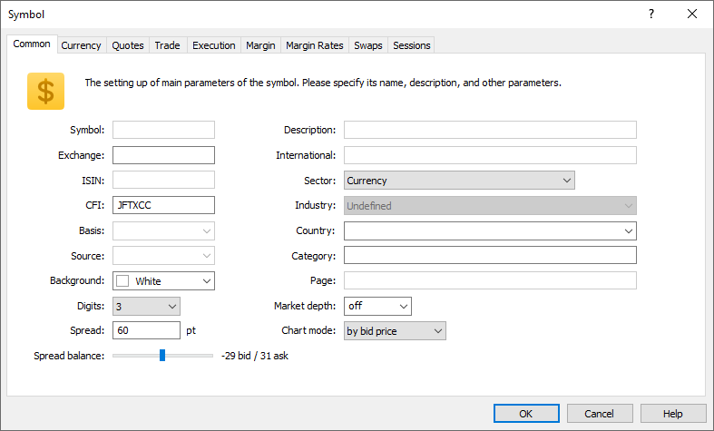

[🏠 Document Start](../../../README.md) / [MetaTrader 5 Trading Platform](../../../MetaTrader-5-Trading-Platform.md) / [Platform Setup](../../Platform-Setup.md) / [General Information](../General-Information.md) / Working with Instructions

[Previous](Price-Data.md) | [Next](Specifying-Symbols-and-Groups.md)

# Working with Instructions (#working-with-instructions)

There are several methods of working with instructions in different sections of platform administration. Depending on the selected section of administering, the instruction can be an [account](../Accounts.md), a [group](../Groups.md), a [holiday](../Holidays.md), a directive that allows or prohibits [access](../Security/Firewall.md), etc.

## Creating Instructions on the Basis of Existing Ones (#creating-instructions-on-the-basis-of-existing-ones)

In order to avoid specifying common parameters of an instruction each time it is created, one can create it on the basis of an existing one by changing its key parameter. For example, if you open the "EURUSD" [symbol](../Symbols.md) for editing by a double click of the mouse or using the " Edit" command, change its name to "EURGBP" and save it, you will get a new symbol with the settings similar to "EURUSD".

Key fields for different instructions are listed below:

  * [IP Access](../Security/Firewall.md) — "From", "To";
  * [Holidays](../Holidays.md) — "Date", "Time", "Description";
  * [Groups](../Groups/Group-Settings.md) — "Name";
  * [Managers (#common)](../Managers.md#common) — "Login";
  * [Routing](../Routing.md) — "Name";
  * [Gateways](../Gateways.md) — "Name";
  * [Plugins](../Plugins.md) — "Name";
  * [Data Feeds (#common)](../Data-Feeds/Configuration-of.md#common) — "Name";
  * [Symbols](../Symbols/Symbol-Settings/Common.md) — "Symbol";
  * [Synchronization (#common)](../Synchronization.md#common) — "Server".

## Group Work with Instructions (#groupwork)

The administrator terminal allows to change the settings of instructions of a selected section in bulk. To do it, one should select the necessary instructions using the mouse with "Shift" and "Ctrl" keys and start editing them by executing the " Edit" command.

Some fields may be blocked when opening multiple instructions for editing. This means that those fields cannot be changed for multiple instructions simultaneously:

At that the values of the very upper instruction are displayed in the rest of the fields. Any value of edited instructions is changed only if the user changes its value. All the other fields remain unchanged. 
