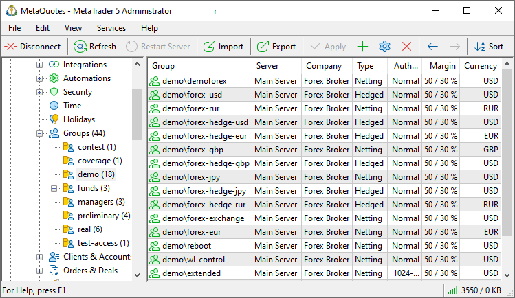
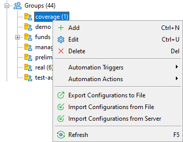

[🏠 Document Start](../../README.md) / [MetaTrader 5 Trading Platform](../../MetaTrader-5-Trading-Platform.md) / [Platform Setup](../Platform-Setup.md) / Groups

[Previous](Leverages.md) | [Next](Groups/Group-Settings.md)

# Groups (#groups)

All the system users are divided into groups. There can be no users on the server, who are not included into any of groups. The system contains the following default structure of groups:

  * demo — section for [demo (#demo)](Groups/Group-Types.md#demo) groups;

  * demoforex — groups of demo groups for FOREX
  * managers — section for [manager (#manager)](Groups/Group-Types.md#manager) groups;

  * administrators — group of administrators' accounts (maximal permissions in the system);
  * dealers — group of dealer accounts;
  * real — section for [real (#real)](Groups/Group-Types.md#real) groups;

  * real — group of accounts for live trading.
  * preliminary — group where [preliminary (#preliminary)](Groups/Group-Types.md#preliminary) accounts are created, when a request for opening a real account is sent from the client terminal.

The groups are represented in a table with the following fields:

  * Group — group title;
  * Server — [trade server](Network-cluster.md) that serves this group;
  * Authorization — method of authorization fro this group;
  * Currency — default [deposit currency (#currency)](Groups/Group-Settings.md#currency) for this group. Then you can change the deposit currency for any account.

## Hierarchy of Groups (#hierarchy)

Groups of accounts can be divided into sections and sub-sections depending on their types. There are three default sections: "demo", "managers" and "real". Group sections are created when groups are created.

In the "Groups" section select " Add" which will open a dialog window. In the ["Name" (#name)](Groups/Group-Settings.md#name) field specify path to the group. For example, if you specify "real\IB\realUSD" in section "real" the sub-section "IB" will be created with group "realUSD" inside it. If one or several higher level sections do not exist by the moment of group creation, they will be created.

in order to delete a sections, delete all groups inside it.

## Managing Groups (#managing-groups)

Groups management is performed in the right part of the administrator terminal.

  * Add  
In order to add a group, enter the corresponding section and execute the " Add" command in the [Edit](../MetaTrader-5-Administrator/User-Interface/Main-Menu/Edit.md) menu, on the [toolbar](../MetaTrader-5-Administrator/User-Interface/Toolbar.md) or in the context menu. After that the window of [group setting](Groups/Group-Settings.md) will be opened.
  * Edit  
In order to edit a group, select it and execute the " Edit" command in the [Edit](../MetaTrader-5-Administrator/User-Interface/Main-Menu/Edit.md) menu, on the [toolbar](../MetaTrader-5-Administrator/User-Interface/Toolbar.md) or in the context menu. After that the window of [group setting](Groups/Group-Settings.md) will be opened. The group editing window can be called by a double left click on its name in the list. You can also edit several groups [together (#groupwork)](General-Information/Working-with-Instructions.md#groupwork). To do this select them using the mouse and keys "Ctrl" or "Shift", and execute command " Edit".
  * Delete  
In order to delete a group, select it and execute the " Delete" command in the [Edit](../MetaTrader-5-Administrator/User-Interface/Main-Menu/Edit.md) menu, on the [Standard](../MetaTrader-5-Administrator/User-Interface/Toolbar/Standard.md) toolbar or the context menu. You can delete several groups at once by selecting them using the mouse and keys "Ctrl" or "Shift".

  * You can't delete a group that contains at least one [account](Accounts.md).

  * Additional general information about working with configuration records is given in the ["Working with Instructions"](General-Information/Working-with-Instructions.md) section.

  
---  
  

## Context Menu (#context)

The context menu in the list of groups allows executing the following commands:

  * Servers — using this command, one can filter the groups displayed in the list by the trade server they belong to. A list containing all trade servers of the platform will be opened as soon as it is executed.
  *  Add — add a new group;
  *  Edit — edit a selected group;
  *  Delete — delete a selected group;
  *  Move Up — move a selected group up relative to others;
  *  Move Down — move a selected group down relative to others;
  *  Sort Alphabetically — sort configurations alphabetically. Please note that sorting is done on the server, not in the local terminal.
  * Automation triggers — create an [automation](Automations.md) task for the selected event or edit an existing one. The menu displays only the triggers and tasks associated with the current section.
  * Automation actions — add an automation action to an existing task or create a new task based on the action. The menu displays only the actions associated with the current section.
  *  Export to File — [export](General-Information/ImportExport-Settings.md) group settings to a file.
  *  Import from File — [import (#import)](General-Information/ImportExport-Settings.md#import) group settings to a file.
  *  Import from Server — start [importing groups](Groups/Import-of.md) from a remote MetaTrader 5 or MetaTrader 4 server;
  * Request — open the sub-menu for requesting [journal](Network-cluster/Journal.md) entries for the selected group:

  *  Journal — request all journal entries on the group;
  * Orders — request journal entries about the [orders](Orders.md) of the group;
  * Deals — request journal entries about the [deals](Deals.md) of the group;
  * Positions — request journal entries about the [positions](Positions.md) of the group;
  *  Find — open the [search](../MetaTrader-5-Administrator/User-Interface/Search.md) window;
  * Auto Arrange — if this option is enabled the size of columns is selected automatically;
  * Grid — this option shows/hides field separators in the table with groups.

