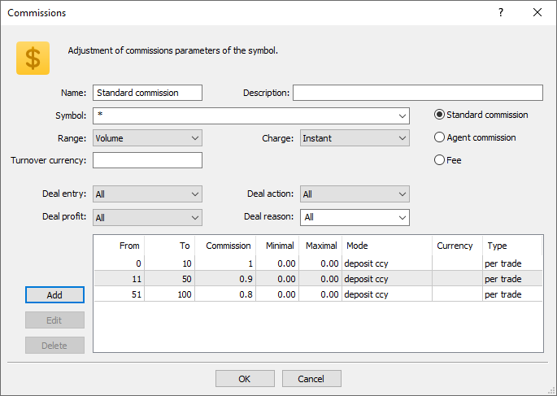

[🏠 Document Start](../../../README.md) / [MetaTrader 5 Trading Platform](../../../MetaTrader-5-Trading-Platform.md) / [Platform Setup](../../Platform-Setup.md) / [Groups](../Groups.md) / Commission Settings

[Previous](Group-Symbol-Settings/Swaps.md) | [Next](Commission-Settings/Commission-Calculation.md)

# Commission Settings (#commission-settings)

Commission for processing trading operations is the main source of revenue for brokers. The MetaTrader 5 platform provides extensive opportunities for flexible commission settings: depending on deal size, total turnover, profitability, trade direction and other parameters.

To set up commission charges, select the appropriate tab in [group settings (#commissions)](Group-Settings.md#commissions).

## Common Settings (#common-settings)

The following parameters belong here:

  * Name — name of commissions.
  * Description — description of commissions. This text description will be used as a comment to commission [deals](../Deals.md), performed at client accounts. Comments are only for deals related to daily and monthly charging of standard commission. Please note that the maximum length of a comment to a deal is 31 characters. If a commission description exceeds this length, part of it will be cut off when copied to a deal comment.
  * Symbol — symbols, from trading operations of which commission will be charged. As soon as you click on this field, a standard list of [symbol selection](../General-Information/Specifying-Symbols-and-Groups.md) will appear. Symbols can be specified using [masks (#mask)](../General-Information/Specifying-Symbols-and-Groups.md#mask). The maximum line length is 127 characters.

## Commission Type (#type)

There are three types of commissions available in the platform: standard, agent and fee.

### Standard commission (#standard-commission)

This type of commission is charged by a broker for the clients' trades;

### Agent commission (#agent-commission)

This commission is charged by agents. The payment is made from the brokerage funds. Each account has the [Agent account (#agent-account)](../Accounts/Editing-Account.md#agent-account) field, in which the number of the appropriate agent account can be specified. Commissions of all trades conducted on this trading account will be transfered to the Agent account in accordance with the commission settings.

### Fee (#fee)

The fee is similar to standard commission: it is also charged by a broker per trader’s deals and has the same settings and the calculation principle. The differences are as follows:

  * Fees can only have [the "Instant" calculation mode (#charge)](Commission-Settings.md#charge).
  * The amount is written to the separate "Fee" field, while the standard commission appears in the "Commission" field.

Fees allow splitting deal commissions for a separate accounting. For example, this option can be used when part of commission is charged by the brokerage company, and the other part is payable to an external system (exchange) the broker is integrated with.

  * Standard commissions and fees are charged for the profit of the brokerage company from the accounts of clients that perform trade operations.
  * Agent commissions are not charged from the accounts of clients that perform trade operations. They are charged to agent accounts by the brokerage company in the form of balance deals.

  
---  
  

## Charging Commissions (#charge)

Commission can be charged immediately after each trade, or it can be accumulated during the trading day or month and then charged in one operation. Select the desired option in the "Charge" field:

  * Instant — commissions are charged instantly during execution of each deal (both when entering and exiting positions). The value of the standard commission charged instantly is displayed in the Commission field of [deals](../Deals.md). Agent commissions are charged as separate balance operations (["Agent commission" deals (#action)](../Deals.md#action)). In case of an instant charge, commission levels can be specified only as volume. No other options are available in the Charge field.
  * Daily — the commission amount is accumulated during a day in a special field of a client record. At [the end of the day (#end-of-day)](../Network-cluster/Configuring-Servers/Trade-Server.md#end-of-day) the accumulated amount is charged from the account with a separate balance operation (a deal of the Daily commission or Daily agent commission type). A more detailed description of the process of commission charging is given in the ["Commission calculation"](Commission-Settings/Commission-Calculation.md) section.
  * Monthly — the commission amount is accumulated during a month in a special field of a client record. At the end of the month the accumulated amount is charged from the account with a separate balance operation (a deal of the Monthly commission or Monthly agent commission type). A more detailed description of the process of commission charging is given in the ["Commission calculation"](Commission-Settings/Commission-Calculation.md) section.

  * Only executed (filled) volume is used for calculation of turnover or single trade operations. Unfilled volume of orders is ignored for calculation of commissions.
  * Commissions are charged for deals executed in both directions (both when opening/increasing volume of a position and when closing/partially closing a position).

  * Commission charging should only be changed from daily/monthly to instant when there are no accumulated commissions on accounts. Otherwise, all accumulated commissions will be reset to zero at [the end of the trading day (#eod)](../Network-cluster/Configuring-Servers/Trade-Server.md#eod), and will not be deducted from the accounts.

  
---  
  

## Filters by deal types (#deals)

In the instant mode, you can additionally specify the parameters of deals from which the commission will be charged:

  * Deal entry — direction of deals, to which the commission shall apply. This option is only available for instant commissions. If the value is "In", commission will only be charged on entry deals; if "Out" — commission will apply to exit deals; "All" (default) — all deals. For reversal deals with the in/out type, "In" means that commission is only charged on the volume of the newly opened position, "Out" means commission on the closed volume. The following rules apply to Close By deals:
    * No commission is charged on Close By deals when "All" or "In" is selected, since the commission is charged on two original deals. For example, a commission of USD 1 is charged on each deal. When a trader performs an entry Buy 1.00 EURUSD deal and an entry Sell 1.00 EURUSD deal, a commission of 2 USD will be charged. When the 1.00 EURUSD position is closed by the Sell 1.00 EURUSD position, the client will not be charged additional commission.
    * If "Out" is selected, commission on both Close By deals will be charged, and the total commission value is written to the main exit deal (in which profit/loss is specified). For example, a commission of USD 1 is charged on each deal. When a trader performs an entry Buy 1.00 EURUSD deal and an entry Sell 1.00 EURUSD deal, no commission will be charged. When the 1.00 EURUSD position is closed by the Sell 1.00 EURUSD position, a commission of USD 2 will be charged. A commission of 2 USD will be specified in the first 'out by' deal, and a zero commission will be specified in the second deal.
  * Deal action — type of deals, to which the commission shall apply: buy, sell, or both. This option is only available for instant commissions.
  * Deal profit — filter deals by their financial result. For example, you can charge a commission only on deals which generated a profit.
  * Deal reason — filter by deal execution [reasons (#reason)](../Deals.md#reason). For example, you can reduce commissions for deals performed by trading robots to encourage algorithmic trading. Alternatively, you can charge an additional commission for deals processed through a dealer.

## Commission Levels (#level)

Commissions can be multilevel, i.e. vary depending on the deal volume, turnover, profit, etc. Select the required condition in the "Range parameter":

  * Volume — deal volume (number of lots). For example, if you set levels as 0 — 10 and 12 — 20, a 15-lot deal will be subject to the second level commission.
  * Turnover Money — turnover in money over the period specified in the Charge field (day or month). For example, the levels are set as 0 — 500, 501 — 1000, and commission is charged on a monthly basis. The first-level commission will be charged until the total cost of the client's operations exceeds 500 units. As soon as the money turnover exceeds the value of 500, commission for all deals per period is recalculated according to the second level.  
By default, the money turnover is calculated in the group deposit currency: the price of each trade is calculated and converted into the deposit currency. For example, the price of Buy 1 lot EURUSD with a contract size of 100,000 is 100,000 EUR. If the client's deposit currency is USD, the position price is converted at EURUSD at the time of the transaction (in this case, it is the transaction price). If commission is to be charged on the turnover in some certain currency regardless of the group deposit, set it in the Currency field. Commission ranges will be based on the turnover in the specified currency. When calculating commissions, the deal price is also converted into that currency.
  * Turnover Volume — total volume of trading operations (number of lots) for the period specified in the Charge field (day or month).
  * Notional value — the value of a deal, calculated depending on the [symbol's margin/profit calculation method (#calculation)](../Symbols/Symbol-Settings/Trade.md#calculation).  
  
For the symbols with the Forex calculation type, the value is calculated in the base symbol currency and is equal to the product of the contract size and the volume. For example, for EURUSD with the contract size of 100,000, the value of 1 lot is equal to 100,000 EUR.  
  
For the symbols with the CFD, CFD Leverage, CFD Index and Futures type, the value is also calculated in the base currency. Since the contract size of such instruments is not expressed in money (it can be expressed, for example, in the amount of assets), the contract size is additionally multiplied by the instrument price to obtain the value in monetary terms. For Futures symbols, the final value is additionally multiplied by the ratio of tick value to tick size. For example, if some Futures symbol has USD as the base currency, the contract size is equal to 100, the cost is 33, and the tick value to tick size ratio is 1/0.1, the value of one lot of the position is equal to 100*33*10 = USD 33,000. For a CFD symbol with the same parameters, one lot size would be 100*33 = USD 3,300.   
  
If the symbol base currency differs from the turnover currency specified in commission settings, the calculated value will be additionally converted using the relevant exchange rate.  
  
Example: levels 0 — 9,999 and 10,000 — 1,000,000 are specified. GBP is specified as the currency. Commission is charged instantly. The trader executes a GBPUSD 1.0 Buy deal at 1.34644, with a contract size 10,000. The deal value is 1 * 10,000 = GBP 10,000. No conversion is needed here, as the base currency matches the selected one. The deal falls into the second range of commission.  

  * Profit — profit/loss of the deal or the total profit/loss of a client's deals for a day or month, depending on the selected commission charging mode. The currency in which the level will be indicated and to which the profit will be converted, is specified in the field below.
  * Turnover currency — settlement currency. The group deposit currency is used by default (if no other currency is specified).

  * The value of the client's deals will be converted to this currency when calculating [turnover in money (#turnover-money)](Commission-Settings.md#turnover-money). Accordingly, commission levels will be specified in this currency. 
  * It is used when setting up levels based on the deal value.

Commission levels are configured at the bottom of the window.

In the From and To fields, set the minimum and maximum values for the range. The value is specified in selected commission level units: deal volume, turnover, profit, etc. For example, the Range field is set to "Volume". In this case, a level between 0 to 10 will means that the specified commission will be charged on deals with a volume not more than 10 lots.

If levels are specified based on profit, the range values can be negative. For example, from -1000 to -100 means that the level will be applied to the corresponding loss.

The ranges must not overlap. If the operation falls into several ranges, the commission is charged according to the first suitable range.

If you do not need multilevel commissions, set one level covering the entire range of values for the selected condition.

Next, specify commission calculation parameters:

  * Commission — volume of commissions, the unit depends on the commission calculation type selected in the appropriate field.
  * Minimal/Maximal — minimum and maximum amount of commission charged. The units in which the value is specified depend on how the commission is calculated. If commission is calculated as a percentage, the values are specified in the client's deposit currency. In all other cases, the values are indicated according to the calculation method — in the base currency, the group currency, in points, etc. To disable the minimum or maximum commission limit, set the value to 0.
  * Mode — units of commission calculation:

  * Deposit ccy — commissions are calculated in the [deposit currency (#currency)](Group-Settings.md#currency) specified fir this group.
  * Base ccy — commissions are calculated in the [base currency (#base-currency)](../Symbols/Symbol-Settings/Currency.md#base-currency) of the symbol the deal was executed for.
  * Profit ccy — commissions are calculated in the [profit currency (#profit-currency)](../Symbols/Symbol-Settings/Currency.md#profit-currency) of the symbol the deal was executed for.
  * Margin ccy — commissions are calculated in the currency of [margin requirements (#margin-currency)](../Symbols/Symbol-Settings/Currency.md#margin-currency) specified for the symbol of the deal.
  * Points — commissions are charged in points of the symbol price. Point value is calculated as the [profit](../Symbols/Symbol-Settings/Trade/Profit-Calculation.md) for a position of the same direction (long/short) and size of 1 lot with the difference of close and open prices equal to 1 pips (point).
  * Percents — the specified percent is charged from the real value of the deal/turnover. The value is calculated in the base currency. For further calculation details please see the description of the [Notional value (#value)](Commission-Settings.md#value) field above. The trade/turnover value calculated in the base currency is converted to the group deposit currency, and the final commission (the specified percentage) is calculated based on this value.
  * Specified ccy — commissions are calculated in the currency specified in the "Currency" field.

  * Profit percent — commission is calculated as a percentage of the deal profit (if charged instantly) or of the trader's total profit for the day or month (if charged at the end of the day or month). In case of a loss, the corresponding commission value will not be debited from the trader, but will be credited to the trader's account instead. To avoid such charges, set the minimum commission size to 0 and/or set the [filter by deal profit (#deals)](Commission-Settings.md#deals).
  * Currency — a currency that will be used for commission calculation. This field is active only in the "Specified ccy" mode of commission calculation. A currency has a triliteral representation, for example, EUR, USD, JPY, etc.
  * Type — type of commission charging:

  * Per trade — commissions are charged from each executed deal.
  * Per volume — commissions are charged from the volume (from each lot) of executed deals. Only executed (filled) volume of trade operations is considered.

