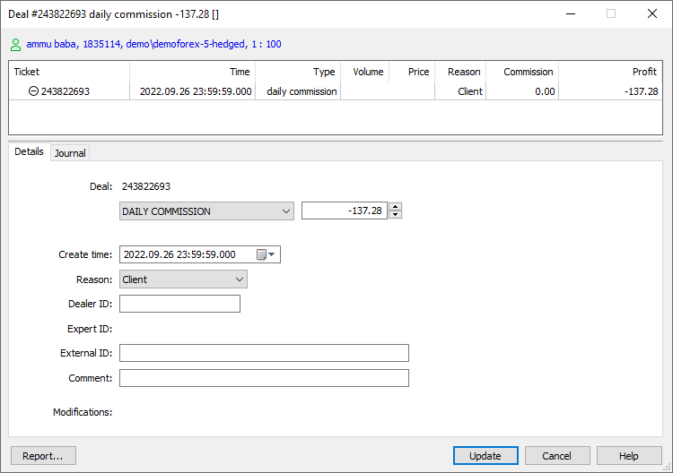

[🏠 Document Start](../../../../README.md) / [MetaTrader 5 Trading Platform](../../../../MetaTrader-5-Trading-Platform.md) / [Platform Setup](../../../Platform-Setup.md) / [Groups](../../Groups.md) / [Commission Settings](../Commission-Settings.md) / Commission Calculation

[Previous](../Commission-Settings.md) | [Next](Commission-Examples.md)

# Commission Calculation

The periodicity of calculation and charging of trade operation is specified in the ["Charge" (#charge)](../Commission-Settings.md#charge) field. The following variants possible:

  * Instant — commissions are charged instantly during execution of each deal. The value of a standard commission charged instantly is displayed in the Commission field of a [deal](../../Deals.md). Agent commissions are charged as separate balance operations (["Agent commission" deals (#action)](../../Deals.md#action)).
  * Daily — the commission amount is accumulated during a day in a special field of a client record. At [the end of the day (#end-of-day)](../../Network-cluster/Configuring-Servers/Trade-Server.md#end-of-day) the accumulated amount is charged from the account with a separate balance operation (a deal of the Daily commission or Daily agent commission type).
  * Monthly — the commission amount is accumulated during a month in a special field of a client record. At the end of the month the accumulated amount is charged from the account with a separate balance operation (a deal of the Monthly commission or Monthly agent commission type).

This section describes how the daily and monthly calculation of commissions is performed.

## Blocking of Assets

> The mechanism of asset blocking is implemented only for the standard commissions to guarantee the possibility of paying of commission by clients. It is not used for agent commissions since that are not charged from clients that perform trade operations.

Depending on the option chosen, the preliminary calculated amount of commission is blocked at client account during a day or a month:

  * If commission is charged for volume of a single trade operation, then its size can be calculated immediately. The corresponding volume of assets is blocked at the account.
  * If commission is charged for turnover (in money of volume), the system considers the volume of trade operations performed earlier during the current day/month. As soon as the client's daily/monthly turnover exceeds a certain level, the amount of the locked commission is immediately recalculated in accordance with the next level.

The volume of blocked assets is displayed in the row of state of client account:

Blocked assets are excluded from Equity and Free Margin. Thus they cannot be used for trading. The commission that will be blocked for a placed order is also considered when checking the free margin.

  * Commission is also blocked when placing all the types of pending orders. At that if a pending order is deleted, the corresponding volume of commission is unblocked. If a pending order is filled, only the commission that corresponds to the filled volume of the order stays blocked.
  * Blocked assets are also released for all deleted, closed and canceled trade requests that didn't result in execution of a deal.

  
---  
  
## Charging of Commissions

The final calculation and charging of commissions are performed at the end of day or month depending on the [settings (#charge)](../Commission-Settings.md#charge). The turnover of trade operations for the specified period is calculated. Further the final calculation of commissions is performed, and then they are summed up for each client. In case of standard commission, the total amount of commission is withdrawn from client account as a balance operation. 

  * According to each commission configuration only one balance operation is performed for each client. The entire volume of commissions accumulated during a day/month is charged with a single deal.
  * After the deal of charging the standard commission is performed the volume of blocked assets is zeroized.
  * The final calculation and charging of commissions are performed at the end of day or month depending on the [settings (#charge)](../Commission-Settings.md#charge). This peculiarity should be considered when moving accounts between groups with different commission settings. For example, if during a trade day an account is moved from a group with commissions charged daily to a group without commissions, no commission will be charged from that account for all the operations performed on that day.

  
---  
  
In case of agent commission, the assets are charged to agent accounts using balance operations. Just the same as the standard commissions, one balance operation is performed according to each commission configuration. Balance operations are performed separately for each account, where an agent account is specified.

Account number, from operations on which an agent gets a commission, is specified as a comment to the corresponding balance deal used for accruing the agent commission. The comment is specified in the following form:

agent from #xxxxxxx  
---  
  

Commission deals can have the following types: 

  * DAILY COMMISSION — standard commission charged daily;
  * MONTHLY COMMISSION — standard commission charged monthly;
  * DAILY AGENT COMMISSION — agent commission charged daily;
  * MONTHLY AGENT COMMISSION — agent commission charged monthly;

The "Comment" field of the deal contains text specified in the ["Description" (#description)](../Commission-Settings.md#description) field of the commission configuration or the number of an account, from operations on which an agent commission is charged.
