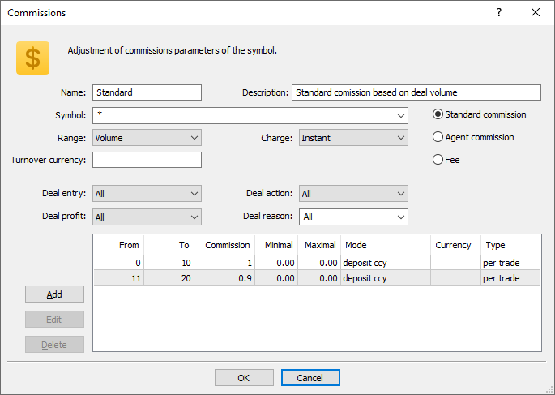
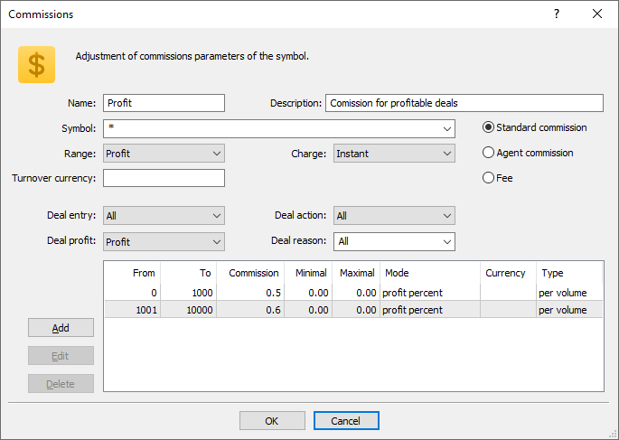

[🏠 Document Start](../../../../README.md) / [MetaTrader 5 Trading Platform](../../../../MetaTrader-5-Trading-Platform.md) / [Platform Setup](../../../Platform-Setup.md) / [Groups](../../Groups.md) / [Commission Settings](../Commission-Settings.md) / Commission Examples

[Previous](Commission-Calculation.md) | [Next](../Group-Types.md)

# Examples of Settings

Let us consider some commission configuration examples.

### Standard commission

Such a commission will be applied when any of the clients from the group performs a deal for a symbol from the "Forex" subgroup. Commission will be charged on both entry and exit deals. The amount will be debited from the trader's account immediately after the operation using a balance deal of the "Commission" type.

For each deal with a volume of up to 10 lots, 1 unit in the group's deposit currency will be charged. For deals with a volume of 11 to 20 lots, 0.9 currency units will be charged. No commission will be charged for larger deals.

### Profit commission

Such a commission will be applied when a client from the group performs a profitable trade for a symbol from the "Forex" subgroup. Although no deal direction filter is set, commission will only be charged for exit deals. Entry deals do not have a financial result; therefore, they do not have profit and do no participate in calculations. The amount will be debited from the trader's account immediately after the operation using a balance deal of the "Commission" type.

For each deal with a profit up to 1,000 units of deposit currency, a commission of 0.5% of the profit amount will be charged. For example, if a deal profit is USD 540, the commission will be equal to USD 2.7. For deals with the profit from 1,001 to 10,000 units, commission will be equal to 0.6% of the profit. No commission will be charged for trades with a larger profit.
