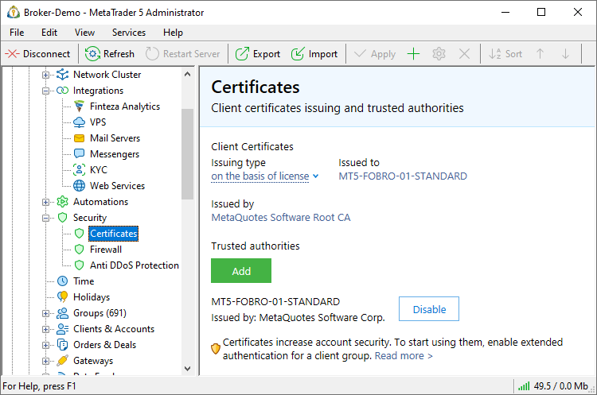
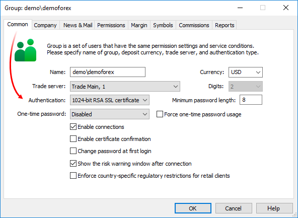
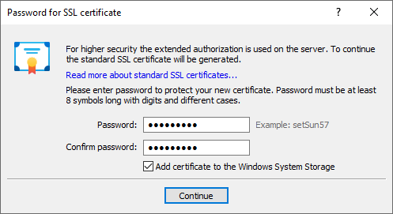
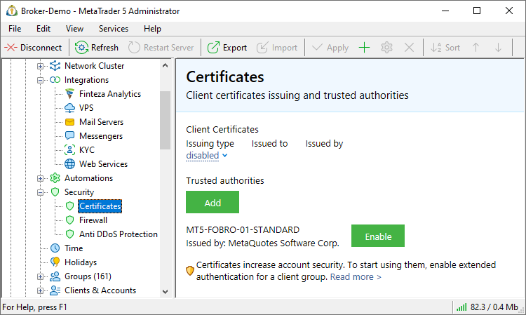
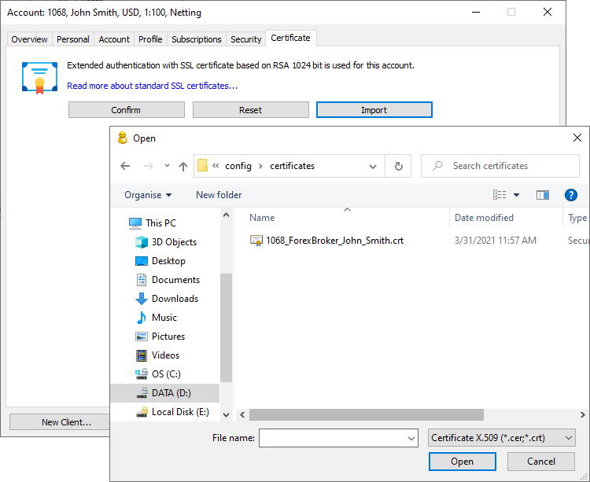

[🏠 Document Start](../../../README.md) / [MetaTrader 5 Trading Platform](../../../MetaTrader-5-Trading-Platform.md) / [Platform Setup](../../Platform-Setup.md) / [Groups](../Groups.md) / Extended Authentication Setup

[Previous](Import-of.md) | [Next](Position-Accounting-Systems.md)

# Extended Authentication Setup (#extended-authentication-setup)

To ensure a high level of account security, the trading platform is provided with an extended authentication feature. During extended authentication, an SSL certificate is required in addition to a login and password, in order to connect to an account. This certificate can be automatically [generated (#server-certificates)](Extended-Authentication-Setup.md#server-certificates) and issued to a client during first connection to the trade server. Also, you can use your [own certificate (#server-certificates)](Extended-Authentication-Setup.md#server-certificates): generate it using third-party software, issue it to the client, and then import to the account on the trade server side.

Extended authentication features:

  * Enabled in [group settings (#authorization)](Group-Settings.md#authorization).
  * Used only as an addition to [standard authentication](../../MetaTrader-5-Administrator/Getting-Started/Connect-to-Server.md). Users need to specify their account login and password in any case.
  * Works for all account types - client, manager and administrator.

## Extended Authentication Using Certificates Generated on the Server (#server-certificates)

The trading platform provides a mechanism for automatic generation of client certificates. A certificate can be generated:

  * on the basis of the certificate from the license of the trading platform. The license contains a certificate especially issued by MetaQuotes Software Corp. for each individual company.
  * on the basis of any other certificate that can be used to generate certificates. Such a certificate must contain a private key.

One of these options can be selected in the "[Certificates](../Security/Certificates.md)" section. In any case, the following requirement must be met:

> The Certification Authority that has issued the certificate used to generate the client certificates must be added to the [trusted CA list (#trusted)](../Security/Certificates.md#trusted). Such a mechanism prevents from the use of fake certificates issued by unknown authorities.

### Configuration of the Client Group (#group)

To enable the extended authentication mode for a group of clients, go to its ["Common" (#authorization)](Group-Settings.md#authorization) tab. In the "Authentication" field select "1024-bit RSA SSL Certificate" or "2048-bit RSA SSL Certificate". The 2048-bit encryption is more secure, but the generation of the certificate is slower. In most cases, a 1024-bit encryption is sufficient.

### Confirmation of Certificates (#confirm)

For additional security, you can enable manual confirmation of certificates generated for clients ("Enable certificate confirming" option).

The first time a user connects in the extended authentication mode, a [certificate is generated (#generation)](Extended-Authentication-Setup.md#generation). However, the below restrictions apply until the generated certificate is confirmed by a manager or an administrator:

  * The account cannot be used for connection in the administrator or manager terminal.
  * In the client terminal, connection is possible only in the "investor" mode, without the possibility to trade.

After generating a certificate, a [special email (#certificate)](../../Platform-Components/Trade-Server/Mail-Templates.md#certificate) is sent to the terminal describing the action to be taken to confirm the certificate (for example, call the specified number and identify personality). The email appears on the ["Mailbox"](../Mailbox.md) tab of the Toolbox window.

After a user performs the action described in the email, an administrator/manager can confirm the certificate on the ["Security" (#security)](../Accounts/Editing-Account.md#security) tab of the account.

  * For demo groups certificates are confirmed automatically immediately after they are generated.

  * If during certificate confirmation the user is connected to a trade server using the client terminal, the user will need to re-connect in order to switch to the full-featured operation with an account (with an access to trading functionality).

  
---  
  

### Certificate Generation (#generation)

When connecting to the server in the extended authentication mode, the user first completes the [standard](../../MetaTrader-5-Administrator/Getting-Started/Connect-to-Server.md) authentication procedure by specifying the login and password. The server checks if there is a certificate for this account. If a certificate is found, the extended authentication is performed (the client certificate is checked). If it is not found, a new certificate is generated.

The trade server sends to the terminal a request to generate two keys, including a [private](https://en.wikipedia.org/wiki/Public-key_cryptography) and a [public](https://en.wikipedia.org/wiki/Public-key_cryptography) key. The private key is used for decrypting server messages. It is not sent anywhere, and is only stored in the terminal (in an encrypted form, with reference to the hardware). The public key is sent to a trade server and is saved in the client record. The trade server will use the key to encrypt messages that are sent to the terminal.

Based on the account details (client's name and account number), the server generates [a public key certificate](https://en.wikipedia.org/wiki/Digital_signature) and signs it using its private key (which guarantees that the certificate cannot be falsified). This certificate is sent to the terminal. It will be used for authenticating the user on the server, and for encrypting data sent by the terminal to the server.

Next, the terminal packs the previously generated private key and the public key certificate received from the server into one file (container) [PFX certificate](https://en.wikipedia.org/wiki/PKCS_12). The PFX is additionally protected with a password. Thus, even having obtained a PFX certificate, attackers will not be able to use it.

The password for protecting the PFX certificate is set by the user in a special dialog:

The following should be specified here:

  * Password — a password to install the certificate;
  * Confirm Password — confirmation of the password to avoid errors;
  * Add certificate to the Windows System Storage — if this option is enabled, the certificate is automatically added to storage of the operating system. If you install the certificate to the system storage, then you can choose not to keep the PFX file of the certificate on the disk in the folder /terminal_data_folder/config/certificates. The terminal always checks the certificate both in the system storage and in the specified folder on the disk.

> The password set for a certificate must contain at least two types of characters (lower case, upper case, digits and special symbols) and be no less than 5 characters long.

PFX certificate protected by the specified password is saved in the directory [/profiles/server name/certificates (#certificates)](../../MetaTrader-5-Administrator/Getting-Started/Structure-of-Directories-and-Files.md#certificates) of the administrator (manager) terminals (or in the directory /config/certificates/ of the client terminal) so that it can later be moved. The names of certificates are given according to the following rule: Login_ID_Name.pfx, where:

  * Login is the account number;
  * ID is the short name of the company in which the account has been opened;
  * Name is the name of the client specified when creating the account.

  * Even having obtained the *.pfx file of the certificate, you cannot use it, if you do not know the password. The minimum password length is set in the [group settings (#minimum-password)](Group-Settings.md#minimum-password).
  * Certificate is generated only during the first connection of an account or in case a certificate has been [reset (#authorization)](../Accounts/Editing-Account.md#authorization) on the server.
  * The certificate is not required when connecting using an [investor password (#invest)](../Accounts/Editing-Account.md#invest).

  
---  
  

## Extended Authentication Using Custom Certificates (#custom-certificates)

The trading platform allows using custom client certificates for authentication, in case it is required by your company's security policy.

To use custom certificates, disable generation of certificates in the trading platform. In the "[Certificates](../Security/Certificates.md)" select "Issue client certificates on the basis of:disabled".

The list of trusted certification authorities must contain only one CA that issues the company's certificates.

> Automatic generation of certificates can be disabled only for separate groups. This can be done on the ["Common" (#authorization)](Group-Settings.md#authorization) tab of a group by setting RSA Custom in the "Authentication" field.

### Configuration of the Client Group (#group)

To enable the extended authentication mode using custom certificates for a group of clients, go to the ["Common" (#authorization)](Group-Settings.md#authorization) tab of the group settings. In the "Authentication" field, select "Custom SSL Certificate".

> If automatic generation of certificates is disabled for the entire platform in the "[Certificates](../Security/Certificates.md)" section, any mode of extended authentication (1024-bit, 2048-bit or Custom SSL Certificate) allows the use of custom certificates.

The function of additional manual confirmation is not used for custom certificates. Confirmation is performed automatically during [import of the certificate (#import)](Extended-Authentication-Setup.md#import) to a client account.   
---  
  

### Issuing Certificates to Clients (#issuing-certificates-to-clients)

When using custom certificates, their distribution among clients is the entire responsibility of the company. Certificate files must be somehow passed to clients (for example, on a digital medium, including e-token).

To use the certificate for authentication, the client must do one of the following:

  * copy the certificate file to the directory [/profiles/server name/certificates (#certificates)](../../MetaTrader-5-Administrator/Getting-Started/Structure-of-Directories-and-Files.md#certificates) of the administrator (manager) terminals or in the directory /config/certificates/ of the client terminal.
  * install the certificate in the operating system storage of the computer, from which the user will work with the trading platform.
  * connect the digital storage (e-token) to the computer.

> During authentication the terminal checks the described storages of terminals. It should be noted that the necessary certificate in the folder /certificates of the terminal is searched for by the account number specified in the certificate file name. The account number must be specified at the beginning of the certificate file name, for example, 10034_JohnSmith.pfx.

### Import of a Certificate into a Client Account (#import)

With the extended authentication, the server compares the certificate of a user with the certificate matched to his or her account on the server. If automatic generation of certificates is used on the server, the issued certificates are automatically imported into the [account](../Accounts.md).

When using custom certificates, it is necessary to import them into client accounts. To do this, go to the ["Security" (#security)](../Accounts/Editing-Account.md#security) tab of the client account and use the import function:

> When importing a certificate, it is automatically confirmed. The function of additional confirmation is not used for custom certificates.
