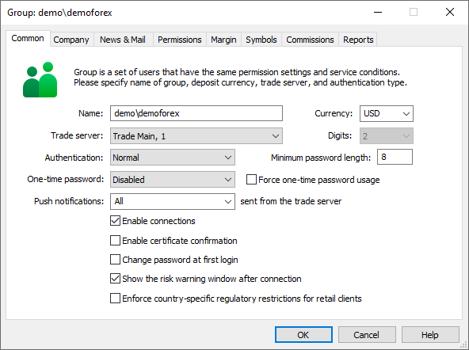
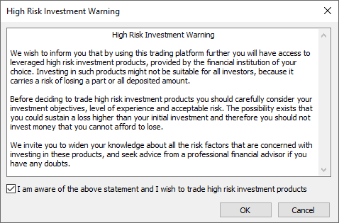
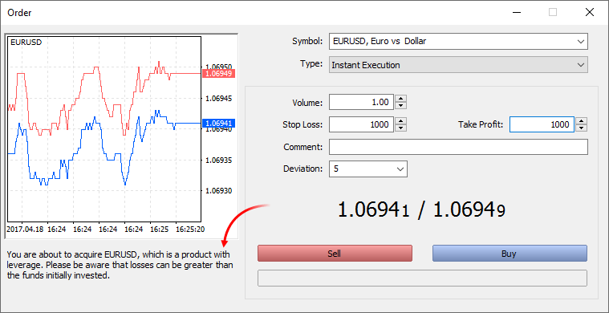
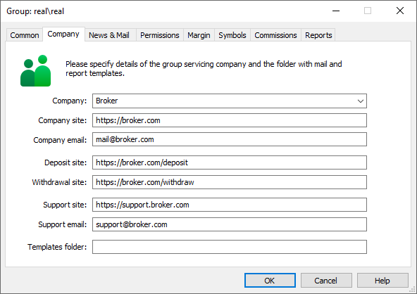
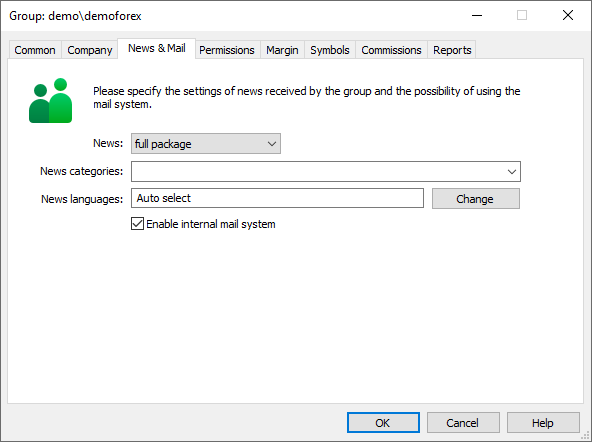
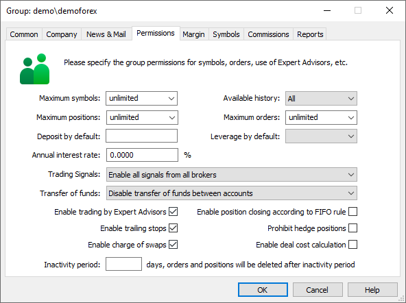
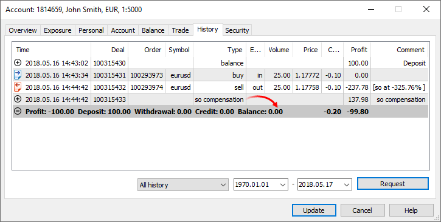
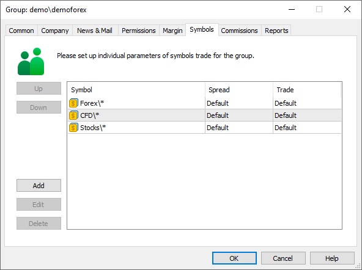
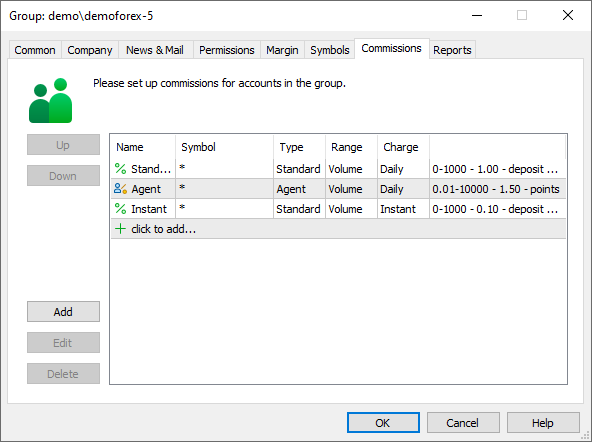
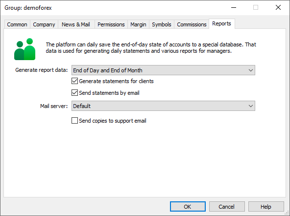

[🏠 Document Start](../../../README.md) / [MetaTrader 5 Trading Platform](../../../MetaTrader-5-Trading-Platform.md) / [Platform Setup](../../Platform-Setup.md) / [Groups](../Groups.md) / Group Settings

[Previous](../Groups.md) | [Next](Group-Symbol-Settings.md)

# Group Settings (#group-settings)

The window of [group](../Groups.md) settings is opened when you add or edit a group. It contains eight tabs:

## Common (#common)

### General settings (#general-settings)

- Name — group name and path to it. If a group is created/edited in the [root section (#hierarchy)](../Groups.md#hierarchy), then only its name should be specified. A group can contain only upper case and lower case letters, digits, symbols "\_" (underline) and "-" (hyphen). The group name defines its [type](Group-Types.md).
- Currency — the deposit currency of this group. The drop-down list contains the most frequently used currencies. If the required one is not available in the list, specify it manually.
- Digits — the number of digits after the decimal point in the deposit currency. The accuracy of the standard deposit currencies, such as USD, EUR, GBP, JPY, CHF, RUR, etc., is predetermined by the platform. It cannot be changed. When using other deposit currencies, the accuracy can be changed manually. This parameter affects the display of the accounts' trading status in the terminals, including the balance, equity, margin, etc.
- Trade server — one of [trade servers](../Network-cluster.md) added in the Network section, which services this group.

### Security settings (#security-settings)

- Authentication — method of authentication for this group:
  - Normal — [normal](../../MetaTrader-5-Administrator/Getting-Started/Connect-to-Server.md) authentication via login and password.
  - 1024-bit RSA SSL certificate — [extended authentication](Extended-Authentication-Setup.md) via certificates with 1024-bit encryption.
  - 2048-bit RSA SSL certificate — extended authenticator via certificates with 2048-bit encryption.
- Custom SSL certificate — extended authentication via [custom certificates (#custom-certificates)](Extended-Authentication-Setup.md#custom-certificates).
- Minimum password length — minimal length of [passwords (#password)](../Accounts/Editing-Account.md#password) for accounts created in the group, and for certificates used in the [extended authorization (#password)](../../MetaTrader-5-Administrator/Getting-Started/Connect-to-Server/Extended-Authorization.md#password). The maximum possible password length is 16 characters.
- Enable certificate confirmation — if you check this field, all generated client certificates will require [confirmation (#authorization)](../Accounts/Editing-Account.md#authorization).
- Change password at first login — if this option is enabled, the forced [change of master password (#change-password)](../../MetaTrader-5-Administrator/Getting-Started/Connect-to-Server.md#change-password) will be required for each account created in this group. Any action is prohibited for the account until its master password is changed. Before enabling this option, make sure that the group is allowed to change passwords ("[Allow to change password (#account)](../Accounts/Editing-Account.md#account)" option is enabled). Otherwise, clients will not be able to connect to the server, because they will not be able to change the password. After changing the primary password, the investor password is also reset. The user will have to specify a new password using the terminal setting.

### One-time passwords (#otp)

The use of one-time passwords ([Time-based One-time Password Algorithm, TOTP](https://en.wikipedia.org/wiki/Time-based_one-time_password)) or two-factor authentication (2FA) provides an additional level of security for trading accounts. This technology protects a trading account from unauthorized access even if its login and password are leaked.

If 2FA/TOTP is enabled, users are required to enter a special one-time password every time they connect to their accounts, in addition to standard account login and password (as well as a certificate if the extended authentication is enabled). One-time passwords can be generated by:

- Mobile terminals for [iPhone](https://download.mql5.com/cdn/mobile/mt5/ios?hl=en&utm_campaign=download&utm_source=metatrader5.help "mobile terminal for iPhone") and [Android](https://download.mql5.com/cdn/mobile/mt5/android?hl=en&utm_campaign=download&utm_source=metatrader5.help "mobile terminal for Android").
- The most popular 2FA applications, including Google Authenticator, Microsoft Authenticator, LastPass Authenticator and Authy. They can be downloaded to a mobile device from the App Store or Google Play.

One-time passwords are supported not only in all client terminals (Desktop, Mobile, Web), but also in Manager and Administrator terminals. This capability additionally protects platform access within your company.

Enabling: One-time passwords can be enabled for all types of connections, as well as for connections via the [web terminal](../../Platform-Components/WebTerminal.md) only. Select the necessary option in the "One-time password" parameter.

For further details about one-time passwords please visit the "[2FA/TOTP](../../MetaTrader-5-Administrator/Getting-Started/Connect-to-Server/2FATOTP.md)" section.

Mandatory usage: In some countries, regulators require the use of additional account security measures, such as the use of OTPs. When the "Force one-time password usage" option is used, all clients in this group will need to use one-time passwords to connect. Otherwise, clients can bind their accounts to the generator or use the default authentication method. Before you enable it, please inform your clients about the new OTP option. Be extremely careful enabling this option for the only one manager group on the trading server.

Usage in the web platform: The MetaTrader 5 platform supports extended authentication via certificates. It protects users but works only on desktop and mobile terminals. For web terminal users, only one-time passwords can be used as additional means of protection.

If you enable one-time passwords for everyone, those who use certificates will experience unnecessary difficulties when connecting. They will have to pass a triple authentication: enter their standard login/password, provide a certificate and specify a one-time password.

In order to protect web terminal users without causing difficulties for other users who already apply certificates, enable the "TOTP for Web only" mode. Now, if you enable the "Force one-time password usage", one-time passwords become mandatory for web terminals (other connections are not affected).

- OTP use can be [disabled for individual clients (#otp)](../Accounts/Editing-Account.md#otp) in the group.

- Accounts with OTP cannot use [Virtual Hosting](../Integrations/Sponsored-VPS.md). The service is designed for uninterrupted operation of terminals; therefore, it is not possible to request a one-time password from the user for each authorization.

- An account can only be linked to one OTP generator.

---

### Push notifications (#push)

The platform allows you to promptly notify traders of transactions taking place on their accounts. There are two standard tools:

[Push notifications from the local terminal (#notifications)](https://www.metatrader5.com/en/terminal/help/startworking/settings#notifications). A trader just needs to enable the corresponding option and specify the MetaQuotes ID in the terminal settings to receive messages about all transactions on the account to his or her mobile device.

Push notifications from the trade server. The advantage of this option over the previous one is that traders do not need to keep their terminals connected at all times to receive notifications since they are sent by the server. To configure them, traders just need to enable the corresponding option in their terminals and specify the MetaQuotes ID. After that, the terminal subscribes the current account to server notifications.

Brokers can enable/disable notifications for each group, as well as customize their level of details. The following types of notifications are currently provided:

- Placed orders
- Performed deals
- Balance operations (top-ups, withdrawals, credit operations, bonuses, etc.)

For example, it is possible to send notifications only about deals or only about balance operations on the account.

When subscribing, the terminal checks which notifications are available for the group the account belongs to. When enabling notifications, available types will be displayed in the terminal journal:

'1222': subscribed to deals, orders, balance notifications from trade server

---

To avoid unnecessary load on the trade server, notifications are sent only to real group accounts. No notifications are sent to demo accounts.

> Unlike SMS messages, push notifications are sent via the Internet and are independent of cellular operators. This means brokers do not need to pay for provider services. Besides, this solves the issue of delivery to different regions. Traders only need to install the mobile terminal for iPhone or Android. Please see the details in the article "[How to get rid of SMS messages? Use MetaTrader 5 push notifications!](https://support.metaquotes.net/en/articles/436)".

### Other settings (#other-settings)

Enable connections — this option allows to permit/prohibit the client connection of accounts within the group. If the option is disabled none of the account within the group will be able to connect to the server. Disabled groups are shown with the  icon in the list.

Show the risk warning window after connection — if this option is enabled, when a client connects in the trading terminal, a warning about the risks associated with operations on the financial markets appears. Trade operations on a client's account are not allowed until the client confirms that he or she has read the warning and is aware of the risks. To confirm, the client should check "I am aware of the risks and I wish to trade high risk investment products". This warning is displayed once per session of the terminal. The next time it will appear after the restart of the terminal.

> The risk warning is not displayed for [demo accounts (#demo)](Group-Types.md#demo).

Enforce country-specific regulatory restrictions for retail clients. Every country has regulators — state bodies that supervise the activities of financial institutions (including brokers). Each regulator has its own set of requirements applied to trading currencies, securities and other instruments.

In most cases, clients of brokerage firms are individuals from different countries. The platform provides the means of meeting the requirements of certain regulators without interfering with the work of traders not covered with these requirements. Restrictions applied to trader accounts depend on the client's country and other conditions set by that country's regulator.

For example, the National Securities Market Commission (Comisión Nacional del Mercado de Valores) of Spain compels brokers to warn clients using the leverage of 1:10 or higher about potential risks in a special way. Therefore, if a client's country is Spain and they use a leverage of 1:10 or higher, the additional warning is displayed in the trading dialog:

The trade dialog and the warning will appear even during one-click trading, for example when performing a trade operation from the Market Depth window or from the quick trading panel on the chart.

Currently, only one regional limitation is used in the platform. The list is to be expanded later.

- A group is only considered to be [demo (#demo)](Group-Types.md#demo), if its name (including the path) contains "demo" (case sensitive). For example, "demoforex". The names of [manager (#manager)](Group-Types.md#manager) groups must contain "manager" characters.

- Use of 2048-bit encryption provides higher security, but slows down the process of key generation and checking, as compared to 1024-bit.

- If there is only one [manager group (#manager)](Group-Types.md#manager) in the system, extended authorization mode cannot be set to it. This will prevent loss of control over the platform in case the certificate is lost.

- You cannot change binding to a [trade server (#trade-server)](Group-Settings.md#trade-server) of a group that contains [accounts](../Accounts.md).

---

## Company (#company)

Information about the company that serves the group is specified in this tab. This information is used for generating reports, sending e-mails, etc.

- Company — name of the company that serves the group. The field is mandatory. The list of companies available for selection is formed based on the trading platform license. This may be the company that owns either the main or additional [White Label](../../Platform-Installation/White-Label.md).
- Company website — website address.
- Company email — email address.
- Deposit site, Withdrawal site — URLs of your website pages in which traders can deposit or withdraw money from their trading accounts. If you fill these fields, the "Deposit" and "Withdraw" commands in the terminals will become available to the accounts from this group. A click on these commands opens the relevant pages of your website. Group-specific deposit and withdrawal page setting are of higher priority compared to global settings specified in the "[Account allocation (#deposit-withdrawal)](../Accounts/Account-Allocation-Settings.md#deposit-withdrawal)" settings. Links to withdrawal and deposit pages are only displayed for real accounts. These links are hidden for demo accounts. For more details, please see the "[Depositing and Withdrawing Funds](../Accounts/Links-to-Depositing-and-Withdrawing.md)" section.
- Support site — address of the website of the technical support team. The specified page will be displayed in the "Company" tab of the "Toolbox" window in the client terminals. If the address is not specified, https://www.mql5.com is used.

> When specifying the address, one can use macros that are replaced on the client terminal side forming the final address:

- Support email — email address of the technical support team. This address is used for receiving copies of daily reports if the [relevant option (#reports)](Group-Settings.md#reports) is enabled for the group.
- Templates folder — name of the sub-folder in the standard folder of templates in the server catalog where templates of [reports (#reports)](Group-Settings.md#reports), [emails](../../Platform-Components/Trade-Server/Mail-Templates.md), etc. for this company are stored. If this field is empty, standard templates will be used.

## News & Mail (#news-mail)

In this tab you can configure parameters of news received by a group, and manage use of the inner mailing system:

- News — setup of news receipt. A group can receive either all news messages (full package), or only news headers, or they can receive no news at all;
- News categories — names of [news categories (#news-category)](Group-Settings.md#news-category) that are received from [data feeds](../Data-Feeds.md). The group will receive news only from the categories that are specified in this field. An empty value means that all categories are allowed. Categories are indicated as a comma separated list. The backslash character "\" is used to indicate subcategories.
- News languages — field for filtering news messages by languages. To edit the list of news, press "Change". If "Any language" is selected, the group users will receive all news items from allowed categories irrespective of their language. Window for selecting the group news language and that of selecting the [language of news (#news-language)](../../MetaTrader-5-Administrator/Terminal-Settings/Common.md#news-language) that are received in the terminal, are similar;
- Enable internal mail system — if this field is checked, the group users will be allowed to use the internal [mail system](../Mailbox.md).

### News Category and Language (#news-category)

- Usually, news categories are provided by data feeds. News providers supplement news with the information about categories to which the news belong. The same applies to the news language.
- A news category can be additionally specified in the [News Category (#parameters)](../Data-Feeds/Configuration-of.md#parameters) parameter of the data feed. This is a standard parameter supported by all data feeds. The parameter is applied as follows:

- If a data source does not provide news categories, news items will be added to the category specified in this parameter (the category will be specified in the news).
- If the data source provides a category, then the data feed will add the "News Category" parameter value before the original category name. The resulting category will look like "[value from News Category] \ [category from data source]". The "\" characters in a category name are interpreted as subcategory separators. Therefore, it means that all news items are added to the category specified in the parameter, within which original categories from the data source will be used.

## Permissions (#permissions)

In this tab group permissions are set up:

- Maximum symbols — maximal number of [symbols](../Symbols.md), whose quotes an account can receive simultaneously. This option allows reducing load on the server if there are many symbols.  
  Client terminals only receive quotes for the financial symbols enabled in the Market Watch window. The "Maximum symbols" parameter sets the number of first instruments in the Market Watch window, for which terminals will receive quotes. For example, if you specify 10, terminals will receive quotes for the first ten symbols in the list. Traders can change the order of symbols and thus enable or disable delivery of quotes for them.
- Maximum positions — maximum number of open position a client can have on a trade account at the same time. The limitation operates differently depending on the [position accounting type](Position-Accounting-Systems.md):
  - Netting — number of open positions is considered. When a limit is reached, the platform disables placing new orders whose execution may increase the number of open positions. In fact, the platform allows placing orders only for the symbols that already have open positions. The current pending orders are not considered since their execution may lead to changes in the current positions but it cannot increase their number.
  - Hedging — pending orders are considered together with open positions, since a pending order activation always leads to opening a new position. When a limit is reached, the platform disables placing both new market orders for opening positions and pending orders.
- Maximum orders — maximal number of pending orders that can be simultaneously placed by one account included into this group. The limit can also be configured at the [account (#limits)](../Accounts/Editing-Account.md#limits) level.
- Available history — maximal time period, trading history for which can be requested. If the limit is set for a group, the history of orders and deals in terminals will be available to the relevant accounts only within the specified depth.
- Annual interest rate — annual interest on deposits of accounts included into this group. Interest is calculated at the [end of each trading day (#end-of-day)](../Network-cluster/Configuring-Servers/Trade-Server.md#end-of-day) on the amount of free assets (Free Margin) of a client excluding credit assets. During a month the amount of calculated interest is accumulated. Then at the end of the month (the end of the last day of the month) the accumulated amount of interest is added to the client account as a separate [deal](../Deals.md) of the INTEREST RATE type;
- Deposit by default — deposit that will be used when creating demo accounts in the group via the client terminal (regardless of the value selected in the account open dialog). The setting affects only demo groups;
- Leverage by default — the leverage amount to be used for demo accounts created in this group from client terminals. To enable traders to choose a desired leverage, leave this field empty and specify the list of available leverage options in [account allocation settings (#leverage)](../Accounts/Account-Allocation-Settings.md#leverage).
- Trade signals — allow/prohibit using the ["Signals"](https://www.mql5.com/en/signals "Trade Signals in MetaTrader 5") service in the client terminals.
- Disabled — if this option is selected, the signal settings (the "Options" window) and the signal list (the "Toolbox" window) are hidden in client terminals connected using the accounts from this group. Users will not be able to subscribe to any signals both from the terminal and via www.mql5.com.
- Enable all signals from all brokers — this option allows using the ["Signals"](https://www.mql5.com/en/signals "Trading Signals in MetaTrader 5") service in trading terminals without limitations.
- Enable signals from my severs only — if this option is selected, clients in this groups will be able to subscribe only to the signals created on the basis of accounts opened in your brokerage company. Signals created on the basis of other accounts will not be displayed in the client terminals. If no signal is left on the showcase according to this limitation, the full showcase with signals from all brokers will be displayed.
- Transfer of funds — clients can transfer funds between accounts via the client terminal. Using this parameter, you can disable or limit the transfer of funds:
  - Disable transfer of funds between accounts — transfer of funds is disabled.
  - Enable between accounts with the same name — both [accounts](../Accounts/Editing-Account.md) must have the same name and e-mail.
  - Enable between account from the same group and sub-groups — the account to which the funds are transfered must be either in the same group with the source account or in its subgroups. Examples when a transfer is possible: both accounts are in the "real" group; the source account is in the "real" group, the target account is in the "real\ecn" group. Examples when a transfer is not possible: the source account is in the "real\ecn" group, the target account is in the "real\ndd" group; the source account is in the "real\ecn" group, the target account is in the "real" group.
  - Enable between account with the same name and group — both conditions described above must be met.

> Also, transfer of funds is subject to the following general requirements:

- Enable charge of swaps — allow charging [swaps](../Symbols/Symbol-Settings/Swaps.md) for this group;
- Enable trailing stops — allow using trailing stop in the client terminal. The use of trailing stops can be set up for each [account (#trailing-stop)](../Accounts/Editing-Account.md#trailing-stop) separately;
- Enable trading by Expert Advisors — allow the group accounts to trade using Expert Advisors. This parameter can be set up for each [account (#ea-trading)](../Accounts/Editing-Account.md#ea-trading) separately.
- Close positions by FIFO rule — the mode of position closing according to a FIFO rule. If this option is enabled, then positions for each instrument can only be closed in the order in which they were opened: the oldest one should be closed first, then the next one, etc. The option is only valid for [hedging accounts](Position-Accounting-Systems.md), in which traders can have multiple positions for the same financial instrument. There are three main methods to close a position; the option behavior will be different for each of the methods:
  _ Closing from the client terminal: the trader closes the position manually, using a trading robot, based on the Signals service subscription, etc. In case of an attempt to close a position, which does not meet the FIFO rule, the trader will receive an appropriate error.
  _ Closing upon Stop Loss or Take Profit activation: these orders are processed on the server side, so the position closure is not requested on the trader (terminal) side, but is initiated by the server. To prevent non-FIFO closing, the order in which stop levels are placed on the client side is changed. If multiple positions exist for the same instrument, the placing of stop levels for any of them causes analogous levels to be placed for all others. Accordingly, if a level triggers, all positions will be closed in a FIFO compliant order.  
  The same behavior is used when modifying and deleting stop levels. \* Closing upon Stop Out triggering: such operations are also processed on the server side. In a normal mode, in which FIFO-based closing is disabled, in case of [Stop Out (#stopout-processing)](Group-Settings.md#stopout-processing) positions are closed starting with the one having the largest loss. If this option option is enabled, the open time will be additionally checked for losing positions. The server determines losing positions for each symbol, finds the oldest position for each symbol, and then closes the one which has the greatest loss among the found positions.
- Prohibit hedge positions — prohibit opening of opposite positions and placing of opposite orders. If this option is enabled, accounts are not allowed to have oppositely directed positions and orders for the same financial instrument. For example, if the account has a Buy position, then the user cannot open a Sell position or place a pending sell order for the same symbol. If such an attempt is made, the user will receive an error stating that hedging is prohibited. The option is only valid for [hedging accounts (#hedging)](Position-Accounting-Systems.md#hedging).
- Enable deal cost calculation — calculate the cost of deal execution and display it in client terminals. This option should be enabled by NFA regulated brokers.

In accordance with the [regulatory requirements](https://www.nfa.futures.org/rulebook/rules.aspx?Section=4&RuleID=RULE%202-36), brokers must explicitly provide to traders information about the costs of each deal relative to the current mid-point price of the symbol (mid-point spread cost). Actually, this value means the amount the trader loses on traded spread.

The value is calculated according to the following formulas.

Forex:  
For Buy deals: Normalize((Market Bid price + Market Ask price)/2 _ Contract size _ Volume in lots) - Normalize(Deal price _ Contract size _ Volume in lots)  
For Sell deals: Normalize(Deal price _ Contract size _ Volume in lots) - Normalize((Market Bid price + Market Ask price)/2 _ Contract size _ Volume in lots)

CFD, CFD Index, CFD Leverage and Exchange Stocks, Exchange MOEX Stocks:  
For Buy deals: Normalize((Market Bid price + Market Ask price)/2 - Deal price) _ Contract size _ Volume in lots  
For Sell deals: Normalize(Deal price - (Market Bid price + Market Ask price)/2) _ Contract size _ Volume in lots

Futures, Exchange Futures, FORTS Futures, Exchange Options, Exchange Margin Options:  
For Buy deals: Normalize((Market Bid price + Market Ask price)/2 - Deal price) _ Contract size _ Volume in lots _ Tick value / Tick size  
For Sell deals: Normalize(Deal price - (Market Bid price + Market Ask price)/2) _ Contract size _ Volume in lots _ Tick value / Tick size

Calculation uses the Bid and Ask prices that existed in the market at the deal execution time. When the value is calculated for historical operations, the formula uses market Bid and Ask prices [stored in deals](../Deals.md). Please note that the saving of these values was introduced in platform build 2890. The relevant values are not available for the deals which were executed earlier. Therefore, cost calculation is impossible for them.

The deal size is determined depending on the trading instrument type, similarly to [profit calculation](../Symbols/Symbol-Settings/Trade/Profit-Calculation.md). For Forex and CFD instruments, the pip level is equal to the contract size multiplied by the trade volume; for futures it is the ratio of price to tick size multiplied by the trade volume, etc.

The value derived from the formula is the deal cost in the instrument's profit currency. If it differs from the account deposit currency, the amount is [converted (#conversion)](../Symbols/Symbol-Settings/Trade/Profit-Calculation.md#conversion) using the "Profit rate" value of the deal.

The calculated value is displayed in the "Cost" column in the [deal history (#trade-history)](https://www.metatrader5.com/en/terminal/help/trading/performing_deals#trade-history) in client terminals.

If the option is disabled, the calculation is not performed, and the corresponding column in the terminals is hidden.

- Inactivity period — this function is only available for [demo accounts](Group-Types.md). This feature enables automatic clearing of databases from irrelevant data and thus reducing the load on the platform. If a demo account from this group was not connected to the server for the specified number of days, all its open orders and positions will be deleted from the databases. The default inactivity period is equal to 360 days. To disable deletion of operations, sets the parameter to 0.

Inactivity check is performed [every Sunday at optimization time (#optimization)](../Network-cluster/Configuring-Servers.md#optimization) for all accounts in the group, including newly created and existing ones. For example, if the option was disabled for the group and then you set the value of 30, then at the specified time the server will check all accounts in the group. If the server finds any accounts which have not connected to the platform for the last 30 days, all operations of these accounts are deleted from the database. The accounts are not deleted — this process is managed by a [separate setting on the trade server (#demo)](../Network-cluster/Configuring-Servers/Trade-Server.md#demo).

## Margin (#margin)

Margin settings for the group are set up in this tab:

- Risk management — the risk management model defines the type of pre-trade control and the [position accounting system](Position-Accounting-Systems.md) used. Please see the [appropriate section](../Symbols/Symbol-Settings/Trade/Margin-Calculation.md) for details. After changing this parameter the server should be [restarted](../Network-cluster/Restarting-and-Stopping-Servers.md).
  - for Retail Forex, CFD, Futures — used for the OTC market. Margin calculation is based on the type of instrument, as well as group settings. [Netting position accounting system (#netting)](Position-Accounting-Systems.md#netting) is used.
  - for Retail Forex, CFD, Futures with hedging — used for the OTC market. Margin calculation is based on the type of instrument, as well as group settings. [Hedging position accounting system (#hedging)](Position-Accounting-Systems.md#hedging) is used.
  - for Stock Exchange, based on margin discount rates — used for the exchange market. Margin calculation is based on the discounts specified in [symbol settings](../Symbols/Symbol-Settings/Margin.md). Discounts are set by the broker, however they cannot be lower than the exchange set values.
- Margin call level — when a client reaches this level of assets, they are in the "Margin call" state. Clients under Margin call are displayed in a special window in the manager terminal. Thus a manager can send a notification to clients that they should replenish their accounts. The Margin call state does not affect the ability of opening new positions. Only used for the 'for Retail Forex\*' modes.  
  In the 'for Stock Exchange' mode, a Margin Call occurs when the initial margin on the client's positions becomes greater than the equity.
- Stop out level — when a client reaches this level of assets his/her pending orders are deleted and open position are closed forcedly. The [order of processing a Stop out (#stopout-processing)](Group-Settings.md#stopout-processing) is described below. Only used for the 'for Retail Forex\*' modes.  
  In the 'for Stock Exchange' mode, a Stop Out occurs when the maintenance margin on the client's positions becomes greater than the equity.
- In percent/money — in this field you can select have the Margin call and Stop out levels are indicated. The "In money" option means that the levels are set as a value of the "Equity" parameter of an account. The "In percent" option means that the levels are set as a value of the "Margin level" parameter (Equity/Margin\*100) of an account.
- Stop out fully hedged accounts — if this option is enabled, then Stop out will be performed on accounts having open positions, the zero margin (positions are covered) and negative equity. If the option is disabled, orders will not be forcibly deleted and positions will not be forcibly closed in above cases. The option can be only used on hedging accounts.
- Compensate negative balance after stop out — automatically perform on a client's account the special operation, which increases the balance and sets it to zero, if the balance has become negative after a position was closed by Stop Out. The details are available [below (#compensate)](Group-Settings.md#compensate).
- Withdraw credit after negative balance compensation — works as an addition to the previous option. If enabled, the credit funds on the account will be set to zero after a negative balance compensation operation. Credit funds are withdrawn in a separate balance operation with the "so credit compensation" type.

- Floating leverage profile — additional margin calculation rules for clients in the group. You can create multiple margin profiles in the [Leverages](../Leverages.md) section and then quickly switch between them manually or [automatically (#automation)](../Leverages.md#automation).

- Virtual credit — additional money that a broker can allocate to a client for opening a position of larger volume than allowed by his/her assets. However, the virtual credit is not used for the calculation of free margin to support open positions. Besides, a trader cannot withdraw this money.

- If a group has clients with open positions, then position accounting type cannot be changed for this group.
- It is not recommended to move accounts between groups with different [position accounting systems](Position-Accounting-Systems.md).

---

### Processing of Stop out by Server (#stopout-processing)

When Stop outs are processed automatically by the server (not by a plugin or a manager), then orders and positions are forcedly closed on an account in the following order:

- The server analyzes client's pending orders that are not under execution at the moment.
- It deletes a pending order with the largest margin reserved.
- If Equity (or Margin level, depending on how the SO level is determined) is still under the Stop out level, the next order is deleted. Orders without a reserved margin (no margin requirements) are not deleted.
- If Equity (or Margin level) is still under the Stop out level, the server closes a position with the largest loss. If all of the positions are profitable, the position with the lowest profit is closed (excluding swaps and commissions).
- Positions are closed until Equity (or Margin level) becomes higher than the Stop out level.

- [Netting accounts (#netting)](Position-Accounting-Systems.md#netting) allow partial position closure by Stop out if the volume of the position to be closed exceeds the maximum allowable volume for the symbol. For example, a trader has a 50-lot position, while the [maximum permissible deal volume (#volumes)](../Symbols/Symbol-Settings/Trade.md#volumes) is 20. In the event of a Stop out, the platform will first close 20 lots of the position. If after this the client's funds level is still below the threshold, the platform will close the next 20 lots. Otherwise, the trader will have part of the position remaining open. In this case, the position comment will indicate [so XX%], where XX is the margin level at which Stop out occurred.

For more details about how the Stop out is processed on the server side please read the [MetaTrader 5 API documentation (#ticks)](https://support.metaquotes.net/en/docs/mt5/api/hook_scheme#ticks).

### Compensation of a negative balance after a Stop Out (#compensate)

If positions are forcedly closed in the situation of a Stop Out, the balance of a client can become negative. This may happen during sharp market moves. According to the rules set out by some Regulators, for example by [the European Securities and Markets Authority](https://www.esma.europa.eu/), clients' balances may not fall below zero. Therefore, you should enable the 'Compensate negative balance after stop out' for clients from countries where such rules apply.

The server forcibly closes the client's positions upon the situation of a Stop Out. If the compensation is enabled, and the client's balance has become negative after the closing of the last position, the 'so compensation' operation is immediately performed on this account to increase the balance to zero:

An appropriate entry is made in a server log:

2018.05.16 14:55:42.834 '1814659': negative balance -137.98 compensated after stop out

---

The standard ["StopOuts Compensation Report"](../Reports/StopOut-Compensations.md) allows controlling such compensation operations. This report includes all deals with the "so compensation" type.

> The compensation function works only if the client’s balance has become negative as a result of a Stop Out. If the balance becomes negative as a result of another operation, for example the Stop Loss, compensation is not performed.

### Profit/loss in free margin (#profitloss-in-free-margin)

In this box, you can set up how profit/loss should be considered when calculating the free margin of a client:

- Unrealized profit — in this field, select whether the floating profit/loss should be included in free margin or not:
  - Do not use unrealized profit/loss — do not take into account open positions;
  - Use unrealized profit/loss — in calculation use loss and profit of open positions;
  - Use unrealized profit — use only profit;
  - Use unrealized loss — use only loss;
- Daily fixed profit — in this field, select whether to include the profit/loss fixed during a trade day in the free margin or not:
  - Use daily fixed profit/loss — include both profit and loss fixed during a trade day in the free margin.
  - Use daily fixed loss — include only loss fixed during a trade day in the free margin. During a day obtained profit is accumulated in the special field of the [client record](../Accounts/Editing-Account.md) ("Accumulated" — in the manager and administrator terminals, "Blocked" - in the client terminal). If the option "Release fixed profit at the end of day" is enabled, at the end of trade day the accumulated profit is released (set to zero) and added to the user balance (included in the free margin). This option only works with the [netting position accounting (#risk)](Group-Settings.md#risk).
- Release fixed profit at the end of day — this option becomes available only if the option "Use daily fixed loss" is selected. If it is enable, then the profit accumulated by a client will be released (and thus included in the free margin) at the end of trade day. If this option is disabled, then it will be possible to release the accumulated only using an external application (for example, a gateway). The server will not perform this operation.

## Symbols (#symbols)

This tab sets the availability of trading instruments for a specific group, as well as individual settings for these instruments. By default the tab contains the value of "\*", which means that [all instruments](../Symbols.md) in the platform are available for the group.

- Add — add a symbol or a group of symbols to the list of available instruments for the accounts from the specified group. After you press it, a window for adding and [setting up symbols for this group](Group-Symbol-Settings.md) will be opened.
- Delete — delete a selected item.
- Edit — edit a selected item. The same action can also be performed by clicking twice on an entry.

For the rule, you can specify multiple symbols separated by commas, or a group of symbols using the "\*" mask and the negation sign "!". For example:

- Forex\* — all symbols from the Forex subgroup
- Forex\*,!EURUSD — all symbols from the Forex subgroup, except EURUSD
- Forex\EURUSD,Forex\GBPUSD — only the specified symbols

The maximum length of the string with the enumeration of symbols is limited to 128 characters. The string cannot consist of only an excluding rule, such as "!Forex\EURUSD". It must contain allowed symbols, to which you can add an exception using "!". For example, Forex\*, !Forex\EURUSD, !Forex\AUDCAD.

If several individual configurations are created for the same symbol (for example, there is a configuration for all symbols by mask "\*", and a configuration for a specific symbol), then every configuration will be applied sequentially from the top downwards. And if a parameter in the configurations is set to "Default", it means that it won't be changed. For example:

- A symbol has minimal and maximal volume set to 0.01 lot and 100 lots on default.
- A configuration is added for the group where the minimal and maximal volume is overridden to 0.1 lot and 150 lots respectively.
- Another configuration is added with settings "Use default volumes" and Spread difference = 5.

The last configuration will not reset the minimal and maximal volume to default 0.01 lots and 100 lots respectively. Values 0.1 and 150 will be used.

If the symbol row in the table is highlighted in red, then this symbol no longer exists. It may have been moved or deleted. Open the entry and edit the symbol path.

## Commissions (#commissions)

On this tab you can set up commissions charged from accounts included into this group. Names of commissions and symbols they apply to are specified here. The following buttons are intended for working with commissions:

- Add — add a new commission type. A click on this button will open the [commission setup](Commission-Settings.md) window.
- Delete — delete a selected item;
- Edit — change a selected item. The same action can also be performed by clicking twice on an entry.

## Reports (#reports)

Here you can set up parameters of [daily and monthly report](../../Platform-Components/Trade-Server/Daily-Reports.md) generation. These are special reports that contain information about the state of client accounts at the end of a trading day or month.

- Generate report data — the platform can save the end-of-day and/or end-of-month states of accounts to a special database. The information includes balance, equity, margin amount and other details. The database is kept on the trade server, in the bases\daily\daily\_\*.dat files. Data from the database is used in end-of-day and end-of-month trading reports sent to clients, as well as in some [manager reports](../Reports.md). If the option is enabled, the platform saves information on accounts from the selected group to the database. If the option is not enable, the below options are not available.  
  Three data saving options are provided: at the end of each day, at the end of each month, at the end of each day and each month.
- Generate statements for clients — the option enables the generation of daily and monthly account state reports. The HTML reports files are created using [templates (#confirm)](../../Platform-Components/Trade-Server/Mail-Templates.md#confirm) available in the \templates\confirmation\ and \templates\statement\ folders. The type of reports to be generated, i.e. daily and/or monthly, depends on the "Generate report data" parameter. If there are no trading or balance operations on the account during the day, a report for that day will not be generated. However, monthly reports will be generated in this case.
- Send statements by email — if the option is enabled the generated HTML report files will be sent to emails specified in [trading accounts (#personal)](../Accounts/Editing-Account.md#personal).
- Mail server — configuration of the [mail server](../Integrations/Mail-Servers.md) to be used for sending daily and monthly reports to trader emails. If "Default" is selected, the platform will check the list of all servers and will use the first available server with the "Default server" option enabled.
- Send copies to support email — send copies of reports to the e-mail address of the technical support service specified at the ["Company" (#company)](Group-Settings.md#company) tab.

- E-mail templates for [daily (#daily)](../../Platform-Components/Trade-Server/Mail-Templates.md#daily) and [monthly (#monthly)](../../Platform-Components/Trade-Server/Mail-Templates.md#monthly) reports on trade activity are located in the \templates\confirmation and \templates\statement folders of the trade server.

- To get information about the process of sending daily reports via e-mail, request [trade server logs](../Network-cluster/Journal.md) (Report Mailer).

- The report generation and sending can be disabled for separate [accounts within a group (#reports)](../Accounts/Editing-Account.md#reports).

- Trading accounts store data on the trader's balance and equity state as at the end of the previous trading day/month. When [switching to the next trading day/month (#eod)](../Network-cluster/Configuring-Servers/Trade-Server.md#eod), the platform updates these values. To save resources, these values are not updated for demo accounts for which generation of daily/monthly reports is disabled.

---

To complete creating or editing a group, press "OK". If you press "Cancel", the window will be closed, while changes will not be saved.
