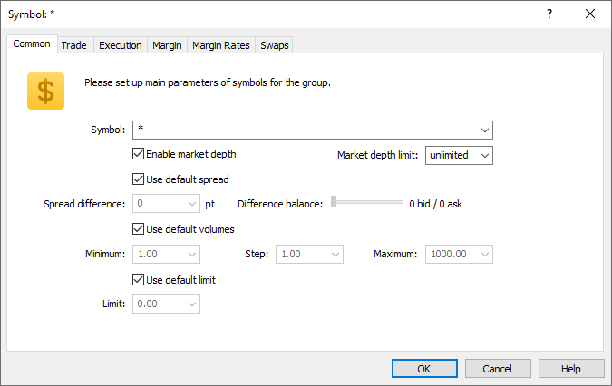

[🏠 Document Start](../../../../README.md) / [MetaTrader 5 Trading Platform](../../../../MetaTrader-5-Trading-Platform.md) / [Platform Setup](../../../Platform-Setup.md) / [Groups](../../Groups.md) / [Group Symbol Settings](../Group-Symbol-Settings.md) / Common

[Previous](../Group-Symbol-Settings.md) | [Next](Trade.md)

# Common

Common settings of a symbol or group of symbols are set up on this tab:

  * Symbol — select a symbol or group of symbols;
  * Enable market depth — allows disabling the depth of market for the client group. If disabled, then a scalper depth of market instead of the exchange one will be used for the symbols. The scalper depth of market shows best Bid/Ask prices as well as a range of prices above and below them generated with the same step (minimal price step), which can be used to quickly place pending orders.
  * Market depth limit — this parameter allows limiting the number of orders in the Market Depth window displayed for this particular group. If the parameter is set to "unlimited", the depth specified in symbol settings (["Market depth" (#dom)](../../Symbols/Symbol-Settings/Common.md#dom)) will be used.
  * Use default spreads — if this option is enabled, all the below parameters will become inactive and spread on these symbols (group of symbols) will be taken from their parameters in the [corresponding section (#spread)](../../Symbols/Symbol-Settings/Common.md#spread);
  * Spread difference — difference of a symbol spread for a certain group of users from the [basic spread of the symbol](../../Symbols.md) (group of symbols);
  * Difference balance — balance of spread difference distribution between bid and ask prices. The volume specified in the "Spread difference" field will be distributed between bid and ask prices in the specified correlation. For example, if you set 3 as the spread difference, then the distribution can be the following: 3 bid/ 0 ask, 2 bid/ 1 ask, etc.
  * Use default volumes — if this option is enabled, volumes for this symbols will be taken from the symbol settings in the corresponding sections. If this option is enabled, all the below parameters will become inactive;

  * Minimum — minimally allowed volume of the symbol order. Not applied when closing positions.
  * Step — step of the volume change.
  * Maximum — maximally allowed volume of a placed order for these symbols. It is considered not only when traders place orders but also when a position is closed by [stop out (#stopout)](../Group-Settings.md#stopout).
  * Use default limit — if this option is enabled, volume limit for this symbols will be taken from the symbol settings in the [corresponding sections (#volumes)](../../Symbols/Symbol-Settings/Trade.md#volumes). If this option is enabled, all the below parameters will become inactive;
  * Limit — maximum allowed cumulative volume of an open position and pending orders by a symbol in one direction (buy or sell). For example, if the limit is set to 5 lots, a user can have an open buy position of 5 lots and place a Sell Limit order of 5 lots. But in this case the trader cannot place a pending Buy Limit order, since the total volume in one direction would exceed the limit. Also, a client having a 5-lot Buy position cannot place a Sell Limit order with a volume exceeding 5 lots: if the pending order triggered after the closing of the initial position, the client would have a short position exceeding the specified limit.

> Price transformation settings (the Spread difference and the Difference balance) for a group are applied after applying [base settings of a symbol](../../Symbols/Symbol-Settings/Common.md).
