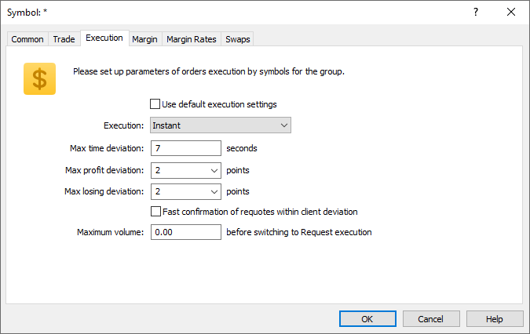

[🏠 Document Start](../../../../README.md) / [MetaTrader 5 Trading Platform](../../../../MetaTrader-5-Trading-Platform.md) / [Platform Setup](../../../Platform-Setup.md) / [Groups](../../Groups.md) / [Group Symbol Settings](../Group-Symbol-Settings.md) / Execution

[Previous](Trade.md) | [Next](Margin.md)

# Execution

Execution parameters of orders of a financial instrument or group of instruments specified on the previous tab, are set up here.

If you enable "Use default execution settings", execution settings for these symbols (or group of symbols) will be taken from their settings in the [corresponding section](../../Symbols/Symbol-Settings/Execution.md). All the below parameters will become inactive.

## Instant

### In this mode a client places an order at prices from the Market Watch window without requesting prices before that. The following settings are available for this mode:

  * Max time deviation — the maximal difference between the time when the price specified in the client's order was received, and the time of the latest price. If this limit is exceeded, requote is performed and new prices are sent to the client;
  * Max profit deviation — maximal deviation of the order price from the current symbol price in the direction profitable for a client. This value being exceeded, new prices will be sent to the client;
  * Max losing deviation — maximal deviation of the order price from the current symbol price in the direction losing for a client. This value being exceeded, new prices will be sent to the client;
  * Maximum volume — the maximum volume of the order that can be accepted in the instant execution mode. All clients' orders larger than that will be automatically transferred to the manual execution mode.

The following options are used only if the deal volume exceeds the maximum volume that can be accepted in the instant execution mode. Such deals are processed in the "Request" execution mode.

  * Timeout — time in seconds, during which the price provided by the dealer is valid;
  * Confirm orders — if this option is enabled, then after a trader received quotes from a dealer and agrees to execute a deal at them, the dealer will have to additionally confirm the execution of this order.

> Price and requote checks are described in the relevant [symbols section (#requote)](../../Symbols/Symbol-Settings/Execution.md#requote).

## Request

In this mode, a client requests the filling price before placing an order. The following options are available here:

  * Timeout — time in seconds, during which the price provided by the dealer is valid;
  * Confirm orders — if this option is enabled, then after a trader received quotes from a dealer and agrees to execute a deal at them, the dealer will have to additionally confirm the execution of this order.

## Market

In this mode, a client places an order at the broker's price, "agreeing with it in advance".

## Exchange

In this execution mode a trader's request is passed to an external gateway connected to an exchange or another liquidity provider.
