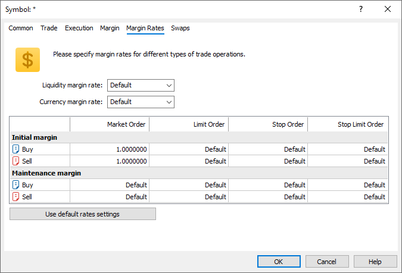

[🏠 Document Start](../../../../README.md) / [MetaTrader 5 Trading Platform](../../../../MetaTrader-5-Trading-Platform.md) / [Platform Setup](../../../Platform-Setup.md) / [Groups](../../Groups.md) / [Group Symbol Settings](../Group-Symbol-Settings.md) / Margin Rates

[Previous](Margin.md) | [Next](Swaps.md)

# Margin rates

This section contains margin rates for various order types. The rates are set for the initial and maintenance margin individually. If there is no rate for the maintenance margin (equal to zero), the initial margin value is used instead.

  * Use default margin rate settings — use margin rate parameters specified for the symbol in the [corresponding section](../../Symbols/Symbol-Settings/Margin-Rates.md).
  * Liquidity margin rate — in the [exchange risk management model (#assets)](../../Symbols/Symbol-Settings/Trade/Margin-Calculation/Stock-Exchange.md#assets), clients can use their own assets as collateral for open positions. The liquidity margin rate determines the amount of the current value of an asset for the specified financial instrument, which will be taken into account as collateral (accounted for in client's equity). If the value is set to 0, the instrument cannot be used as collateral.
  * Currency margin rate — rate change radius of the currency, a futures contract is denominated in, relative to the Russian ruble. The parameter is used when calculating security deposit for futures contracts ([Exchange FORTS Futures (#forts)](../../Symbols/Symbol-Settings/Trade/Margin-Calculation/Basic.md#forts)) traded on Moscow Exchange ([calculating variation margin and security deposit using the current USD exchange rate](https://fs.rts.micex.ru/files/644 "Variation margin and security deposit calculation using the current US Dollar exchange rate") \- in Russian). The values are sent by the Moscow Exchange when using the gateway [MetaTrader 5 to MOEX Derivatives](../../../Platform-Components/Gateways/MOEX-Derivatives.md).
  * Margin rates — this table contains margin rates for various order types. The rates are set for the initial and maintenance margin individually. If there is no rate for the maintenance margin (equal to zero), the initial margin value is used instead.

  * Market buy order — multiplier for calculating margin requirements for long positions relative to the [main amount of margin](../../Symbols/Symbol-Settings/Trade/Margin-Calculation.md);
  * Market sell order — multiplier for calculating margin requirements for short positions relative to the main amount of margin;
  * Buy limit order — multiplier for calculating margin requirements for Buy Limit orders relative to the main amount of margin;
  * Sell limit order — multiplier for calculating margin requirements for Sell Limit orders relative to the main amount of margin;
  * Buy stop order — multiplier for calculating margin requirements for Buy Stop orders relative to the main amount of margin;
  * Sell stop order — multiplier for calculating margin requirements for Sell Stop orders relative to the main amount of margin;
  * Buy stop limit order — multiplier for calculating margin requirements for Buy Stop Limit orders relative to the main amount of margin;
  * Sell stop limit order — multiplier for calculating margin requirements for Sell Stop Limit orders relative to the main amount of margin.

To avoid overriding the coefficient value for a group, leave the value set to "Default". In this case, the corresponding value from the [symbol settings](../../Symbols/Symbol-Settings/Margin-Rates.md) will be used. The "Use Default Settings" command applies these default values to all parameters in this section.

  * If the initial margin is specified, no margin calculations will be performed using the formulas specified in the ["Calculation" (#calculation)](../../Symbols/Symbol-Settings/Trade.md#calculation) field.
  * If the maintenance margin size is not specified, the initial margin value will be used instead.

  * If the [exchange risk management (#margin)](../Group-Settings.md#margin) model is used for a client group and margin rates of an instrument are set to 0, such an instrument is considered to be a non-marginable security. No margin calculations are performed for such instruments (no margin is charged).

  
---  
  
The margin rates are described in details in a [separate section (#rate)](../../Symbols/Symbol-Settings/Trade/Margin-Calculation/Retail-Forex-CFD-Futures-—-Netting.md#rate).
