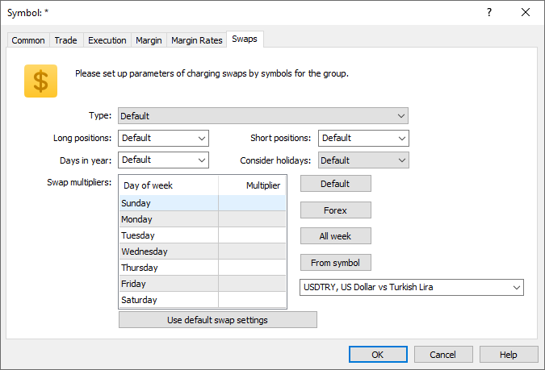

[🏠 Document Start](../../../../README.md) / [MetaTrader 5 Trading Platform](../../../../MetaTrader-5-Trading-Platform.md) / [Platform Setup](../../../Platform-Setup.md) / [Groups](../../Groups.md) / [Group Symbol Settings](../Group-Symbol-Settings.md) / Swaps

[Previous](Margin-Rates.md) | [Next](../Commission-Settings.md)

# Swaps

Position rollovers for a symbol are set up on this tab:

  * Type — swap calculation method. To disable swap calculation, select the "Disabled" option.
  * Long positions — swap for Buy positions.
  * Short positions — swap for Sell positions.
  * Days in year — the number of days in a year to be used for [swap percent calculation (#percentage)](../../Symbols/Symbol-Settings/Swaps.md#percentage). Depending on the country and market in which the broker operates, as well as on the financial instrument type, different [number of days in a year](https://en.wikipedia.org/wiki/Day_count_convention) can be used when calculating annual percent. This parameter operates with such calculation specifics. The most common option of 360 days is used by default. You can change the value to 365 or 366, as well as specify a different value manually.
  * Swap multipliers — swap multiplier for each day of the week. This multiplier will be applied to the calculated swap value before charging. Specify 1 to charge the regular amount, 3 for triple swap or 0 to cancel swap. Conveniently manage the settings using the following commands:

  * Forex — sets standard settings for Forex instruments: standard single swaps on weekdays and triple swap on Wednesday.
  * All week — standard single swap seven days a week.
  * From symbol — copies swap coefficients from the selected symbol.
  * Consider holidays — if the option is enabled, the platform will check holiday configurations and adjust swaps accordingly. The day before the holiday, the swap is doubled. No swap is charged on the day of the holiday. The calculations still use the swap multipliers specified for the corresponding days.

The "Default" value can be set for each field. In this case, the basic symbol configuration from the [relevant section](../../Symbols/Symbol-Settings/Swaps.md) will be used for the group.

For further details on how swaps work, please see "[Symbols \ Swaps](../../Symbols/Symbol-Settings/Swaps.md)".
