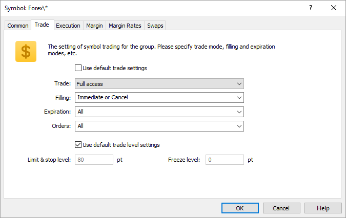

[🏠 Document Start](../../../../README.md) / [MetaTrader 5 Trading Platform](../../../../MetaTrader-5-Trading-Platform.md) / [Platform Setup](../../../Platform-Setup.md) / [Groups](../../Groups.md) / [Group Symbol Settings](../Group-Symbol-Settings.md) / Trade

[Previous](Common.md) | [Next](Execution.md)

# Trade

Individual parameters of symbols trading are specified on this tab:

  * Use default trade settings — if this option is enabled, all the below parameters will become inactive and the trade parameters for symbols (group of symbols) will be taken from their settings in the [corresponding session](../../Symbols/Symbol-Settings/Trade.md);
  * Trade — trade settings for the group: disabled, long only, short only, close only or full access;
  * Filling — additional rules of [order filling (#fill-policy)](../../General-Information/Trading-System.md#fill-policy) that can be set to traders. The necessary filling type should be ticked off:

  * Fill or Kill — this fill policy means that a deal can be executed only with the specified volume.
  * Immediate or Cancel — in this case a trader agrees to execute a deal with the volume maximally available in the market within that indicated in the order. In case the order cannot be filled completely, the available volume of the order will be filled, and the remaining volume will be canceled.

  * Book or Cancel — the order can only be placed in the Depth of Market (order book). If the order can be filled immediately when placed, this order is canceled.

  * Return — this mode is not available in the list. It is always enabled for the market (Buy and Sell) orders in the Exchange Execution mode, as well as for [limit and stop limit orders (#pending-order)](../../General-Information/Trading-System.md#pending-order) in the Market Execution and Exchange Execution modes.
  * Expiration — condition for the expiration of orders. Necessary expiration types should be ticked off:

  * Good till canceled — the order will stay in the queue until it is manually canceled;
  * Day — the order will be effective only during the current trading day;
  * Specified time — the order will be effective till the date specified by the trader;
  * Specified day — the order is active till 00:00 of the specified day. If that time appears to be out of a trade session, the expiration will be processed at a nearest trading time.
  * Use default trade level settings — if this option is enabled, all the below parameters will become inactive and the trade level settings for symbols (group of symbols) will be taken from their settings in the [corresponding session](../../Symbols/Symbol-Settings/Trade.md);
  * Limit & stop level — price channel (in points) from the current market price, within which it is prohibited to place Stop Loss, Take Profit and pending orders. At the attempt to place an order within this channel, the server will return message "Invalid S/L or T/P" and will not accept the order;
  * Freeze level — level for freezing orders that are close to the current price. When an order is as close as the value specified here or less than that, its modification, closing or deletion is prohibited.

