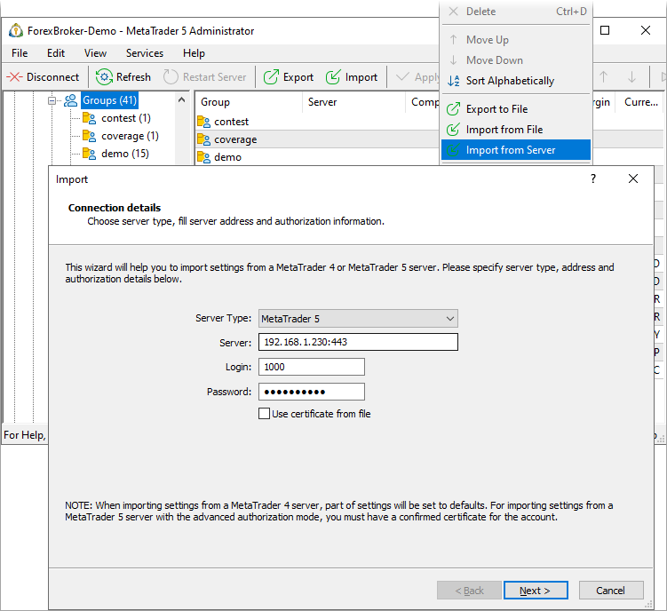
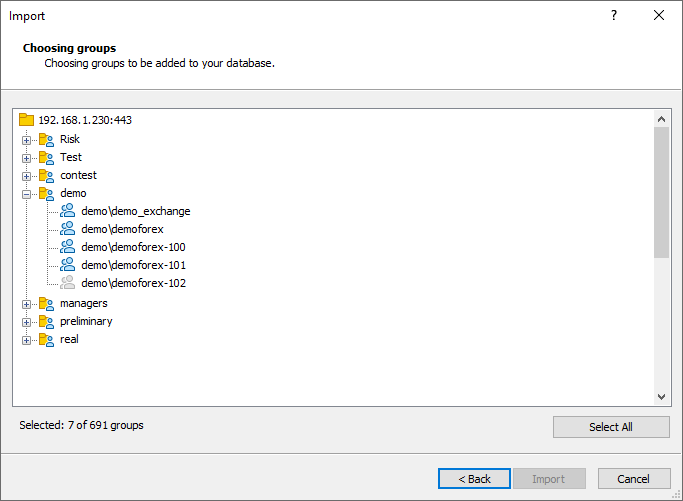

[🏠 Document Start](../../../README.md) / [MetaTrader 5 Trading Platform](../../../MetaTrader-5-Trading-Platform.md) / [Platform Setup](../../Platform-Setup.md) / [Groups](../Groups.md) / Import of

[Previous](Group-Types.md) | [Next](Extended-Authentication-Setup.md)

# Import of Groups

Using the Administrator terminal, you can import groups from other MetaTrader 4 and MetaTrader 5 servers. In order to proceed with the import, select " Import" in the context menu of the ["Groups"](../Groups.md) section.

> Groups can be imported only if the administrator is connected to the main trade server.

The first step is to specify the details of the server from which the groups will be imported, as well as details of the account to connect to it:

  * Server Type — select here the type of the server from which groups will be imported: MetaTrader 5 or MetaTrader 4.
  * Server — the IP address and the port number of the server, separated by a colon.
  * Login — the number of the manager account for authentication on the server.
  * Password — the account password for authentication on the server.
  * Use certificate from file — if accounts are imported from a MetaTrader 5 server with the [extended authorization](../../MetaTrader-5-Administrator/Getting-Started/Connect-to-Server/Extended-Authorization.md) mode enabled, you will need a confirmed certificate to connect using the above specified account details. If the certificate has previously been installed in the storage of the operating system, it will be automatically recognized by the import system. If the certificate has not been installed, you must enable this option and specify the path to it file manually.

  * Certificate File — click "Browse" and specify the pfx-file of the certificate. The certificate file received in the terminal is saved in /terminal data folder/profiles/server name/certificates/.
  * Certificate Password — [the password (#password)](../../MetaTrader-5-Administrator/Getting-Started/Connect-to-Server/Extended-Authorization.md#password) of the certificate.

  * Import in the extended authorization mode is possible only from MetaTrader 5 servers.
  * To import groups, you must have a manager account with the ["Configuring Groups" (#permissions)](../Managers.md#permissions) permission on the source server.

  
---  
  
Once all the details are specified, press the "Next" button. In the case of a successful connection to the server, the list of available groups appears in the next window:

How to select groups:

  * Double click on its icon, and the icon will become bright.
  * Double click on the section icon, in this case all groups from the section are selected.
  * Click on the "Select All" button.

Here you can also view [settings](Group-Settings.md) of groups to import. To do this, double click on their names. To start the import, click the "Done".

  * After importing, check the settings of all groups.
  * All groups [are bound (#trade-server)](Group-Settings.md#trade-server) to the main trade server. After importing the binding can be changed.
  * Only new groups are imported. Settings of existing groups of the same name are not overwritten.

  
---  
  
## Features of Import from MetaTrader 4

There are some specific features of import from MetaTrader 4 servers:

  * When you import groups from the MetaTrader 4 server, existing settings are converted, and default values are assigned to missing settings.
  * When you import groups from the MetaTrader 4 server, trade settings of symbols for the groups are not imported.
  * Groups from the MetaTrader 4 server are imported into the currently selected groups section. When importing groups from the MetaTrader 5 server, their hierarchy is preserved.

