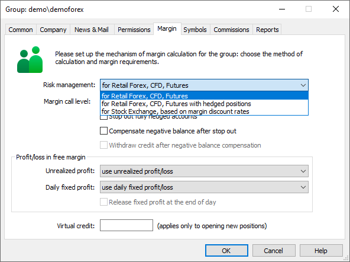

[🏠 Document Start](../../../README.md) / [MetaTrader 5 Trading Platform](../../../MetaTrader-5-Trading-Platform.md) / [Platform Setup](../../Platform-Setup.md) / [Groups](../Groups.md) / Position Accounting Systems

[Previous](Extended-Authentication-Setup.md) | [Next](../Clients.md)

# Position Accounting Systems (#position-accounting-systems)

Two position accounting systems are supported in the trading platform: Netting and Hedging. The system used depends on the [group settings (#risk)](Group-Settings.md#risk):

Different position accounting systems are only supported for the OTC market. On exchange markets, the "netting" system is always used.

## Netting System (#netting)

With this system, you can have only one common position for a symbol at the same time:

  * If there is an open position for a symbol, executing a deal in the same direction increases the volume of this position.
  * If a deal is executed in the opposite direction, the volume of the existing position can be decreased, the position can be closed (when the deal volume is equal to the position volume) or reversed (if the volume of the opposite deal is greater than the current position).

It does not matter, what has caused the opposite deal — an executed market order or a triggered pending order.

The below example shows execution of two EURUSD Buy deal 1 lot each:

## Hedging System (#hedging)

With this system, you can have multiple open positions of one and the same symbol, including opposite positions.

If you have an open position for a symbol, and execute a new deal (or a pending order triggers), a new position is additionally opened. Your current position does not change.

The below example shows execution of two EURUSD Buy deal 1 lot each:

### Impact of the System Selected (#impact-of-the-system-selected)

Depending on the position accounting system, some of the platform functions may have different behavior:

  * Stop Loss and Take Profit inheritance rules change. For more details please read the client terminal Help.
  * To close a position in the netting system, you should perform an opposite trading operation for the same symbol and the same volume. To close a position in the hedging system, explicitly select the "Close Position" command in the context menu of the position.
  * A position cannot be reversed in the hedging system. In this case, the current position is closed and a new one with the remaining volume is opened.
  * In the hedging system, a new condition for margin calculation is available — [Hedged margin (#hedged)](../Symbols/Symbol-Settings/Trade/Margin-Calculation/Retail-Forex-CFD-Futures-—-Hedging.md#hedged).

