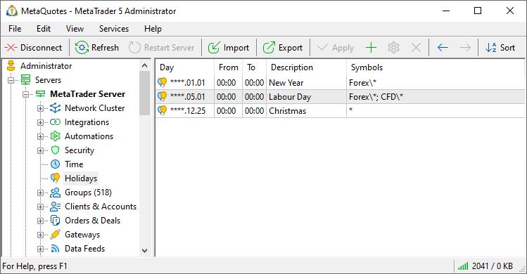
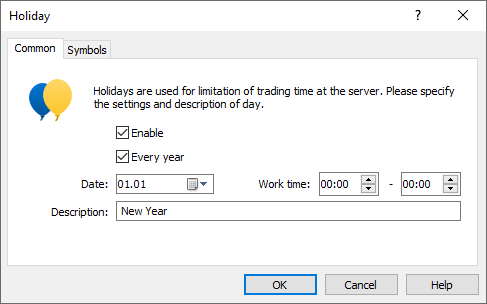
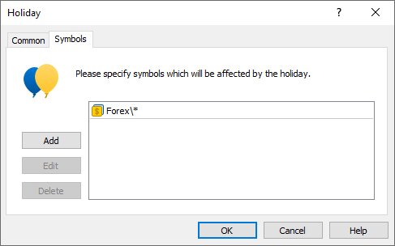
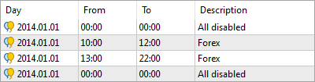

[🏠 Document Start](../../README.md) / [MetaTrader 5 Trading Platform](../../MetaTrader-5-Trading-Platform.md) / [Platform Setup](../Platform-Setup.md) / Holidays

[Previous](Time.md) | [Next](Leverages.md)

# Holidays (#holidays)

In this section you can add holidays to the working time schedule both for symbol groups and separate symbols. During holidays clients can connect, watch charts and trading history, but cannot conduct trade operations.

  * [Data feeds](Data-Feeds.md) that receive quotes only are automatically disabled on holidays. As soon as a holiday is over, the data feeds are automatically enabled. Data feeds that receive news keep working.

  * Holiday settings do not affect [swap calculation](Symbols/Symbol-Settings/Swaps.md).

  
---  
  
Holidays are represented like this:

In order to add or edit a holiday, press " Add" or " Edit", respectively. These buttons are located in the [Edit](../MetaTrader-5-Administrator/User-Interface/Main-Menu/Edit.md) menu, on the [Standard](../MetaTrader-5-Administrator/User-Interface/Toolbar/Standard.md) toolbar and in the [context menu (#context)](Holidays.md#context). The window of holiday settings will be opened as soon as you press them.

> Additional general information about working with configuration records is given in the ["Working with Instructions"](General-Information/Working-with-Instructions.md) section.

## Common (#common)

The following parameters are set up here:

  * Enable — enable/disable a holiday;
  * Every year — enable holiday repeating every year. For such holidays "****" is shown instead of the year;
  * Date — date of the holiday. A date is selected via a calendar that is opened upon pressing . The date can also be entered manually;
  * Work time — server work time on the holiday. If there is no working time on this day, leave zero values in these fields;
  * Description — text description of the holiday.

> The delivery of quotes and trading continue until the last minute of the working time range inclusive. For example, if the specified range is from 00:00 to 18:00, then the actual working time is 00:00:00 – 18:00:59.

## Symbol (#symbols)

here you should specify symbols or groups of symbols, for which this holiday will be effective:

  * Add — add symbols. As soon as you press this button, a new field will appear in this window. Click on this field and select a symbol or group from the appeared list of symbols available on the server. To specify all symbols, select the "Symbols" point. Read more details in ["Specifying Symbols"](General-Information/Specifying-Symbols-and-Groups.md);
  * Delete — delete a selected symbol or group of symbols;
  * Edit — edit a selected symbol or group of symbols.

To complete creation or editing of a holiday press "OK". If you press "Cancel", the window will be closed, while changes will not be saved.

In order to delete a holiday, select it and press " Delete" in the [Edit (#delete)](../MetaTrader-5-Administrator/User-Interface/Main-Menu/Edit.md#delete) menu, on the [Standard](../MetaTrader-5-Administrator/User-Interface/Toolbar/Standard.md) toolbar or in the context menu.

## Holidays Check (#holidays-check)

Holiday rules are checked from top downward. If any rule allows trading for a symbol in the specified interval, all further rules will be ignored for this symbol-interval binding. Thus:

  * It is not possible to override an allowing rule by subsequent prohibiting rules.
  * It is possible to override a prohibiting rule by subsequent allow rules.

Let's consider example:

  * The first rule prohibits trading for all symbols on January 1, 2014
  * The second rule allows trading for Forex group symbols from 10:00 to 12:00 on that day
  * The third rule allows trading for the same symbols from 13:00 to 22:00
  * The fourth rule prohibits trading for all symbols on January 1, 2014.

As a result, on January 1, 2014, trading will be allowed for Forex group symbols from 10:00 to 12:00 and from 13:00 to 22:00. The fourth rule is ignored for the earlier allowed intervals as the check for these intervals stopped after the rules allowing trading for them.

Thus, in order to set several trading intervals inside one time interval, you should first set a prohibitive rule followed by permissive ones.

## Context Menu (#context)

The context menu of Holidays contains the following commands:

  *  Add — add a new holiday;
  *  Edit — edit a selected holiday;
  *  Delete — delete a selected holiday;
  *  Move Up — move the selected holiday up relative to others;
  *  Move Down — move the selected holiday down relative to others;
  *  Sort Alphabetically — sort configurations alphabetically. Please note that sorting is done on the server, not in the local terminal.
  *  Export to File — [export](General-Information/ImportExport-Settings.md) holidays settings to a file.
  *  Import from File — [import (#import)](General-Information/ImportExport-Settings.md#import) holidays settings to a file.
  *  Journal — request [logs](Network-cluster/Journal.md) according to the selected configuration. This will open the trade server logs section, with the name of the selected configuration automatically specified in the query field. You will only need to press the request button.
  *  Find — open the [search](../MetaTrader-5-Administrator/User-Interface/Search.md) window;
  * Auto Arrange — if this option is enabled the size of columns is selected automatically;
  * Grid — this option shows/hides field separators in the table.

