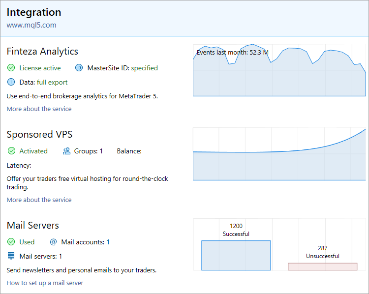

[🏠 Document Start](../../README.md) / [MetaTrader 5 Trading Platform](../../MetaTrader-5-Trading-Platform.md) / [Platform Setup](../Platform-Setup.md) / Integrations

[Previous](Network-cluster/Journal.md) | [Next](Integrations/Finteza-Analytics.md)

# Integrations

The "Integrations" section allows configuring platform integration with external service:

  * [The Finteza business analytics system](Integrations/Finteza-Analytics.md) which provides audience analysis and new client attraction features
  * [Sponsored VPS](Integrations/Sponsored-VPS.md) for attracting new customers and increasing trading volumes on existing accounts
  * [Mail servers](Integrations/Mail-Servers.md) for sending trading reports and notifications
  * [SMS Gateways](Integrations/SMS-Gateways.md) for phone confirmation during registration and for notifications
  * [Instant Messengers](Integrations/Messengers.md) for phone confirmation during registration and for notifications
  * [KYC systems](Integrations/KYC.md) for automated client data and document verification
  * [Web Services](Integrations/Web-Services.md) for integration with websites and for creating trader rooms

Integrations enable automation of various processes. You can reduce manual operations and improve the quality of services provided to traders.

## Service overview

The home section contains stats and graphs revealing key data on using the services:

  * Number of user action events in the platform you have tracked via Finteza
  * Number of hosting spots you have offered to your traders
  * Number of emails and SMS messages you have sent to your clients
  * Number of documents automatically checked via the KYC provider

Here you can also see if any of the services has not been configured yet meaning you are not using all the platform features.

