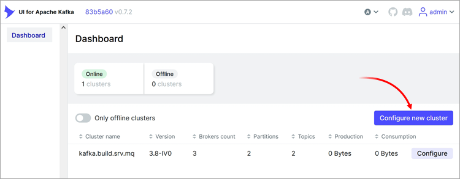
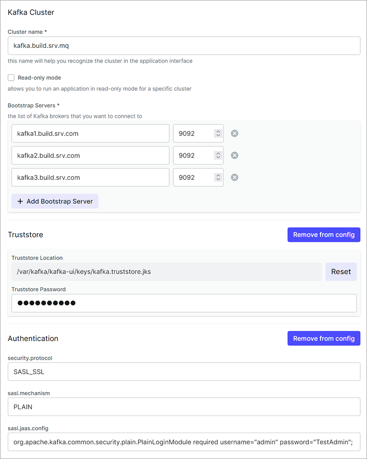

[🏠 Document Start](../../../../README.md) / [MetaTrader 5 Trading Platform](../../../../MetaTrader-5-Trading-Platform.md) / [Platform Setup](../../../Platform-Setup.md) / [Integrations](../../Integrations.md) / [Event Streaming](../Event-Streaming.md) / Kafka Installation and Setup

[Previous](../Event-Streaming.md) | [Next](Kafka-Streaming-Setup.md)

# Apache Kafka Server Installation and Setup (#apache-kafka-server-installation-and-setup)

There are many ways to install and configure [Apache Kafka](https://kafka.apache.org/). In this article, we will demonstrate just one example. Instead of setting up your own server, you may use ready-to-use cloud-based solutions, such as:

  * <https://aws.amazon.com/msk/>
  * <https://yandex.cloud/en/services/managed-kafka>
  * <https://www.digitalocean.com/products/managed-databases-kafka>

Before beginning the installation, we also recommend reviewing the official documentation and other helpful resources about the system:

  * <https://kafka.apache.org/quickstart>
  * <https://www.confluent.io/resources/ebook/kafka-the-definitive-guide/>

## Kafka Cluster Installation (#kafka-cluster-installation)

As an example, let's consider the installation of a Kafka cluster consisting of three brokers. All brokers will be installed on a single physical machine running Ubuntu 22.04, each configured with a different IP address. It is assumed that the server is properly configured and accessible from the Internet on ports 9092 and 9093 at the address kafka.build.srv.com.

This machine will serve both as a broker and as the controller managing the entire cluster. Run the following scripts on each instance:

Install the required packages:

# update and install zip and jdk sudo apt-get update; echo Y|apt-get upgrade; echo Y|apt-get dist-upgrade; echo Y|apt-get autoremove sudo apt-get install unzip sudo apt-get install default-jdk -y (#update-and-install-zip-and-jdk-sudo-apt-get-update-echo-yapt-get-upgrade-echo-yapt-get-dist-upgrade-echo-yapt-get-autoremove-sudo-apt-get-install-unzip-sudo-apt-get-install-default-jdk-y)
---  
  
Create a user account under which Kafka services will operate:

# create kafka user sudo adduser --no-create-home --shell=/sbin/nologin --disabled-password --disabled-login --gecos "" kafka (#create-kafka-user-sudo-adduser-no-create-home-shellsbinnologin-disabled-password-disabled-login-gecos-kafka)
---  
  
Create directories for cluster installation:

sudo mkdir /var/kafka sudo mkdir /var/kafka/kafka1 sudo mkdir /var/kafka/kafka1/logs sudo mkdir /var/kafka/kafka2 sudo mkdir /var/kafka/kafka2/logs sudo mkdir /var/kafka/kafka3 sudo mkdir /var/kafka/kafka3/logs  
---  
  
Download the latest Kafka distribution from <https://kafka.apache.org/downloads> and extract it into three separate directories: kafka1, kafka2, and kafka3.

Set the Kafka user as the owner of each directory to allow modification of their contents:

sudo chown -R kafka:kafka /var/kafka  
---  
  
Generate a unique cluster ID. The ID is required to operate in Controller (Kraft) mode. You can use any sufficiently complex alphanumeric combination. This ID will be needed later during the configuration process.

/var/kafka/kafka1/bin# ./kafka-storage.sh random-uuid [unique cluster ID]  
---  
  
Issue an SSL certificate for the domain through which Kafka will be accessible, for example, using [Let's Encrypt](https://letsencrypt.org/). Copy the certificate file (CRT) and the private key (PFX) to the directory: /var/kafka/kafka1/config/kraft/keys. Next, create a certificate keystore:

keytool -importkeystore -srckeystore [certificate.pfx] -srcstoretype pkcs12 -srcstorepass [certificate password] -destkeystore kafka.keystore.jks -deststoretype jks -deststorepass [keystore password] keytool -keystore kafka.truststore.jks -alias CARoot -import -file [certificate.crt] -storepass [keystore password]  
---  
  
Replace the placeholders with your actual values:

  * certificate.pfx — the filename of the certificate containing the private key
  * password certificate — the password protecting the certificate
  * keystore certificate — the password protecting the certificate keystore
  * certificate.crt — the filename of the certificate containing the private key

Then copy the following four files to /var/kafka/kafka1/config/kraft/:

1\. admin.properties — this file contains the main connection parameters for Kafka.

bootstrap.servers=kafka1.build.srv.com:9092, kafka2.build.srv.com:9092, kafka3.build.srv.com:9092 security.protocol=SASL_SSL sasl.mechanism=PLAIN sasl.jaas.config=org.apache.kafka.common.security.plain.PlainLoginModule required username="admin" password="TestAdmin"; ssl.keystore.location=/var/kafka/kafka1/config/kraft/keys/kafka.keystore.jks ssl.keystore.password=[keystore password] ssl.key.password=[certificate password] ssl.truststore.location=/var/kafka/kafka1/config/kraft/keys/kafka.truststore.jks ssl.truststore.password=hSFdoYWxJ3  
---  
  
Please note:

  * bootstrap.servers=kafka1.build.srv.com:9092, kafka2.build.srv.com:9092, kafka3.build.srv.com:9092 — these are the subdomains where the Kafka brokers will be running. Replace them with the appropriate addresses for your domains. These endpoints will be required when [configuring the connection to Kafka from MetaTrader 5](Kafka-Streaming-Setup.md).
  * username="admin" password="TestAdmin" — these are the login and password of the administrator account, which you will use to connect to the Kafka server. You can replace these credentials with your own.
  * security.protocol=SASL_SSL — the type of authentication that the Kafka server will use. You will need to specify it when [configuring the connection to Kafka from MetaTrader 5](Kafka-Streaming-Setup.md).
  * ssl.keystore.password — the password for the certificate keystore
  * ssl.key.password — the password for the certificate

2\. jaas.conf — this file is used to define Kafka users. 

KafkaServer { org.apache.kafka.common.security.plain.PlainLoginModule required //Cluster administrator login username="admin" password="TestAdmin" user_admin="TestAdmin" //Logins in the format of user_username="Password" user_testconsumer="TestConsumer" user_testproducer="TestProducer" serviceName="kafka"; };  
---  
  
As an example, two users are created with the usernames testconsumer and testproducer. These accounts can be used to [connect to Kafka from MetaTrader 5](Kafka-Streaming-Setup.md).

For the administrator account login and password, use the corresponding credentials from the admin.properties file.

Copy a similar file to the remaining cluster nodes: /var/kafka/kafka2/config/kraft/ and /var/kafka/kafka3/config/kraft/.

3\. kafka1.service — this file defies the service configuration for Kafka.

[Unit] Requires=network.target After=network.target [Service] Type=simple User=kafka Environment=KAFKA_HEAP_OPTS="-Xmx1G -Xms1G -Djava.security.auth.login.config=/var/kafka/kafka1/config/kraft/jaas.conf" Environment=KAFKA_JVM_PERFORMANCE_OPTS="-XX:+UseG1GC -XX:MaxGCPauseMillis=20 -XX:InitiatingHeapOccupancyPercent=35 -XX:+ExplicitGCInvokesConcurrent" ExecStartPre=/bin/bash -c '/var/kafka/kafka1/bin/kafka-storage.sh format -t [unique cluster ID] -c /var/kafka/kafka1/config/kraft/server.properties --ignore-formatted' ExecStart=/bin/bash -c '/var/kafka/kafka1/bin/kafka-server-start.sh /var/kafka/kafka1/config/kraft/server.properties' ExecStop=/var/kafka/kafka1/bin/kafka-server-stop.sh Environment="LOG_DIR=/var/kafka/kafka1/logs" Restart=on-failure LimitNOFILE=65536 [Install] WantedBy=multi-user.target  
---  
  
In the file, specify the unique cluster ID defined in the [previous steps (#uuid)](Kafka-Installation-and-Setup.md#uuid). 

Copy a similar file to the remaining cluster nodes: /var/kafka/kafka2/config/kraft/ and /var/kafka/kafka3/config/kraft/.

4\. server.properties — the detailed settings of the Kafka server. 

<a id="licensed-to-the-apache-software-foundation-asf-under-one-or-more-contributor-license-agreements-see-the-notice-file-distributed-with-this-work-for-additional-information-regarding-copyright-ownership-the-asf-licenses-this-file-to-you-under-the-apache-license-version-20-the-license-you-may-not-use-this-file-except-in-compliance-with-the-license-you-may-obtain-a-copy-of-the-license-at-httpwwwapacheorglicenseslicense-20-unless-required-by-applicable-law-or-agreed-to-in-writing-software-distributed-under-the-license-is-distributed-on-an-as-is-basis-without-warranties-or-conditions-of-any-kind-either-express-or-implied-see-the-license-for-the-specific-language-governing-permissions-and-limitations-under-the-license-this-configuration-file-is-intended-for-use-in-kraft-mode-where-apache-zookeeper-is-not-present-server-basics-the-role-of-this-server-setting-this-puts-us-in-kraft-mode-processrolesbrokercontroller-the-node-id-associated-with-this-instances-roles-nodeid1-the-connect-string-for-the-controller-quorum-controllerquorumvoters1kafka1buildsrvcom90932kafka2buildsrvcom90933kafka3buildsrvcom9093-controllerquorumvoters1localhost9093-socket-server-settings-the-address-the-socket-server-listens-on-combined-nodes-ie-those-with-processrolesbrokercontroller-must-list-the-controller-listener-here-at-a-minimum-if-the-broker-listener-is-not-defined-the-default-listener-will-use-a-host-name-that-is-equal-to-the-value-of-javanetinetaddressgetcanonicalhostname-with-plaintext-listener-name-and-port-9092-format-listeners-listener_namehost_nameport-example-listeners-plaintextyourhostname9092-listenersexternalkafka1buildsrvcom9092controllerkafka1buildsrvcom9093-listenersplaintext9092controller9093-name-of-listener-used-for-communication-between-brokers-interbrokerlistenernameexternal-listener-name-hostname-and-port-the-broker-or-the-controller-will-advertise-to-clients-if-not-set-it-uses-the-value-for-listeners-advertisedlistenersexternalkafka1buildsrvcom9092-advertisedlistenersplaintextlocalhost9092controllerlocalhost9093-a-comma-separated-list-of-the-names-of-the-listeners-used-by-the-controller-if-no-explicit-mapping-set-in-listenersecurityprotocolmap-default-will-be-using-plaintext-protocol-this-is-required-if-running-in-kraft-mode-controllerlistenernamescontroller-maps-listener-names-to-security-protocols-the-default-is-for-them-to-be-the-same-see-the-config-documentation-for-more-details-listenersecurityprotocolmapexternalsasl_sslcontrollersasl_ssl-listenersecurityprotocolmapcontrollerplaintextplaintextplaintextsslsslsasl_plaintextsasl_plaintextsasl_sslsasl_ssl-sasl-settings-saslenabledmechanismsplain-saslmechanismcontrollerprotocolplain-saslmechanisminterbrokerprotocolplain-securityprotocolsasl_ssl-authorizerclassnameorgapachekafkametadataauthorizerstandardauthorizer-alloweveryoneifnoaclfoundfalse-superusersuseradmin-specify-the-service-name-for-sasl-even-if-plain-is-used-this-parameter-is-required-for-correct-operation-saslkerberosservicenamekafka1-ssltls-settings-sslkeystorelocationvarkafkakafka1configkraftkeyskafkakeystorejks-sslkeystorepasswordkeystore-password-sslkeypasswordcertificate-password-ssltruststorelocationvarkafkakafka1configkraftkeyskafkatruststorejks-ssltruststorepasswordkeystore-password-tls-between-brokers-and-clients-securityinterbrokerprotocolssl-sslclientauthrequired-the-number-of-threads-that-the-server-uses-for-receiving-requests-from-the-network-and-sending-responses-to-the-network-numnetworkthreads3-the-number-of-threads-that-the-server-uses-for-processing-requests-which-may-include-disk-io-numiothreads8-the-send-buffer-so_sndbuf-used-by-the-socket-server-socketsendbufferbytes102400-the-receive-buffer-so_rcvbuf-used-by-the-socket-server-socketreceivebufferbytes102400-the-maximum-size-of-a-request-that-the-socket-server-will-accept-protection-against-oom-socketrequestmaxbytes104857600-log-basics-a-comma-separated-list-of-directories-under-which-to-store-log-files-logdirsvarkafkakafka1logskraft-combined-logs-the-default-number-of-log-partitions-per-topic-more-partitions-allow-greater-parallelism-for-consumption-but-this-will-also-result-in-more-files-across-the-brokers-numpartitions3-the-number-of-threads-per-data-directory-to-be-used-for-log-recovery-at-startup-and-flushing-at-shutdown-this-value-is-recommended-to-be-increased-for-installations-with-data-dirs-located-in-raid-array-numrecoverythreadsperdatadir1-internal-topic-settings-the-replication-factor-for-the-group-metadata-internal-topics-__consumer_offsets-and-__transaction_state-for-anything-other-than-development-testing-a-value-greater-than-1-is-recommended-to-ensure-availability-such-as-3-offsetstopicreplicationfactor1-transactionstatelogreplicationfactor1-transactionstatelogminisr1-log-flush-policy-messages-are-immediately-written-to-the-filesystem-but-by-default-we-only-fsync-to-sync-the-os-cache-lazily-the-following-configurations-control-the-flush-of-data-to-disk-there-are-a-few-important-trade-offs-here-1-durability-unflushed-data-may-be-lost-if-you-are-not-using-replication-2-latency-very-large-flush-intervals-may-lead-to-latency-spikes-when-the-flush-does-occur-as-there-will-be-a-lot-of-data-to-flush-3-throughput-the-flush-is-generally-the-most-expensive-operation-and-a-small-flush-interval-may-lead-to-excessive-seeks-the-settings-below-allow-one-to-configure-the-flush-policy-to-flush-data-after-a-period-of-time-or-every-n-messages-or-both-this-can-be-done-globally-and-overridden-on-a-per-topic-basis-the-number-of-messages-to-accept-before-forcing-a-flush-of-data-to-disk-logflushintervalmessages10000-the-maximum-amount-of-time-a-message-can-sit-in-a-log-before-we-force-a-flush-logflushintervalms1000-log-retention-policy-the-following-configurations-control-the-disposal-of-log-segments-the-policy-can-be-set-to-delete-segments-after-a-period-of-time-or-after-a-given-size-has-accumulated-a-segment-will-be-deleted-whenever-either-of-these-criteria-are-met-deletion-always-happens-from-the-end-of-the-log-the-minimum-age-of-a-log-file-to-be-eligible-for-deletion-due-to-age-logretentionhours168-a-size-based-retention-policy-for-logs-segments-are-pruned-from-the-log-unless-the-remaining-segments-drop-below-logretentionbytes-functions-independently-of-logretentionhours-logretentionbytes1073741824-the-maximum-size-of-a-log-segment-file-when-this-size-is-reached-a-new-log-segment-will-be-created-logsegmentbytes1073741824-the-interval-at-which-log-segments-are-checked-to-see-if-they-can-be-deleted-according-to-the-retention-policies-logretentioncheckintervalms300000"></a>
# Licensed to the Apache Software Foundation (ASF) under one or more # contributor license agreements. See the NOTICE file distributed with # this work for additional information regarding copyright ownership. # The ASF licenses this file to You under the Apache License, Version 2.0 # (the "License"); you may not use this file except in compliance with # the License. You may obtain a copy of the License at # # http://www.apache.org/licenses/LICENSE-2.0 # # Unless required by applicable law or agreed to in writing, software # distributed under the License is distributed on an "AS IS" BASIS, # WITHOUT WARRANTIES OR CONDITIONS OF ANY KIND, either express or implied. # See the License for the specific language governing permissions and # limitations under the License. # # This configuration file is intended for use in KRaft mode, where # Apache ZooKeeper is not present. # ############################# Server Basics ############################# # The role of this server. Setting this puts us in KRaft mode process.roles=broker,controller # The node id associated with this instance's roles node.id=1 # The connect string for the controller quorum controller.quorum.voters=1@kafka1.build.srv.com:9093,2@kafka2.build.srv.com:9093,3@kafka3.build.srv.com:9093 #controller.quorum.voters=1@localhost:9093 ############################# Socket Server Settings ############################# # The address the socket server listens on. # Combined nodes (i.e. those with `process.roles=broker,controller`) must list the controller listener here at a minimum. # If the broker listener is not defined, the default listener will use a host name that is equal to the value of java.net.InetAddress.getCanonicalHostName(), # with PLAINTEXT listener name, and port 9092. # FORMAT: # listeners = listener_name://host_name:port # EXAMPLE: # listeners = PLAINTEXT://your.host.name:9092 listeners=EXTERNAL://kafka1.build.srv.com:9092,CONTROLLER://kafka1.build.srv.com:9093 #listeners=PLAINTEXT://:9092,CONTROLLER://:9093 # Name of listener used for communication between brokers. inter.broker.listener.name=EXTERNAL # Listener name, hostname and port the broker or the controller will advertise to clients. # If not set, it uses the value for "listeners". advertised.listeners=EXTERNAL://kafka1.build.srv.com:9092 #advertised.listeners=PLAINTEXT://localhost:9092,CONTROLLER://localhost:9093 # A comma-separated list of the names of the listeners used by the controller. # If no explicit mapping set in `listener.security.protocol.map`, default will be using PLAINTEXT protocol # This is required if running in KRaft mode. controller.listener.names=CONTROLLER # Maps listener names to security protocols, the default is for them to be the same. See the config documentation for more details listener.security.protocol.map=EXTERNAL:SASL_SSL,CONTROLLER:SASL_SSL #listener.security.protocol.map=CONTROLLER:PLAINTEXT,PLAINTEXT:PLAINTEXT,SSL:SSL,SASL_PLAINTEXT:SASL_PLAINTEXT,SASL_SSL:SASL_SSL # SASL settings sasl.enabled.mechanisms=PLAIN sasl.mechanism.controller.protocol=PLAIN sasl.mechanism.inter.broker.protocol=PLAIN security.protocol=SASL_SSL authorizer.class.name=org.apache.kafka.metadata.authorizer.StandardAuthorizer allow.everyone.if.no.acl.found=false super.users=User:admin # Specify the service name for SASL (even if PLAIN is used; this parameter is required for correct operation) sasl.kerberos.service.name=kafka1 # SSL/TLS Settings ssl.keystore.location=/var/kafka/kafka1/config/kraft/keys/kafka.keystore.jks ssl.keystore.password=[keystore password] ssl.key.password=[certificate password] ssl.truststore.location=/var/kafka/kafka1/config/kraft/keys/kafka.truststore.jks ssl.truststore.password=[keystore password] # TLS between brokers and clients #security.inter.broker.protocol=SSL ssl.client.auth=required # The number of threads that the server uses for receiving requests from the network and sending responses to the network num.network.threads=3 # The number of threads that the server uses for processing requests, which may include disk I/O num.io.threads=8 # The send buffer (SO_SNDBUF) used by the socket server socket.send.buffer.bytes=102400 # The receive buffer (SO_RCVBUF) used by the socket server socket.receive.buffer.bytes=102400 # The maximum size of a request that the socket server will accept (protection against OOM) socket.request.max.bytes=104857600 ############################# Log Basics ############################# # A comma separated list of directories under which to store log files log.dirs=/var/kafka/kafka1/logs/kraft-combined-logs # The default number of log partitions per topic. More partitions allow greater # parallelism for consumption, but this will also result in more files across # the brokers. num.partitions=3 # The number of threads per data directory to be used for log recovery at startup and flushing at shutdown. # This value is recommended to be increased for installations with data dirs located in RAID array. num.recovery.threads.per.data.dir=1 ############################# Internal Topic Settings ############################# # The replication factor for the group metadata internal topics "__consumer_offsets" and "__transaction_state" # For anything other than development testing, a value greater than 1 is recommended to ensure availability such as 3. offsets.topic.replication.factor=1 transaction.state.log.replication.factor=1 transaction.state.log.min.isr=1 ############################# Log Flush Policy ############################# # Messages are immediately written to the filesystem but by default we only fsync() to sync # the OS cache lazily. The following configurations control the flush of data to disk. # There are a few important trade-offs here: # 1. Durability: Unflushed data may be lost if you are not using replication. # 2. Latency: Very large flush intervals may lead to latency spikes when the flush does occur as there will be a lot of data to flush. # 3. Throughput: The flush is generally the most expensive operation, and a small flush interval may lead to excessive seeks. # The settings below allow one to configure the flush policy to flush data after a period of time or # every N messages (or both). This can be done globally and overridden on a per-topic basis. # The number of messages to accept before forcing a flush of data to disk #log.flush.interval.messages=10000 # The maximum amount of time a message can sit in a log before we force a flush #log.flush.interval.ms=1000 ############################# Log Retention Policy ############################# # The following configurations control the disposal of log segments. The policy can # be set to delete segments after a period of time, or after a given size has accumulated. # A segment will be deleted whenever *either* of these criteria are met. Deletion always happens # from the end of the log. # The minimum age of a log file to be eligible for deletion due to age log.retention.hours=168 # A size-based retention policy for logs. Segments are pruned from the log unless the remaining # segments drop below log.retention.bytes. Functions independently of log.retention.hours. #log.retention.bytes=1073741824 # The maximum size of a log segment file. When this size is reached a new log segment will be created. log.segment.bytes=1073741824 # The interval at which log segments are checked to see if they can be deleted according # to the retention policies log.retention.check.interval.ms=300000 (#licensed-to-the-apache-software-foundation-asf-under-one-or-more-contributor-license-agreements-see-the-notice-file-distributed-with-this-work-for-additional-information-regarding-copyright-ownership-the-asf-licenses-this-file-to-you-under-the-apache-license-version-20-the-license-you-may-not-use-this-file-except-in-compliance-with-the-license-you-may-obtain-a-copy-of-the-license-at-httpwwwapacheorglicenseslicense-20-unless-required-by-applicable-law-or-agreed-to-in-writing-software-distributed-under-the-license-is-distributed-on-an-as-is-basis-without-warranties-or-conditions-of-any-kind-either-express-or-implied-see-the-license-for-the-specific-language-governing-permissions-and-limitations-under-the-license-this-configuration-file-is-intended-for-use-in-kraft-mode-where-apache-zookeeper-is-not-present-server-basics-the-role-of-this-server-setting-this-puts-us-in-kraft-mode-processrolesbrokercontroller-the-node-id-associated-with-this-instances-roles-nodeid1-the-connect-string-for-the-controller-quorum-controllerquorumvoters1kafka1buildsrvcom90932kafka2buildsrvcom90933kafka3buildsrvcom9093-controllerquorumvoters1localhost9093-socket-server-settings-the-address-the-socket-server-listens-on-combined-nodes-ie-those-with-processrolesbrokercontroller-must-list-the-controller-listener-here-at-a-minimum-if-the-broker-listener-is-not-defined-the-default-listener-will-use-a-host-name-that-is-equal-to-the-value-of-javanetinetaddressgetcanonicalhostname-with-plaintext-listener-name-and-port-9092-format-listeners-listener_namehost_nameport-example-listeners-plaintextyourhostname9092-listenersexternalkafka1buildsrvcom9092controllerkafka1buildsrvcom9093-listenersplaintext9092controller9093-name-of-listener-used-for-communication-between-brokers-interbrokerlistenernameexternal-listener-name-hostname-and-port-the-broker-or-the-controller-will-advertise-to-clients-if-not-set-it-uses-the-value-for-listeners-advertisedlistenersexternalkafka1buildsrvcom9092-advertisedlistenersplaintextlocalhost9092controllerlocalhost9093-a-comma-separated-list-of-the-names-of-the-listeners-used-by-the-controller-if-no-explicit-mapping-set-in-listenersecurityprotocolmap-default-will-be-using-plaintext-protocol-this-is-required-if-running-in-kraft-mode-controllerlistenernamescontroller-maps-listener-names-to-security-protocols-the-default-is-for-them-to-be-the-same-see-the-config-documentation-for-more-details-listenersecurityprotocolmapexternalsasl_sslcontrollersasl_ssl-listenersecurityprotocolmapcontrollerplaintextplaintextplaintextsslsslsasl_plaintextsasl_plaintextsasl_sslsasl_ssl-sasl-settings-saslenabledmechanismsplain-saslmechanismcontrollerprotocolplain-saslmechanisminterbrokerprotocolplain-securityprotocolsasl_ssl-authorizerclassnameorgapachekafkametadataauthorizerstandardauthorizer-alloweveryoneifnoaclfoundfalse-superusersuseradmin-specify-the-service-name-for-sasl-even-if-plain-is-used-this-parameter-is-required-for-correct-operation-saslkerberosservicenamekafka1-ssltls-settings-sslkeystorelocationvarkafkakafka1configkraftkeyskafkakeystorejks-sslkeystorepasswordkeystore-password-sslkeypasswordcertificate-password-ssltruststorelocationvarkafkakafka1configkraftkeyskafkatruststorejks-ssltruststorepasswordkeystore-password-tls-between-brokers-and-clients-securityinterbrokerprotocolssl-sslclientauthrequired-the-number-of-threads-that-the-server-uses-for-receiving-requests-from-the-network-and-sending-responses-to-the-network-numnetworkthreads3-the-number-of-threads-that-the-server-uses-for-processing-requests-which-may-include-disk-io-numiothreads8-the-send-buffer-so_sndbuf-used-by-the-socket-server-socketsendbufferbytes102400-the-receive-buffer-so_rcvbuf-used-by-the-socket-server-socketreceivebufferbytes102400-the-maximum-size-of-a-request-that-the-socket-server-will-accept-protection-against-oom-socketrequestmaxbytes104857600-log-basics-a-comma-separated-list-of-directories-under-which-to-store-log-files-logdirsvarkafkakafka1logskraft-combined-logs-the-default-number-of-log-partitions-per-topic-more-partitions-allow-greater-parallelism-for-consumption-but-this-will-also-result-in-more-files-across-the-brokers-numpartitions3-the-number-of-threads-per-data-directory-to-be-used-for-log-recovery-at-startup-and-flushing-at-shutdown-this-value-is-recommended-to-be-increased-for-installations-with-data-dirs-located-in-raid-array-numrecoverythreadsperdatadir1-internal-topic-settings-the-replication-factor-for-the-group-metadata-internal-topics-__consumer_offsets-and-__transaction_state-for-anything-other-than-development-testing-a-value-greater-than-1-is-recommended-to-ensure-availability-such-as-3-offsetstopicreplicationfactor1-transactionstatelogreplicationfactor1-transactionstatelogminisr1-log-flush-policy-messages-are-immediately-written-to-the-filesystem-but-by-default-we-only-fsync-to-sync-the-os-cache-lazily-the-following-configurations-control-the-flush-of-data-to-disk-there-are-a-few-important-trade-offs-here-1-durability-unflushed-data-may-be-lost-if-you-are-not-using-replication-2-latency-very-large-flush-intervals-may-lead-to-latency-spikes-when-the-flush-does-occur-as-there-will-be-a-lot-of-data-to-flush-3-throughput-the-flush-is-generally-the-most-expensive-operation-and-a-small-flush-interval-may-lead-to-excessive-seeks-the-settings-below-allow-one-to-configure-the-flush-policy-to-flush-data-after-a-period-of-time-or-every-n-messages-or-both-this-can-be-done-globally-and-overridden-on-a-per-topic-basis-the-number-of-messages-to-accept-before-forcing-a-flush-of-data-to-disk-logflushintervalmessages10000-the-maximum-amount-of-time-a-message-can-sit-in-a-log-before-we-force-a-flush-logflushintervalms1000-log-retention-policy-the-following-configurations-control-the-disposal-of-log-segments-the-policy-can-be-set-to-delete-segments-after-a-period-of-time-or-after-a-given-size-has-accumulated-a-segment-will-be-deleted-whenever-either-of-these-criteria-are-met-deletion-always-happens-from-the-end-of-the-log-the-minimum-age-of-a-log-file-to-be-eligible-for-deletion-due-to-age-logretentionhours168-a-size-based-retention-policy-for-logs-segments-are-pruned-from-the-log-unless-the-remaining-segments-drop-below-logretentionbytes-functions-independently-of-logretentionhours-logretentionbytes1073741824-the-maximum-size-of-a-log-segment-file-when-this-size-is-reached-a-new-log-segment-will-be-created-logsegmentbytes1073741824-the-interval-at-which-log-segments-are-checked-to-see-if-they-can-be-deleted-according-to-the-retention-policies-logretentioncheckintervalms300000)
---  
  
Replace the domain addresses with your own in the parameters controller.quorum.voters, listeners, and advertised.listeners.

Copy a similar file to the remaining cluster nodes: /var/kafka/kafka2/config/kraft/ and /var/kafka/kafka3/config/kraft/, replacing the following lines:

node.id=1 ... listeners=EXTERNAL://kafka1.build.srv.com:9092,CONTROLLER://kafka1.build.srv.com:9093 ... advertised.listeners=EXTERNAL://kafka1.build.srv.com:9092  
---  
  
Replace the server number with the corresponding one: 2 and 3.

Next, create a symlink kafka1.service -> /etc/systemd/system and start the cluster node:

systemctl daemon-reload systemctl start kafka1 systemctl start kafka2 systemctl start kafka3  
---  
  
After completing the setup, you can start working with the server: create topics, connect to brokers, and transmit data.

> Any changes to the configuration files require a sequential start of the cluster nodes.

## Configure Producer Permissions (#acl)

To manage system access in Kafka, an Access Control List (ACL) is used. This list defines all users and their corresponding permissions.

MetaTrader 5 acts as a producer, and it requires appropriate permissions — specifically, the ability to create and modify topics. Since the platform exports a [wide variety of data  (#topics)](Kafka-Streaming-Setup.md#topics) into different topic, assigning permissions for each individual topic would be impractical. Instead, you can configure permissions once for all topics with a specific prefix. For example, MT5-. When [setting up data streaming in MetaTrader 5 (#prefix)](Kafka-Streaming-Setup.md#prefix), you can specify this prefix so that all topic names generated by the platform begin with it.

Earlier we [creates the user testproducer (#kafka-user)](Kafka-Installation-and-Setup.md#kafka-user). Now, assign permissions for this user to work with all topics that have the МТ5- prefix using the following commands:

/var/kafka/kafka1/bin/kafka-acls.sh --bootstrap-server kafka1.build.srv.com:9092 \--command-config /var/kafka/kafka1/config/kraft/admin.properties --add --allow-principal User:testroducer \--operation READ \--topic MT5- \--resource-pattern-type prefixed /var/kafka/kafka1/bin/kafka-acls.sh --bootstrap-server kafka1.build.srv.com:9092 \--command-config /var/kafka/kafka1/config/kraft/admin.properties --add --allow-principal User:testroducer \--operation WRITE \--topic MT5- \--resource-pattern-type prefixed /var/kafka/kafka1/bin/kafka-acls.sh --bootstrap-server kafka1.build.srv.com:9092 \--command-config /var/kafka/kafka1/config/kraft/admin.properties --add --allow-principal User:testroducer \--operation CREATE \--topic MT5- \--resource-pattern-type prefixed /var/kafka/kafka1/bin/kafka-acls.sh --bootstrap-server kafka1.build.srv.com:9092 \--command-config /var/kafka/kafka1/config/kraft/admin.properties --add --allow-principal User:testroducer \--operation DELETE \--topic MT5- \--resource-pattern-type prefixed  
---  
  
In this example, the permissions are configured on the kafka1 server. If needed, you can change this to another server. The following options are specified:

  * User — the username to which the permission is granted.
  * \--operation — the type of permission being granted. READ — read access, WRITE — write access, CREATE — permission to create topics, DELETE — permission to delete topics.
  * \--topic — the topic prefix for which the permission is granted.

  * Be sure to grant the appropriate permissions to the user account that MetaTrader 5 will use to connect to Kafka. Without these permissions, the platform will not be able to automatically create topics or publish data to them.
  * Permissions apply only to topics with the specified prefix. They do not affect any other topics, so there is no risk to the security of your other data in Kafka.

  
---  
  

## Create Consumer Groups (#consumer-group)

A Consumer Group is a collection of one or more consumers that collaboratively consume messages from one or more topics. The main purpose of using consumer groups is to scale out message consumption and manage how messages are distributed among consumers in the group.

To create a consumer group and add a user to it, use the following command:

/var/kafka/kafka1/bin/kafka-acls.sh --bootstrap-server kafka1.build.srv.com:9092 \--command-config /var/kafka/kafka1/config/kraft/admin.properties --add --allow-principal User:testconsumer \--operation READ \--group test-consumer-group  
---  
  
In this example, the permissions are configured on the kafka1 server. If needed, you can change this to another server. The following options are specified:

  * User — the username to be added to the consumer group.
  * \--operation — the type of permission being granted. In this case, only READ.

  * \--group — the name of the consumer group.

You must also grant the user read access to the topics. As with producers, this is done by assigning permissions to topics with a specific prefix:

/var/kafka/kafka1/bin/kafka-acls.sh --bootstrap-server kafka1.build.srv.com:9092 \--command-config /var/kafka/kafka1/config/kraft/admin.properties --add --allow-principal User:testconsumer \--operation READ \--topic MT5- \--resource-pattern-type prefixed  
---  
  

## Create Topics (#create-topic)

When exporting data, the platform creates topics automatically. To create a topic manually, use the following command:

/var/kafka/kafka1/bin/kafka-topics.sh --create --topic test-topic \--partitions 3 --bootstrap-server kafka1.build.srv.com:9092 \--replication-factor 3 --command-config /var/kafka/kafka1/config/kraft/admin.properties  
---  
  
In the example, the topics are created on the kafka1 server. If needed, you can change this to another server. The following options are specified:

  * \--topic — the name of the topic
  * partitions 3 — the number of [partitions (#terms)](../Event-Streaming.md#terms) in the topic
  * replication-factor 3 — the [replication factor (#terms)](../Event-Streaming.md#terms) for partitions

> For topics created automatically by the platform, Kafka's default parameters are used (e.g., replication count, compression, etc.). Modifying these parameters is the responsibility of the system administrator. However, you can predefine these settings at the topic prefix level to ensure consistent configuration across all automatically created topics.

## Install a GUI for Kafka Administration (#gui)

By default, Kafka is a command-line service. For easier configuration and data management, you can install an additional component that provides a graphical interface. We recommend using the open-source project Provectus Kafka UI: <https://github.com/provectus/kafka-ui>.

As an example, we will install the UI on the kafka1 server. Create a directory named kafka-ui for the installation and navigate into it:

mkdir -p /var/kafka/kafka1/kafka-ui cd /var/kafka/kafka1/kafka-ui  
---  
  
Download the latest version of kafka-ui:

wget https://github.com/provectus/kafka-ui/releases/download/v0.7.2/kafka-ui-api-v0.7.2.jar  
---  
  
In the kafka-ui directory, create a file named application.yml:

mcedit /var/kafka/kafka1/kafka-ui/application.yml  
---  
  
Add the following content into the file:

dynamic.config.enabled: true logging: level: root:INFO com.provectus:DEBUG reactor.netty.http.server.AccessLog:INFO org.hibernate.validator:WARN  
---  
  
For convenience, create a bash script start.sh:

mcedit /var/kafka/kafka1/kafka-ui/start.sh  
---  
  
Add the following content into the file:

KAFKA_UI=kafka-ui-api-v0.7.2.jar java --add-opens java.rmi/javax.rmi.ssl=ALL-UNNAMED -jar $KAFKA_UI  
---  
  
Add permission to execute the script:

chmod +x /var/kafka/kafka1/kafka-ui/start.sh  
---  
  
Run the script:

./start.sh  
---  
  
Open your Kafka server page in the browser and specify port 8080. In our example: http://kafka1.build.srv.com:8080.

Click 'Configure new cluster':

Enter the following values:

  * Bootstrap servers — kafka1.build.srv.com, kafka2.build.srv.com, kafka3.build.srv.com. Ports 9092.
  * Truststore Location — the path to the [.pfx certificate file (#certificate)](Kafka-Installation-and-Setup.md#certificate) on your local machine. When you click 'Submit', the certificate will be uploaded into the truststore.
  * Truststore password — the password for the certificate.
  * Security Protocol — SASL_SSL.
  * sasl.mechanism — PLAIN.
  * ssl.keystore.location — the path to the [.crt certificate file (#certificate)](Kafka-Installation-and-Setup.md#certificate) on your local machine.
  * ssl.keystore.password — the password for the [SSL certificate (#certificate)](Kafka-Installation-and-Setup.md#certificate) issued for your Kafka servers.

When you click 'Submit', the certificates will be uploaded to the truststore.

After saving the settings, you will see your cluster appear in the Kafka UI.

Next, enable authentication. Stop the kafka-ui application by pressing Ctrl+C. Edit the dynamic configuration file:

mcedit /var/kafka/kaka1/kafka-ui/dynamic-config.yml  
---  
  
Replace the file contents with the following:

auth: type:login_form spring: security: user: name:admin password:[password for UI access] kafka: clusters: \- bootstrapServers: kafka1.build.srv.com:9092,kafka2.build.srv.com:9092,kafka3.build.srv.com:9092 name: 'kafka.build.srv.com' properties: security.protocol:SSL ssl.keystore.password:[certificate password] ssl.keystore.location:/var/kafka/kafka1/kafkaui/uploads/kafka.keystore.jks-1724165427 readOnly: false ssl: enabled: true truststoreLocation:/var/kafka/kafka1/kafkaui/uploads/kafka.truststore.jks-1724165395 truststorePassword:[truststore password] rbac: roles: [] webclient: {}  
---  
  
Specify here:

  * The password for the admin account, which will be used to connect to the interface
  * The list of servers in your Kafka cluster
  * The password for the [SSL certificate (#certificate)](Kafka-Installation-and-Setup.md#certificate)
  * The password for the certificate truststore

Next, configure the kafka-ui service. In the /etc/systemd/system/ directory, create a file named kafka-ui.service:

mcedit /etc/systemd/system/kafka-ui.service  
---  
  
Copy the following content into the file:

[Unit] Description = kafka-ui Requires=network.target After=network.target [Service] RemainAfterExit=true Type=simple User=kafka WorkingDirectory=/var/kafka/kafka1/kafkaui/ ExecStart=/bin/bash -c '/var/kafka/kafka1/kafka-ui/start.sh' Restart=on-failure RestartSec=5s [Install] WantedBy=multi-user.target  
---  
  
Run the service:

sudo systemctl daemon-reload sudo systemctl enable kafka-ui.service sudo systemctl start kafka-ui.service  
---  
  
You can now connect to Kafka through the web interface at: http://kafka1.build.srv.com:8080/.
