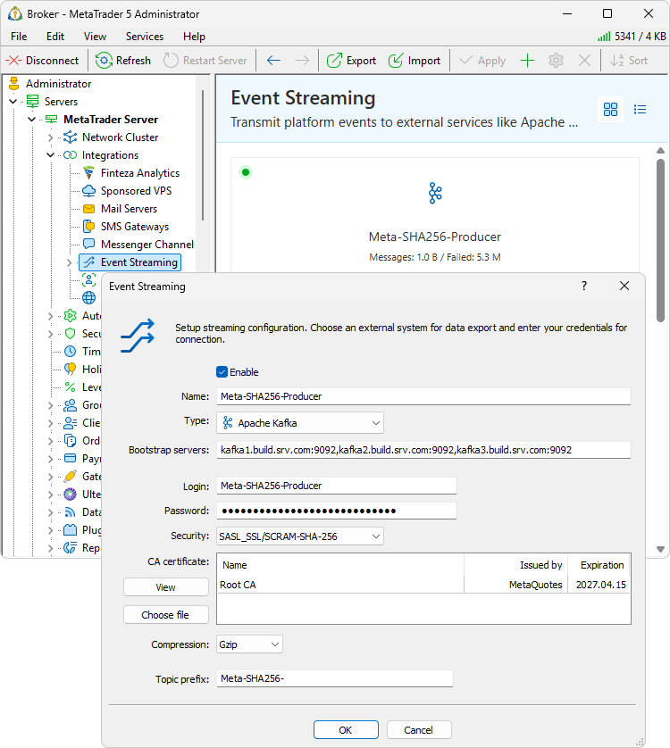
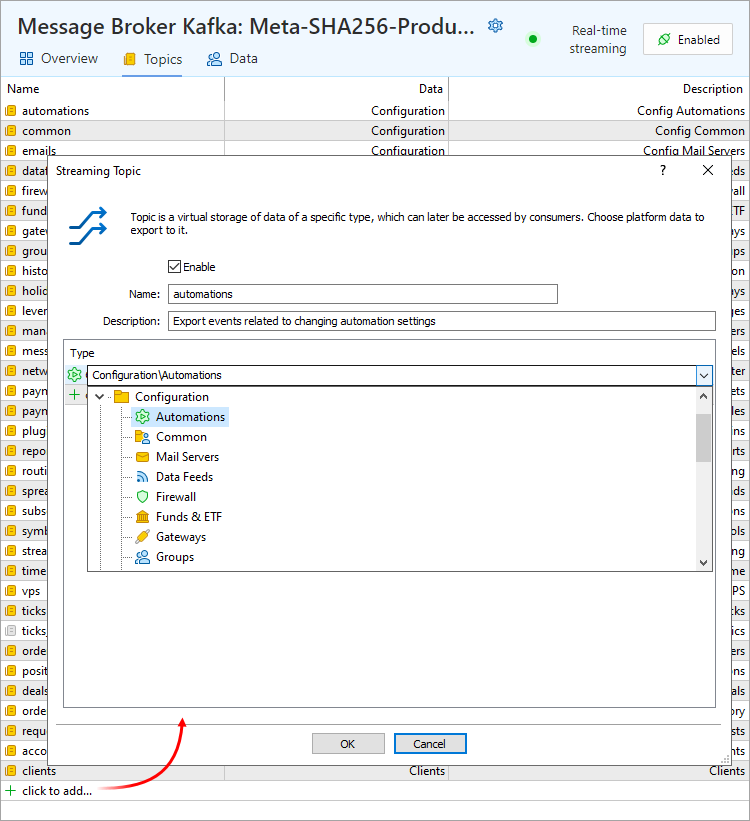
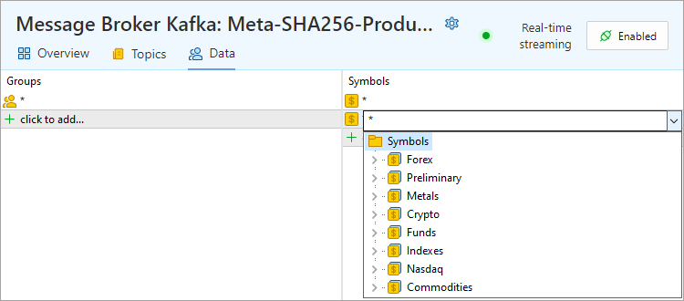
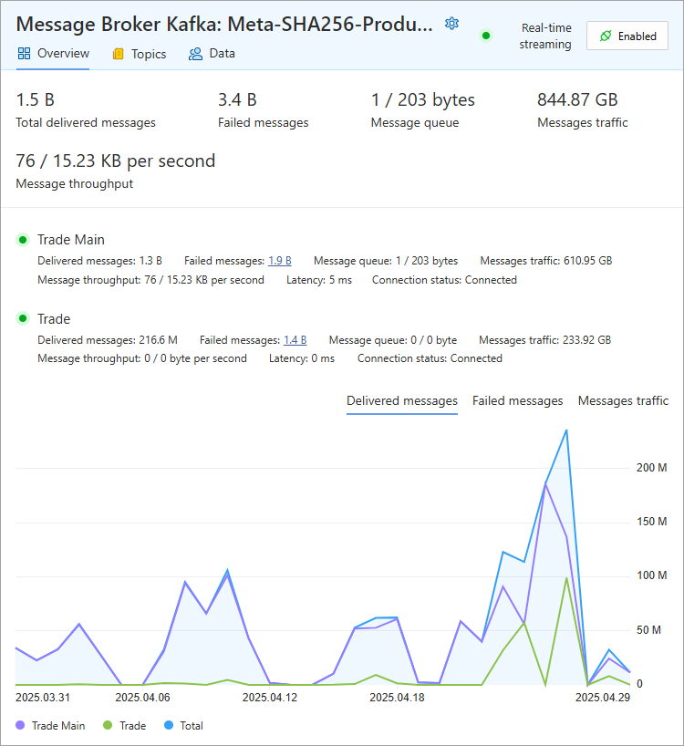

[🏠 Document Start](../../../../README.md) / [MetaTrader 5 Trading Platform](../../../../MetaTrader-5-Trading-Platform.md) / [Platform Setup](../../../Platform-Setup.md) / [Integrations](../../Integrations.md) / [Event Streaming](../Event-Streaming.md) / Kafka Streaming Setup

[Previous](Kafka-Installation-and-Setup.md) | [Next](../Web-Services.md)

# Configuring Data Export to Kafka in МetaTrader 5 (#configuring-data-export-to-kafka-in-etatrader-5)

Create a new streaming configuration:

In the configuration, specify the following:

  * Enable — toggles the data streaming on or off.
  * Name — a custom name for the configuration (producer).
  * Type — the system to which data will be streamed. Currently, only Apache Kafka is supported.
  * Bootstrap servers — a comma-separated [list of Kafka cluster brokers (#bootstrap)](Kafka-Installation-and-Setup.md#bootstrap). Each address must include the port. Only ASCII characters are allowed.
  * Login — [username (#kafka-user)](Kafka-Installation-and-Setup.md#kafka-user) used to connect to the Kafka cluster. This user must be [pre-created (#kafka-user)](Kafka-Installation-and-Setup.md#kafka-user) and granted the necessary permissions. Used during SASL authentication. Only ASCII characters are allowed.
  * Password — password for the specified Kafka cluster user. Only ASCII characters are allowed.
  * Security protocol — security protocol and the [authentication type (#security-protocol)](Kafka-Installation-and-Setup.md#security-protocol) used by the Kafka server: SASL_SSL/PLAIN, SASL_SSL/SCRAM-SHA-256, SASL_SSL/SCRAM-SHA-512.
  * CA Certificate — client certificate file that will be used for authentication when connecting to the Kafka cluster. For further details please refer to the section "[Working with Certificates (#certificates)](Kafka-Streaming-Setup.md#certificates)".
  * Topic prefix — prefix added to the beginning of [each topic name (#topic-full-name)](Kafka-Streaming-Setup.md#topic-full-name). Only Latin letters, numbers, and the symbols '.', '-', '_' are allowed.
  * Compression — used to reduce the size of JSON text data sent to Kafka. Supported algorithms include LZ4, Gzip, and zstd. The recommended option for optimal speed and compression is zstd. Compression applies only during transmission to the Kafka cluster. Within the cluster, data is repackaged based on topic settings. Consumers must support the compression type set at the topic level.

  * Do not change the configuration name while it is active. Doing so creates a duplicate configuration that begins sending messages to the same topics, resulting in data duplication.
  * Changing the settings (Bootstrap servers, Login, Password, Security protocol, Certificate, Topic prefix, Compression) will recreate the producer with new parameters. Some messages in the sending queue may be lost during this process.

  
---  
  

### Full Topic Names (#topic-full-name)

Platform events are streamed to Kafka cluster topics. The platform attempts to create topics automatically using the following naming convention: a [prefix (#prefix)](Kafka-Streaming-Setup.md#prefix) followed by a [name (#topic-name)](Kafka-Streaming-Setup.md#topic-name) specified in the settings. They form the full name of the topic. If no prefix is set, the full topic name is just the topic name from the configuration. For example, if the prefix is 'platform1-' and the topic names are 'network' and 'groups', the topics will be created as 'platform1-network' and 'platform1-groups'.

The use of prefixes simplifies management of [permissions (#acl)](Kafka-Installation-and-Setup.md#acl) to create topic and write data to them. You can grant access by prefix instead of individual topics. Also prefixes are useful for isolating or segmenting data when streaming from multiple MetaTrader 5 platforms to a single Kafka cluster.

Kafka operates and supports streaming operations strictly with the full topic name. If a topic is missing, MetaTrader 5 will try to create it automatically. If you change the topic name or prefix during runtime, the platform will immediately attempt to create a new topic and continue streaming to it. If the platform's Kafka user lacks the necessary permissions for the new topic or prefix, you will see authorization errors in the trade server [logs](../../Network-cluster/Journal.md).

  * Be sure to grant the appropriate prefix [permissions (#acl)](Kafka-Installation-and-Setup.md#acl) to the user account that MetaTrader 5 will use to connect to Kafka. Without these permissions, the platform will not be able to automatically create topics or publish data to them.
  * Permissions apply only to topics with the specified prefix. They do not affect any other topics, so there is no risk to the security of your other data in Kafka.

  
---  
  

### Working with Certificates (#certificates)

When establishing a secure connection between the MetaTrader 5 platform and Kafka brokers over the TLS protocol, it is crucial to configure the [certificates (#certificate)](Kafka-Streaming-Setup.md#certificate) correctly. Any errors in the trust chain, use of unsupported formats, or invalid certificates will result in a connection failure, with the "SSL handshake failed" error in the trading server log.

If you are renting a Kafka cluster from [Confluent Cloud](https://www.confluent.io/resources/ebook/kafka-the-definitive-guide/), use the [Let's Encrypt root certificate](https://letsencrypt.org/certs/isrgrootx1.pem). If you are renting Kafka from [Amazon](https://aws.amazon.com/msk/), download a certificate using [this link](https://www.amazontrust.com/repository/AmazonRootCA1.pem).

Supported Certificate Formats

MetaTrader 5 supports certificates in the PEM text format (.pem, .crt, .cer). The binary DER format is not supported. The platform also supports the PKCS#12 format (.pfx). Certificate files may contain either a single certificate or a full certificate chain.

Trust Chain Requirements

When configured properly, each Kafka broker returns its own certificate along with any necessary intermediate certificates, but does not return the root certificate. Therefore, when [configuring a connection in MetaTrader 5 (#certificate)](Kafka-Streaming-Setup.md#certificate), the root certificate must be specified manually. This is necessary to verify the server authenticity and to establish a complete chain of trust.

Diagnosing TLS Errors ("SSL handshake failed")

If the "SSL handshake failed" error appears in the trading server log when configuring the connection to Kafka, you should check the TLS connection using OpenSSL.

To do this, [download](https://github.com/openssl/openssl/wiki/Binaries) and install the appropriate OpenSSL version for your operating system. Then, check the TLS connection to the Kafka broker. Open PowerShell and run the following command:

.\openssl.exe s_client -connect <kafka_broker>:<port> -showcerts -CAfile my_certificate.pem  
---  
  
where:

  * <kafka_broker>:<port> — the address and port of the Kafka broker.
  * my_certificate.pem — the path to the root certificate (or chain of trust) that you intend to trust.

If theverification is successful, you will receive a response similar to the following:

SSL handshake has read XXXX bytes and written XXX bytes Verification: OK  
---  
  
This indicates that the certificate is valid and the connection can be established using the specified file.

If the chain of trust is incomplete or invalid, you may encounter the following error:

SSL handshake has read XXXX bytes and written XXX bytes Verification error: unable to get local issuer certificate  
---  
  
This typically means that either the root or intermediate certificate is missing, or an invalid certificate is used on the client side.

1\. Ensure that you are using the root certificate issued by the Certificate Authority (CA). Avoid using a server certificate file for connection.

2\. Verify that all intermediate certificates are present. Some Kafka brokers do not send intermediate certificates during the handshake, in which case the client (MetaTrader 5) cannot construct a complete chain of trust. To check, run the following command in PowerShell:

.\openssl.exe s_client -connect <kafka_broker>:<port> -showcerts  
---  
  
This command should return the server certificate and one or more intermediate certificates. If intermediate certificates are missing, add them manually to the CAfile.

## Configuring Exported Data (#topics)

After creating the configuration, navigate to the "Topics" section and select the data you wish to stream:

Add a topic and specify:

  * Name — the second part of the [full topic name (#topic-full-name)](Kafka-Streaming-Setup.md#topic-full-name), which is added at the end. Only Latin letters, digits, and the symbols '.', '-', and '_' are allowed.   
A [prefix](Kafka-Installation-and-Setup.md) can also be included in the name. For more details on topic naming, refer to the section [Full Topic Names (#topic-full-name)](Kafka-Streaming-Setup.md#topic-full-name).
  * Description — a description of the configuration.
  * Type — the type of data to be streamed to the topic:
    * Configurations — changes to the corresponding platform settings.
    * Ticks — [tick data](../../BidAskLast-Ticks.md) and [trading statistics (#statistics)](../../BidAskLast-Ticks.md#statistics).
    * Trading — any changes in open orders, deals, and positions (creation, modification, deletion), changes to order history, and trade requests sent to the server.
    * Trading accounts — creation, modification of personal details, and changes in the financial state of [trading accounts](../../Accounts.md).
    * Clients — creation, modification of personal data, linked accounts, documents, and other changes to the [client](../../Clients.md) database.

> Ensure that the platform (producer) has the necessary [permissions (#acl)](Kafka-Installation-and-Setup.md#acl) to create topics and write to them. Otherwise, authorization errors will appear in the trading server [log](../../Network-cluster/Journal.md).

## Event Filtering (#data)

You can further filter the events to be streamed:

  * Trading operations (orders, deals, positions, requests) — by group
  * Price data — by instrument

To do this, configure the appropriate settings in the "Data" section:

> Each producer in the platform has a fixed memory limit for storing messages prior to transmission. This limit is set to 1 GB, which typically holds around 500,000 — 5,000,000 messages. If messages cannot be delivered for any reason and the queue reaches this limit, the system will automatically discard the oldest messages to make space for new ones. This results in message loss.

## Data Format (#format)

All events are streamed to Kafka in JSON format, encoded in UTF-8. JSON is a widely supported data format used by many systems. For example, a tick data entry would appear as follows:

{ "type": "tick", "action": "add", "records": [ { "Symbol": "EURAUD", "Time": "1743156690296", "Bid": "1.71045", "Ask": "1.71098", "Last": "0.00000", "Volume": "0" } ] }  
---  
  
Description of data exports is provided in the [MetaTrader 5 Web API](https://support.metaquotes.net/en/docs/mt5/api/webapi_main) documentation, under the "Data Structure" sections of the relevant configurations and databases.

## Recommendations (#recommendations)

If you observe performance degradation during message transmission, check the network throughput and ensure sufficient disk space is available on each Kafka broker. If needed, configure data retention limits to enable automatic cleanup of topics in a timely manner.

Global retention settings can be adjusted via the log.retention.hours parameter (default is 168) in the server.properties file. To configure retention per topic, use the retention.ms parameter.

> Closely monitor disk space across your Kafka cluster. If it becomes fully exhausted, individual brokers will begin to fail, ultimately leading to cluster-wide failure.

## Statistics and Monitoring (#statistics)

In the "Overview" section, each producer has detailed metrics available to help monitor performance.

The top part shows statistics for all producers.

  * Total delivered messages — number of messages successfully delivered from the platform to the Kafka cluster for the current calendar day.
  * Failed messages — number of messages that failed to be delivered during the current calendar day.
  * Message queue — number and size of messages (uncompressed data — key and JSON) currently pending delivery. Ideally, this should remain at 0/0. If the message queue is constantly growing, check your network throughput and the performance of your Kafka cluster: this may be caused by lack of disk space or high CPU usage. Consider adding more Kafka brokers to balance the load.
  * Message traffic — volume of message (uncompressed data — key and JSON) transmitted to the Kafka cluster today.
  * Message throughput — number of messages and total size of data (uncompressed data — key and JSON) transmitted per second.

Below the general overview, statistics are displayed for each trading server in the platform cluster. Additional metrics include:

  * Latency — measures message delivery time with confirmation. before sending a message to the Kafka cluster, the platform timestamps it at the moment it is queued. The message is sent to the Kafka cluster, after which the platform receives delivery confirmation. The platform then calculates the difference between the confirmation time and the timestamp to determine latency. N/A indicates latency cannot be calculated due to lack of connection or traffic.
  * Connection status — reflects connectivity to the Kafka cluster. "Connected" means the platform has established a connection with at least one [broker (#terms)](../Event-Streaming.md#terms).

The count of message delivery errors is displayed as a clickable link. Clicking it opens the corresponding trading server [log](../../Network-cluster/Journal.md), filtered by the keyword Kafka. This will help you quickly locate relevant issues.

Each trading server's message delivery status is marked with a color:

  * Green — no delivery errors detected during the calendar day.
  * Yellow — no current errors, but some messages failed earlier in the day.
  * Red — unable to connect to the Kafka cluster, delivery errors are occurring in real-time, or messages are piling up in the queue and cannot be delivered for more than 60 seconds. Hover for a tooltip with details. For further investigation, request the trade server [logs](../../Network-cluster/Journal.md) using the keyword Kafka.
  * Gray — message streaming is disabled.

All statuses reset at the end of the calendar day, and are updated based on the current state.

Below these metrics, you can find graphical visualizations of message delivery performance.
