[🏠 Document Start](../../../README.md) / [MetaTrader 5 Trading Platform](../../../MetaTrader-5-Trading-Platform.md) / [Platform Setup](../../Platform-Setup.md) / [Integrations](../Integrations.md) / Finteza Analytics

[Previous](../Integrations.md) | [Next](Sponsored-VPS.md)

# Finteza Analytics (#finteza-analytics)

[Finteza](https://www.finteza.com/) is the advertising analytics system, using which you can analyze users' behavior on your site and launch advertising campaigns. The system is integrated into the MetaTrader 5 platform, so right in the platform you can analyze your audience and the efficiency of your campaigns, as well as monitor the client's entire life cycle, from his first visit to your site to the first real trading account deposit.

Finteza is integrated with MetaTrader 5, so you can track your traders' actions in terminals. Obtain statistics on which functions and services are the most popular among your traders: algo trading programs, signal copying, account opening and others.

[Order MetaTrader 5 Finteza Analytics](https://support.metaquotes.net/en/market/product/402 "Order MetaTrader 5 Finteza Analytics")

## How to Set Up Analytics (#how-to-set-up-analytics)

### Create a Finteza account (#create-a-finteza-account)

Register a Finteza account directly through the Administrator terminal and receive a full 30-day trial access. Simply specify your name, website address, and corporate email. A tracker will be created in Finteza based on the provided website, which will collect statistics on your traders. You can then integrate Finteza into your website and consolidate its data with your platform statistics to obtain end-to-end analytics.

The tracker ID will be automatically added to the platform settings. Thus, immediately after registration, you will begin collecting data on your traders' activities within the platform: deposits and withdrawals, account requests, utilization of windows, Expert Advisors and indicators, and more. The system provides data on all terminals, including desktop, mobile and web. Use comprehensive analytics to evaluate your clients' Lifetime Value and to identify the most in-demand features.

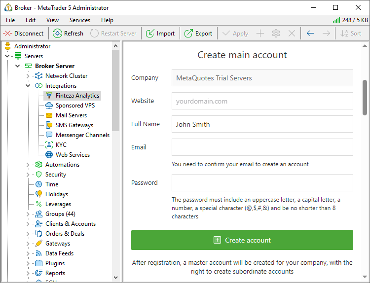

> To switch to the full version, [order Finteza](https://support.metaquotes.net/en/market/product/402) via MetaQuotes Support Center. If you wish to extend your trial period, please contact [technical support](../../Technical-Support.md).

### Log into your account (#log-into-your-account)

Log into your account in the "Activation" section. This will enable the display of primary statistics across websites and platforms directly within the Administrator terminal, without the need to switch to Finteza.

If you have multiple Finteza accounts, use the one with the highest privileges to access the most comprehensive statistics across all projects.

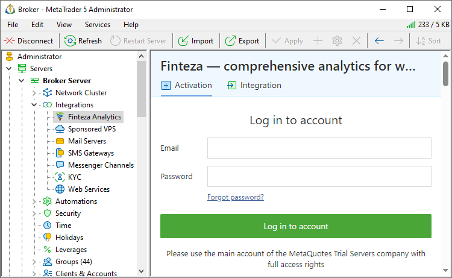

After that, the trading platform will start receiving data from Finteza. The main website statistics will be displayed in the Administrator terminal, and more detailed metrics will become available under the "Analytics" section of the Manager terminal. For further details please watch the video "[Finteza Integration with MetaTrader 5](https://support.metaquotes.net/en/articles/956)".

### Manual configuration (#manual-configuration)

If you have a previously registered account with a created tracker, log in and specify the tracker ID. Open the Finteza panel and copy it from the "Settings \ Common" section:

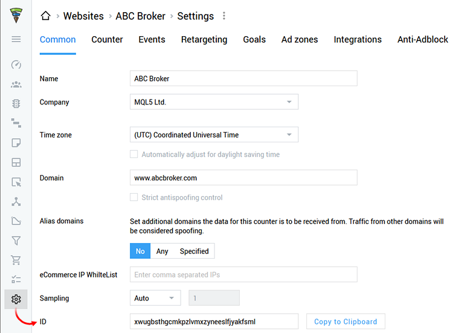

Add the ID to the "Main Site ID" field in the MetaTrader 5 Administrator settings section:

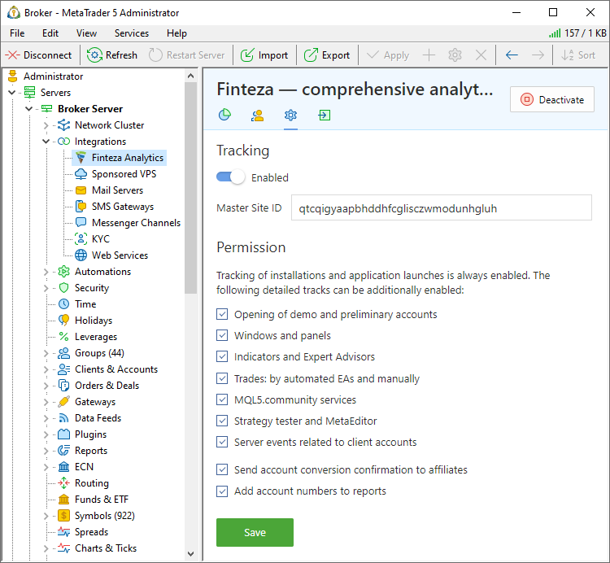

### Add Finteza code to your website (#add-finteza-code-to-your-website)

To obtain comprehensive analytics for your website and link them with traders' activities in the platform, install Finteza on your website. This can be done by adding a small code to every page. Open your website in the [Finteza panel](https://panel.finteza.com/) and go to the "Settings\Counter" section.

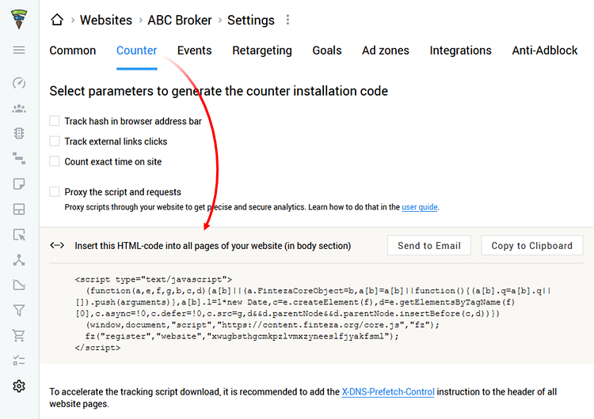

Copy the tracking code and paste it into all pages of your side in the <head></head> tags. This step can be completed by your web developer. For further details please see the [Documentation](https://www.finteza.com/en/integrations/insert-code).

Immediately after integration, you will start receiving data on page visits, unique and non-unique users, traffic sources and quality, and more.

### Add event tracking to your site (#add-event-tracking-to-your-site)

Finteza allows you to track any events on your website, such as link or button clicks, form submissions, page scrolls, and more. To do this, add a simple function call to the desired location on your site:

fz( "event", "{EVENT_NAME}" );  
---  
  
Instead of {EVENT_NAME}, specify a certain event name, for example "Registration" or "Create account". This name will be displayed in Finteza reports.

Here's an example of how to create an event for a link click and form submission:

<a href="https://www.example.com/" onclick="fz(\'event\', \'Click+Link\'); return true;">www.example.com</a> or <a href="https://www.example.com/" data-fz-event="Click+Link">www.example.com</a>  
---  
  
<form action="" method="get" onsubmit="fz(\'event\', \'Form+Order+Submit\'); return true;"> ... </form>  
---  
  
For further details please see the [Documentation](https://www.finteza.com/en/integrations/send-events).

If you have your own mobile application, you can also track events within it. Finteza offers [ready-made SDKs for iOS and Android](https://www.finteza.com/en/integrations/sdk).

## Statistics on your trackers (#statistics)

Directly from MetaTrader 5 Administrator, you can track key metrics for your trackers and advertising zones, including the number of visitors, page views, and events. The relevant data is available under the "Finteza Analytics \ Statistics" section.

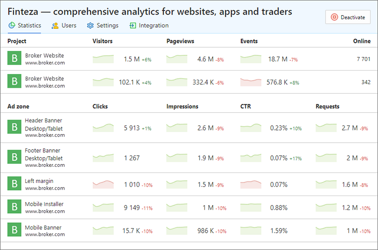

## Manage employee access (#users)

From the "Users" section, you can manage employee access to Finteza and create new accounts. Use the context menu to open and view user profiles in Finteza, enable and disable users, and manage passwords.

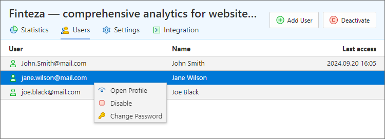

To create a new account, click "Add User" at the top of the section and enter the basic information: name, position, email and password.

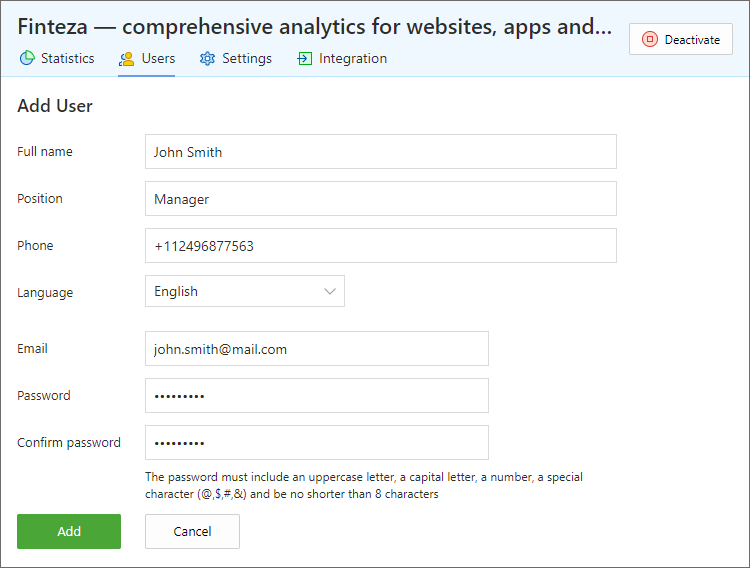

## Server and Client Events (#events)

Finteza automatically accumulates data on your terminal installations and launches. All such events are linked to the website specified in the "Master Site ID" field. These events can be viewed at any time under the "Events" section of the Finteza panel. This data is only available to you.

To enable tracking of additional events, use the "Integration \ Finteza Analytics \ Settings" section in the Administrator terminal:

  * Demo and preliminary account opening
  * Opening of windows and panels inside the terminal
  * Launch of indicators and Expert Advisors
  * Trades: performed automatically by trading robots and manual trades
  * Usage of MQL5.community services
  * Usage of Strategy Tester and MetaEditor
  * Server events related to client accounts: live account creation, moving of a preliminary account to a real group and first account deposit

All events, except for the last point, are sent to Finteza by client terminals. When connected to your trading server, the terminals request the relevant settings and sends the appropriate events to the specified tracker. Server events are sent to Finteza by the trading server.

All event names start with "MetaTrader 5". An additional specification is used for server events: "MetaTrader 5 Trade Server".

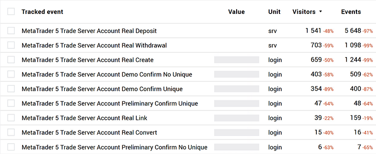

To view detailed statistics, enable the option "Add account numbers to reports". In this case, the relevant account number will be added to the "Value" field (accordingly, "Account" will be indicated as "Units") of each tracked event. If the option is disabled, only your server name will appear as an additional parameter for each event in Finteza.

Finteza automatically associates server and client events with user actions on your site. This action chain provides an in-depth end-to-end analytics. View the entire journey of your traders, from their first visit to your website, to opening of a real account, deposits and actions performed in the terminal.

## Additional settings for mobile terminals (#mobile)

Add the master_site_id parameter to the [mobile terminal download link](../../Additional-Features.md). Use your Finteza tracker ID as the parameter value. For example:

https://download.mql5.com/cdn/mobile/mt5/ios?server=ABC-Demo,ABC-Real&utm_campaign=brasil.06.23&utm_source=affiliate_43&master_site_id=sdfdsflknolkmfjbfjvbfkdjvbdkfjnbv   
https://download.mql5.com/cdn/mobile/mt5/android?server=ABC-Demo,ABC-Real&utm_campaign=brasil.06.23&utm_source=affiliate_43&master_site_id=sdfdsflknolkmfjbfjvbfkdjvbdkfjnbv  
---  
  
The parameter effect is similar to the "Main website ID" under the [Integration\Finteza Analytics](Finteza-Analytics.md) section. It specifies to which of your Finteza trackers the client terminal should send information about its actions. However, the server parameter only reaches the terminal after the user logs in using their trading account. Therefore, during the first launch, the terminal is unaware of the receiving Finteza tracker, and thus it cannot send the successful installation and account registration start tracks. The master_site_id parameter, passed in the deep link, fills this gap.

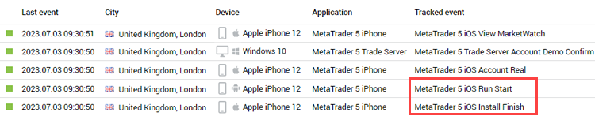

If the link does not contain master_site_id, the two events highlighted in the screenshot below will not be registered. You will not be able to track your traders' first actions which precede the account opening step. Without these events, you cannot accurately determine the number of installed terminals, which is one of the key traffic acquisition metrics. Furthermore, you will not be able to measure the app install to real account conversion rates.

## Working with Affiliates (#working-with-affiliates)

To manage affiliate programs, enable the "Send account conversion confirmation to affiliates" option. An additional utm_affiliate_site parameter will be added to all tracked events sent from your terminals to Finteza. Thus, you can track the efficiency of your affiliates in terms of client attraction, using a special Finteza panel section: "Sources / Referral".

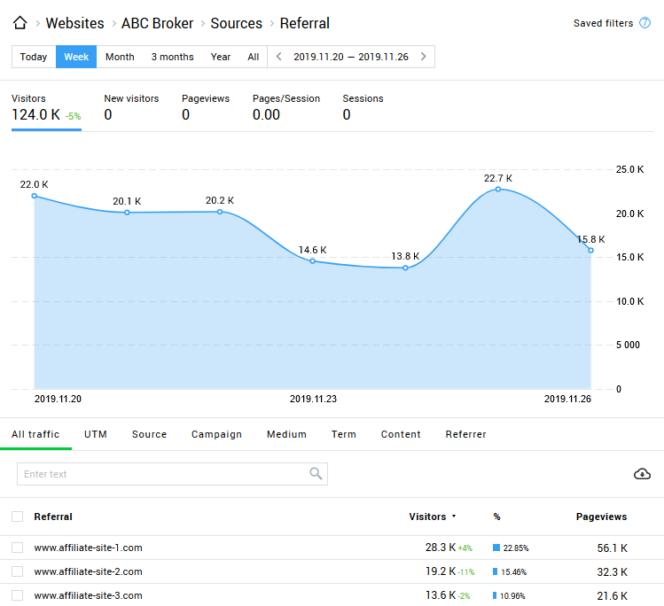

## Tracked Events Chart (#tracked-events-chart)

The bottom of the section features a summary chart on the total number of events sent to your tracker by the trading server and client terminals.

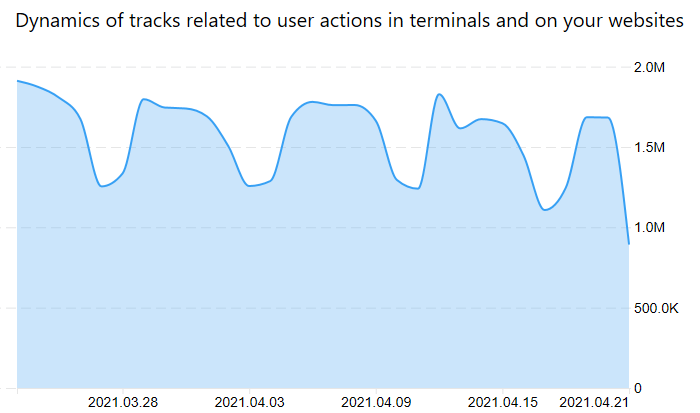

## Manager Access Control (#manager-access-control)

To grant your managers appropriate access permissions to Finteza data, use [manager account settings (#permissions)](../Managers.md#permissions). The following access levels are provided: access to the integration section, access to page views, marketing campaigns and reports.

## Trader tracking (#visitor)

If you have an active [Finteza subscription](https://support.metaquotes.net/en/news/3420), additional data will be available to you in the account and client dialogs:

  * Visitor ID — a unique identifier assigned to a user when he/she installs your terminal or visits your site, if a Finteza tracker is installed in it. With this tracker, you can trace trader behavior, from the first website visit to a real account deposit.
  * Affiliate — the name of the website from which the trading terminal installer was downloaded.

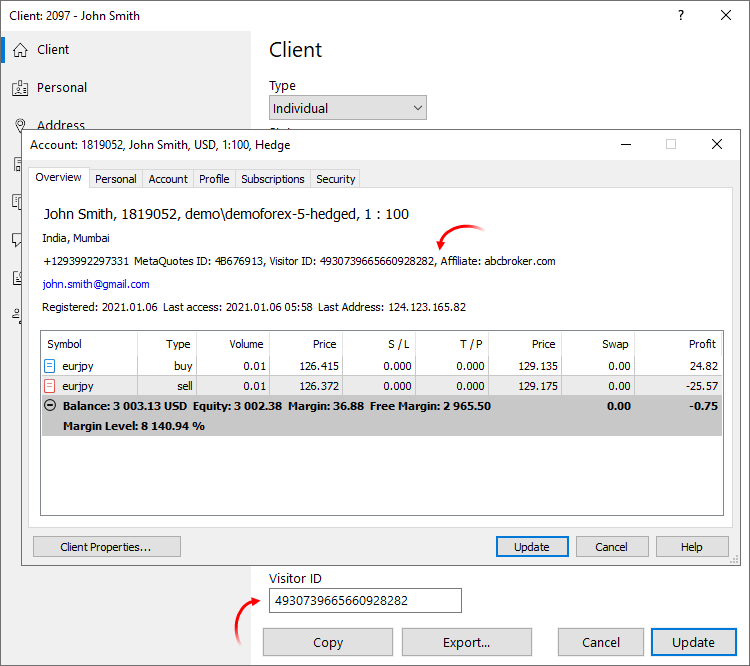

Find the required Visitor ID in the Finteza panel, under the visits section, and click on it to apply the ID as a filter. This will enable the generation of any report on trader actions in your site: page views, events, sales funnels, and others.

