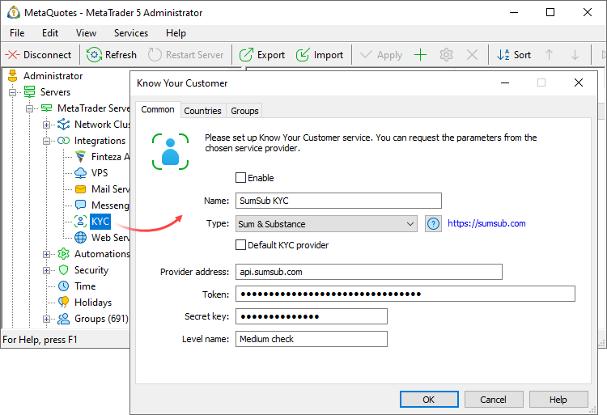
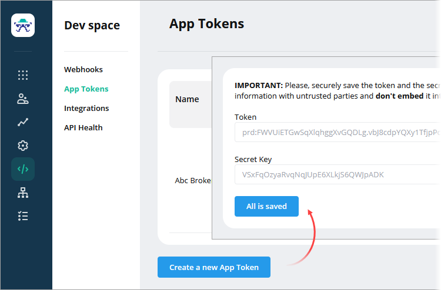
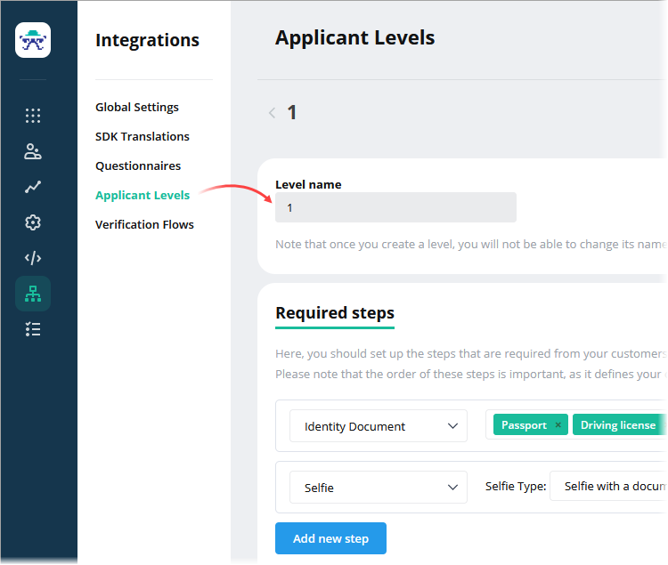
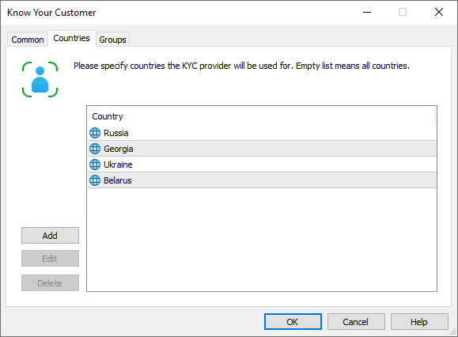
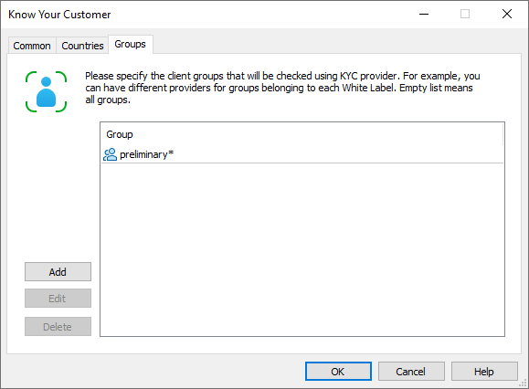
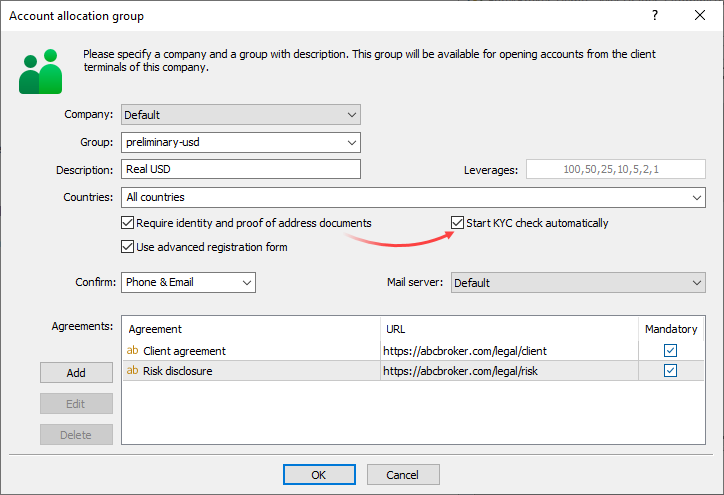

[🏠 Document Start](../../../README.md) / [MetaTrader 5 Trading Platform](../../../MetaTrader-5-Trading-Platform.md) / [Platform Setup](../../Platform-Setup.md) / [Integrations](../Integrations.md) / KYC

[Previous](Messengers/Slack.md) | [Next](Event-Streaming.md)

## KYC (#kyc)

The trading platform integration with KYC (Know Your Customer) services enables the validation of client personal data and documents with one click or even in a fully automated mode. Set up connection to an external KYC provider in just a few minutes in order to:

  * Send data and documents for automated verification straight from the [client dialog (#kyc)](../Clients.md#kyc). Each check results in a detailed report, which is saved in the client history. Based on the check results, an appropriate status is automatically set for [client documents (#documents)](../Clients.md#documents).
  * Configure [automatic data check (#auto)](KYC.md#auto) for preliminary account registration. This feature provides the further automation of client onboarding procedures.

> [Request trial from Sum & Substance](mailto:metatrader@sumsub.com) to evaluate the KYC procedure benefits.

## Integration Setup (#integration-setup)

Open the "Integrations — KYC" section and create a new configuration:

Specify the following parameters:

  * Name — configuration name.
  * Type — KYC check service type. Each provider has an individual set of settings. Please request the required settings from the provider. 
  * Default KYC provider — the platform uses the option when [selecting a KYC provider (#best-provider)](KYC.md#best-provider) to check client data, if the procedure could not be executed using group or country settings.

Further settings depend on the provider. Please request required settings from the provider.

> Currently only the [Sum & Substance](https://sumsub.com/) provider is supported. Support for [World-Check](https://www.refinitiv.com/en/products/world-check-kyc-screening), [eSpear](https://espear.com/) and other providers will be added soon.

### Sum & Substance (#sumsub)

[Sum&Substance](https://sumsub.com/) provides an all-in-one technical and legal toolkit to cover KYC/KYB/AML needs. It is a single powerful platform to convert more customers, speed up the verification processes, reduce costs and detect digital fraud.

To get access to the service, please fill in the registration form at <https://sumsub.com>. Next, log into the control panel using the provided login and password. The control panel features the required integration data.

Open section "[DevSpace\App Tokens (#/devspace/apptokens)](https://api.sumsub.com/checkus#/devspace/apptokens)" and add a new application. Add the following permissions for the application: seePersonalData, SeeBgCheckResults, managePersonalData, manageUsers, manageClientSettings, seeStats, seeSensitiveData. After adding the application, you will receive a token and a secret key which you should specify in the provider settings on the MetaTrader 5 side.

Next, create a provider configuration and specify the following parameters:

  * Provider address — address for connecting to the service. api.sumsub.com is used by default. In most cases, there is no need to change it.
  * Token — token for authorization. The token is available in the [DevSpace (#/devspace/apptokens)](https://api.sumsub.com/checkus#/devspace/apptokens) section of the control panel.
  * Secret key — a secret key for authorization. The key is available in the [DevSpace (#/devspace/apptokens)](https://api.sumsub.com/checkus#/devspace/apptokens) section of the control panel.

In the "Level name" parameter, specify the name of the setting which defines your client verification process. Sum & Substance allows the customization of the number of steps which the user must complete in order to obtain the verified status, as well as of the set of required documents and other parameters. This procedure is called the Verification Level. You can use different levels depending on certain conditions. For example, you can set soft verification for safer regions. You can pre-configure verification levels in the Sum & Substance control panel and create several KYC configurations on the MetaTrader 5 side. Specify in the configurations specific verification levels and define the list of countries for which they will be used.

For further details about how to set up verification levels please view the [Sum & Substance documentation](https://help.sumsub.com/articles/57128-customizing-verification-levels-and-flows).

## Countries (#country)

Specify the list of countries, for which this KYC provider will be used, for [manual (#kyc)](../Clients.md#kyc) and for [automatic (#auto)](KYC.md#auto) checks. Use of different providers ensures the best verification conditions for clients from different regions. You can also [adjust the verification process (#level)](KYC.md#level) depending on the country.

If no country is specified, the platform will use this provider for clients from any country.

> When opening a demo account, the country is determined automatically on the client terminal side. When opening a preliminary account, the country is also detected automatically, but the client can specify another country in the registration form.

## Groups (#group)

Specify the list of client groups, for which this KYC provider will be used, for [manual (#kyc)](../Clients.md#kyc) and for [automatic (#auto)](KYC.md#auto) checks. Thus you can organize work with your White Label partners. You partners can select providers and pay for their services.

## How the provider is selected (#best-provider)

  * The system checks the client group and country
  * The provider located higher in the list is selected from all providers, which meet the [country (#country)](KYC.md#country) and [group (#group)](KYC.md#group) conditions
  * If none of the providers is suitable, the default provider is utilized (as set by the "Default KYC provider" option in common settings)

## Documents request from terminals and automatic verification (#auto)

The KYC integration enables complete automation of client onboarding procedures.

[Live accounts](../Accounts/Preliminary.md) can be requested from desktop and mobile terminals. Configure the registration form to request supporting documents from clients during registration. This can be done by enabling the "Require identity and proof of address documents" option under [account allocation section (#require-documents)](../Accounts/Account-Allocation-Settings.md#require-documents).

Enable the option "Start KYC check automatically". Once a preliminary account is opened and linked to a client, appropriate client data and documents will be automatically sent to the KYC service for verification. After the check, the system provides a report which can be viewed under the [client comments section (#kyc)](../Clients.md#kyc). If the option is disabled, you can send the data [manually through the client's personal data section (#kyc)](../Clients.md#kyc).
