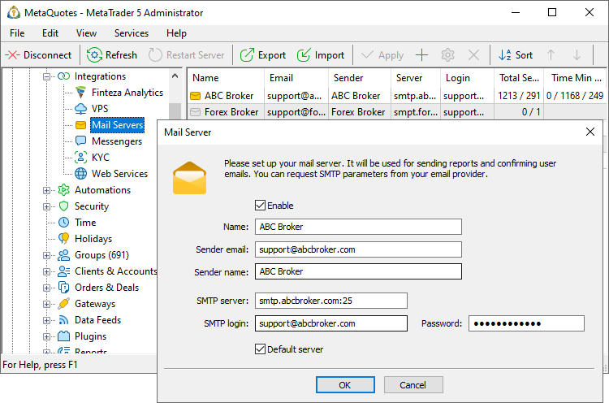

[🏠 Document Start](../../../README.md) / [MetaTrader 5 Trading Platform](../../../MetaTrader-5-Trading-Platform.md) / [Platform Setup](../../Platform-Setup.md) / [Integrations](../Integrations.md) / Mail Servers

[Previous](Sponsored-VPS.md) | [Next](SMS-Gateways.md)

# Mail Servers

The MetaTrader 5 platform is provided with the built-in email service. The service is used to send [trading reports (#reports)](../Groups/Group-Settings.md#reports) to traders, for the [confirmation of email addresses (#confirmation)](../Accounts/Account-Allocation-Settings.md#confirmation) specified during account opening via client terminals, and for the [manual email sending (#create)](../Mailbox.md#create).

Reports and confirmation emails can be sent from different mailboxes, while a separate mailbox can be used for each client group. Thus your White Label partners can send emails to their clients from their own addresses.

Mail server configurations can be efficiently managed in the "Mail servers" section. Configure required parameters once and then you will be able to select the desired server configuration in the [client group (#reports)](../Groups/Group-Settings.md#reports) or [account allocation settings](../Accounts/Account-Allocation-Settings.md).

Create a new configuration and set the mail server parameters:

  * Enable — enable/disable the mail server configuration. If the configuration is disabled, emails will not be sent via this server.
  * Name — configuration name.
  * Sender email — email address from which emails will be sent.
  * Sender name — sender name will be indicated in emails.
  * SMTP server — email server address for sending reports and port number, separated by a colon. Example: smtp.mailserver.com:80.
  * SMTP login — account login on the mail server.
  * Password — account password on the mail server. Some services, such as Gmail, Yahoo, mail.com, and others, require the use of a separate password to access the mailbox through third-party applications. It is usually called App Password. If you are using such a service for mailing, specify the App Password instead of the main password for accessing the mailbox. Additional information is usually provided on the service's website. For example, you can find information for Gmail [here](https://support.google.com/accounts/answer/185833?hl=en) and [here](https://www.hostpapa.com/knowledgebase/how-to-create-and-use-google-app-passwords/).
  * Default server — the "Default" option can be selected for the used mail server in [group settings (#reports)](../Groups/Group-Settings.md#reports) and [account allocation settings](../Accounts/Account-Allocation-Settings.md). In this case the platform will check the list of all servers and will use the first available server with the "Default server" option enabled.

Sent email statistics is shown for each configuration in the list:

  * Total Sent / Errors — number of sent emails and number of unsent emails due to errors.
  * Queue — number of emails on the queue to be sent.
  * Time Min / Max / Avg — minimum, maximum and average time in milliseconds spent to send one email.

