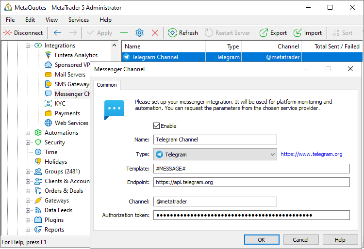
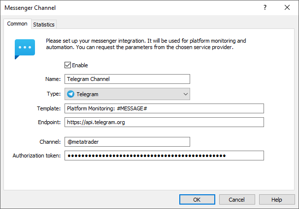
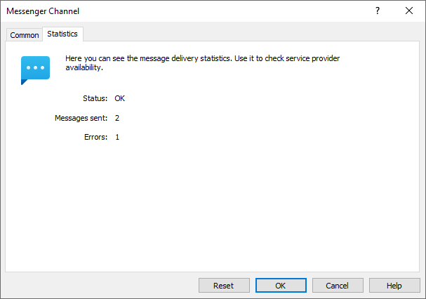

[🏠 Document Start](../../../README.md) / [MetaTrader 5 Trading Platform](../../../MetaTrader-5-Trading-Platform.md) / [Platform Setup](../../Platform-Setup.md) / [Integrations](../Integrations.md) / Messengers

[Previous](SMS-Gateways/Voiso.md) | [Next](Messengers/Telegram.md)

# Messengers (#messengers)

The trading platform features built-in integration with popular instant messengers. Using it along with the [Automations service (#messenger-channel)](../Automations/Actions.md#messenger-channel), you can configure the platform to send notifications about various system events to Telegram, Slack and other messenger channels. For example, you can promptly receive monitoring data, notifications about large financial transactions, manager connections in the platform, and other information directly on your phone.

## Configuring the Provider (#configuring-the-provider)

Create a new configuration and specify the following parameters for connecting to the messenger:

  * Enable — enable/disable messenger configuration. If the configuration is disabled, the service will not be used to send messages.
  * Name — configuration name.
  * Type — used messenger. Currently supported messengers integrations include Telegram and Slack. The list will be further expanded.
  * Template — the basic [template (#template)](Messengers.md#template) for sending messages via this messenger.

Further settings depend on the messenger:

  * [Telegram](Messengers/Telegram.md)
  * [Slack](Messengers/Slack.md)

## How to use messengers after setup (#use)

To send messages to the configured channels use the "[Post in messenger channel (#messenger-channel)](../Automations/Actions.md#messenger-channel)" action. Enter the text to send and select one of the available messenger configurations.

## Templates (#template)

You can use message templates, while the text can be changed depending on the used message messenger or channel. For example, you can unify platform state notifications sent through the [Automations (#messenger-channel)](../Automations/Actions.md#messenger-channel) service. Specify the relevant text in the "Template" field, and it will be added to all messages:

The field contains the default #MESSAGE# macro which substitutes the source text. In our example, the "Platform Monitoring" text is added to it, and the resulting message will be generated as "Platform Monitoring: [text from automation action]".

# Statistics (#statistics)

During operation, the system collects statistics on sent messages. It is available in the corresponding section of each messenger, as well as in the general list of configurations.

  * Status — the availability of the server (endpoint), via which the messages are sent.
  * Message sent — the number of successfully sent messages. 
  * Errors — the number of messages that could not be sent.

To reset the statistics and to start collecting it anew, select "Reset".
