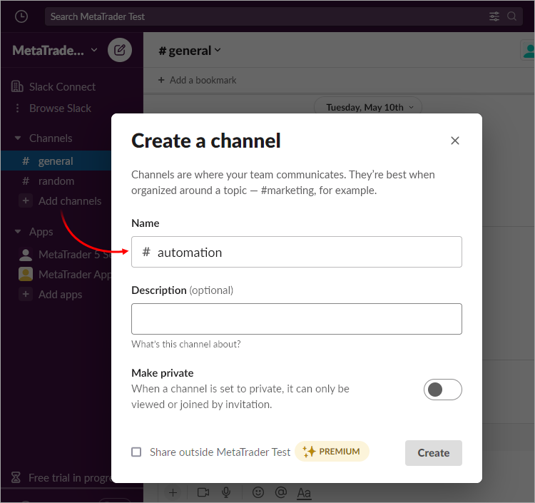
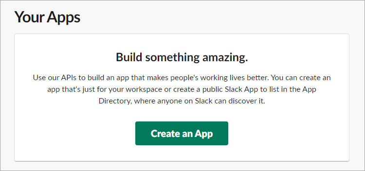
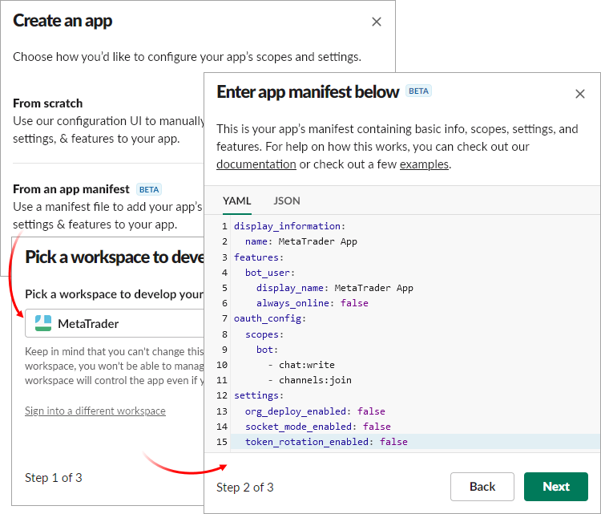
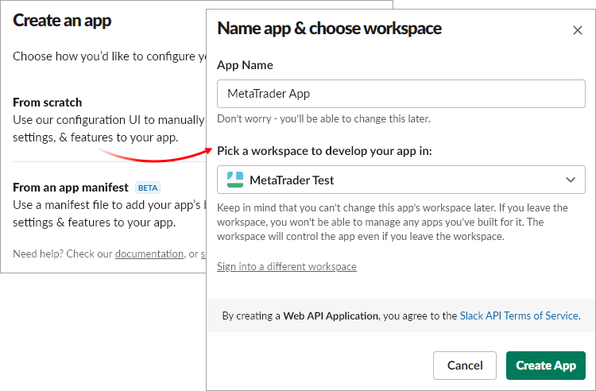
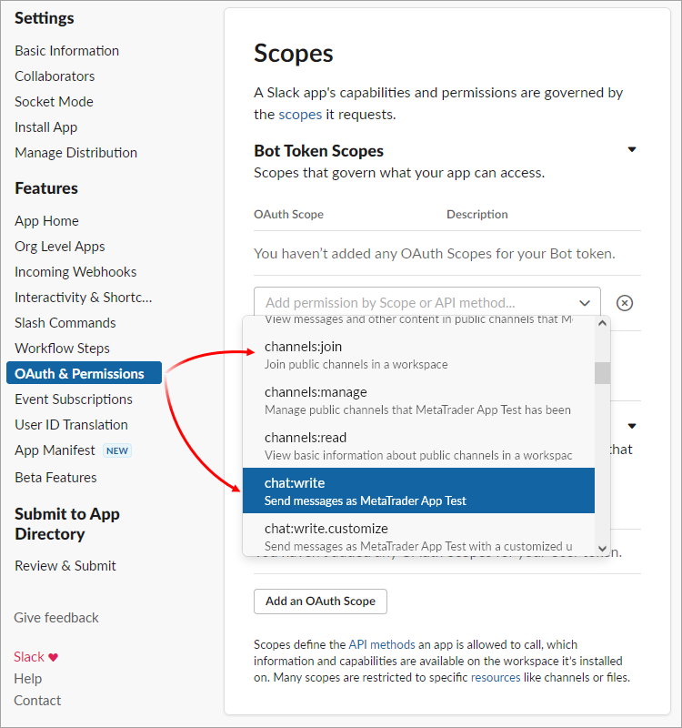
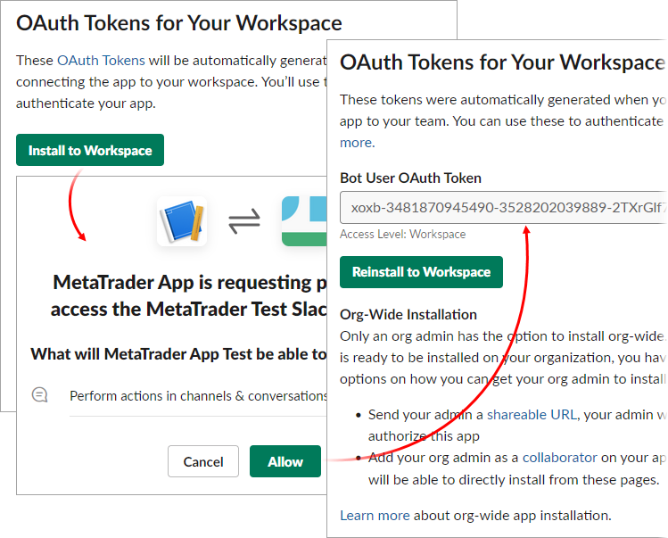
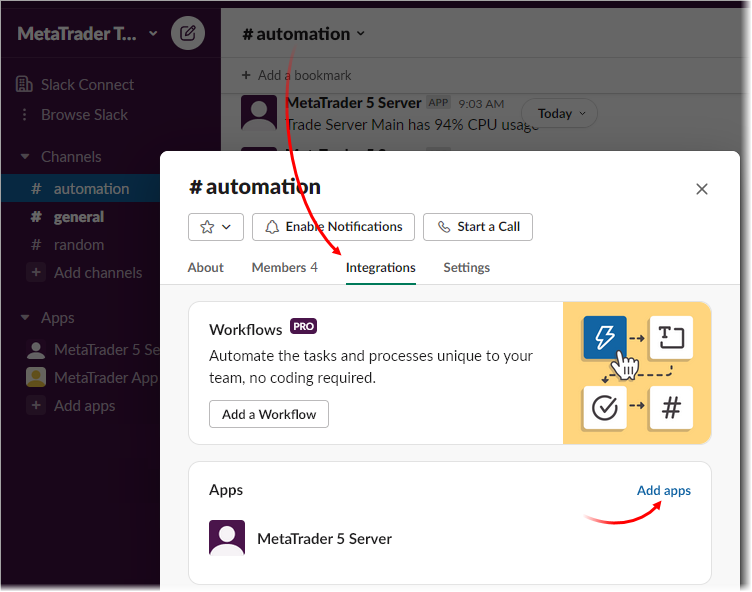
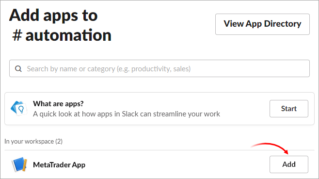
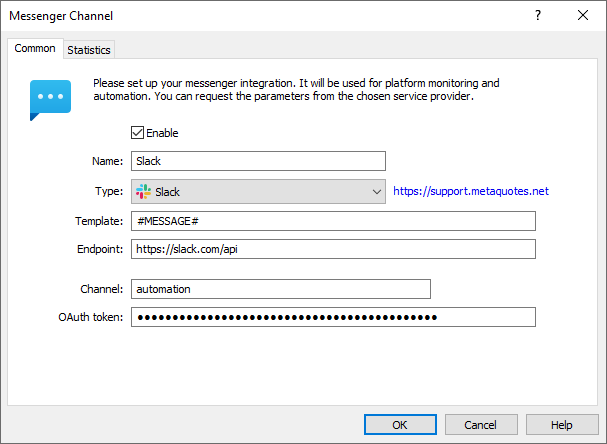

[🏠 Document Start](../../../../README.md) / [MetaTrader 5 Trading Platform](../../../../MetaTrader-5-Trading-Platform.md) / [Platform Setup](../../../Platform-Setup.md) / [Integrations](../../Integrations.md) / [Messengers](../Messengers.md) / Slack

[Previous](Telegram.md) | [Next](../KYC.md)

# Slack (#slack)

To set up a Slack channel integration:

  * Create a workspace in which messages will be posted
  * Create an application which will post the messages
  * Connect the application to the channel in the workspace
  * Create a messenger configuration in the platform

## Creating a channel in the workspace (#workspace)

Select a workspace and create there a channel to which the system will post messages. If you do not have a workspace yet, create it following the [Slack instructions](https://slack.com/help/articles/206845317-Create-a-Slack-workspace).

To create a channel, click "Add channel" on the left-hand side of the workspace. Next, specify the name of the channel.

The channel name will be used to configure the messenger on the platform side. It is specified without #. In this example, it is "automation".

## Creating an application in Slack (#app)

To create an application, follow the link <https://api.slack.com/apps?new_app=1>.

You can configure the created application manually or use the attached manifest — a ready-made settings template, in which you should only replace a few lines.

### Configuration using the manifest (#configuration-using-the-manifest)

To assist with the setup, we have prepared a manifest template. It sets all the necessary application parameters, and you only need to specify your name.

The manifest is available in two formats: YAML and JSON. You may use any of them at your discretion:

YAML

display_information:   
name: MetaTrader App   
features:   
bot_user:   
display_name: MetaTrader App   
always_online: false   
oauth_config:   
scopes:   
bot:   
\- chat:write   
\- channels:join   
settings:   
org_deploy_enabled: false   
socket_mode_enabled: false   
token_rotation_enabled: false  
---  
  
JSON

{   
"display_information": {   
"name": "MetaTrader App"   
},   
"features": {   
"bot_user": {   
"display_name": "MetaTrader App",   
"always_online": false   
}   
},   
"oauth_config": {   
"scopes": {   
"bot": [   
"chat:write",   
"channels:join"   
]   
}   
},   
"settings": {   
"org_deploy_enabled": false,   
"socket_mode_enabled": false,   
"token_rotation_enabled": false   
}   
}  
---  
  
You should change two parameters in these settings:

  * name — application name.
  * display name — the display name will be used for the messages published by the application in the workspace.

When creating an application, select "From an app manifest", then select a workspace and paste in the updated manifest text:

### Manual configuration (#manual-configuration)

When creating an application, select "From scratch", then specify the application name and select a workspace:

After creating the application, add "chat:write" and "channels:join" permissions for the app in the "OAuth & Permissions" section:

### Getting an OAuth token (#getting-an-oauth-token)

In the "OAuth & Permissions" section, click "Install to Workspace". After you confirm access to the workspace, a token will be generated for you. Specify it in the platform-side messenger settings.

## Connecting an application to a workspace (#app-connect)

Go to Slack and add the application to the channel where you want to post messages. Click on the channel name and go to the "Integrations" section. Click "Add apps" in this section:

Next, select the previously created application.

## Creating a configuration (#configuration)

When your workspace and application are ready, create a [messenger configuration](../Messengers.md) in the platform, fill in the common parameters, and then specify the following details:

  * Endpoint — the address of the Slack server to which requests are sent. The default endpoint is https://slack.com/api; this value should not be changed.
  * Channel — the name of the channel within the Slack workspace, to which the messages will be sent. The name is specified without the # prefix.
  * OAuth token — token for authorizing the application that will send messages to the channel.

