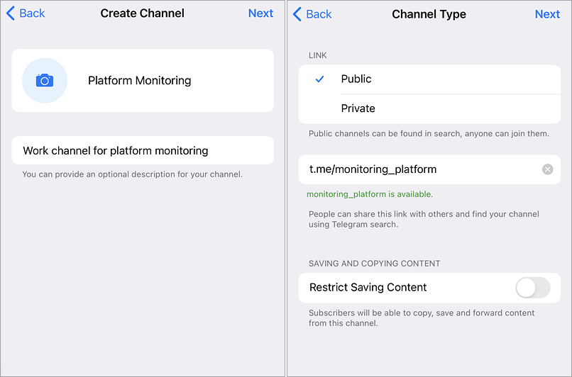
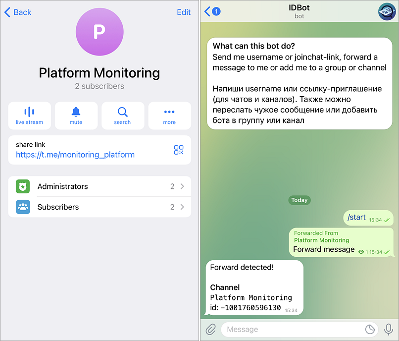
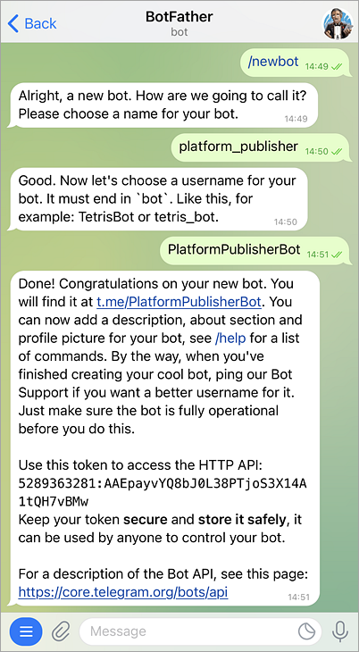
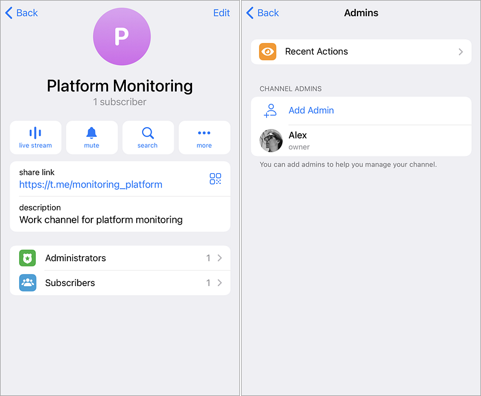
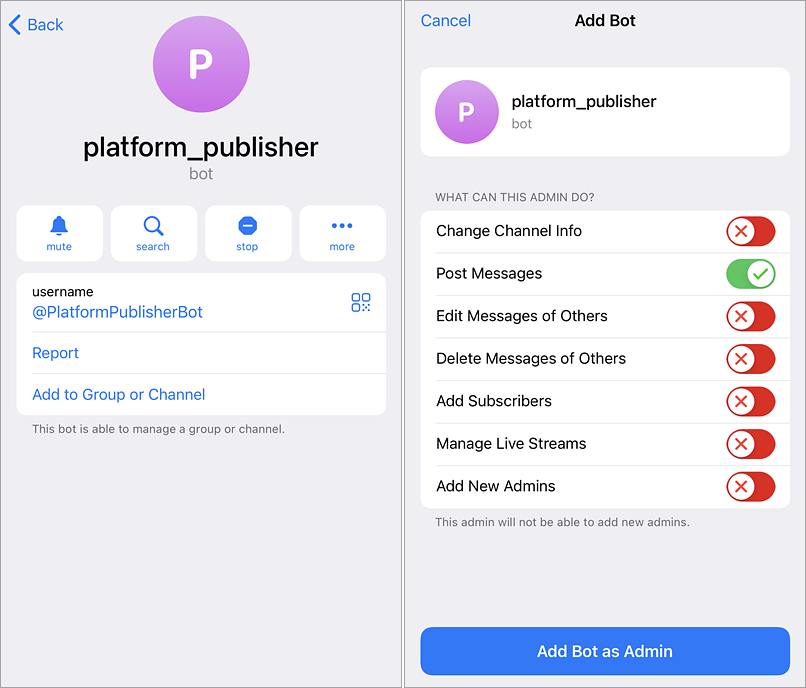
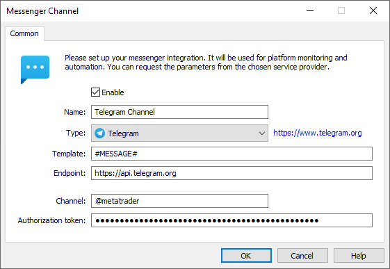

[🏠 Document Start](../../../../README.md) / [MetaTrader 5 Trading Platform](../../../../MetaTrader-5-Trading-Platform.md) / [Platform Setup](../../../Platform-Setup.md) / [Integrations](../../Integrations.md) / [Messengers](../Messengers.md) / Telegram

[Previous](../Messengers.md) | [Next](Slack.md)

# Telegram (#telegram)

To set up a Telegram channel integration:

  * Create a channel to which messages will be posted
  * Register a bot which will post messages
  * Add the bot to the channel and set the relevant permissions
  * Create a messenger configuration in the platform

## Creating a Telegram channel (#channel)

Create a channel to which messages will be posted. To do this, open the Telegram app, tap the new dialog button next to the search bar and select "Create Channel". If you already have a channel, go to the next step.

Specify the channel name and privacy settings.

To set up the integration, you will need the name or ID of the created channel:

If the channel is public, the name is available on its properties page. Open the channel and tap on the title. In the properties window, the name is shown in the link: https://t.me/[channel name]. Specify it in the platform-side messenger settings, along with the @ character. For example, @monitoring_platform.

The public name is not available for private channels. You will need to use the Channel ID instead. To receive it, forward any message from the channel to the bot at <https://t.me/username_to_id_bot>. Specify the ID in the platform-side messenger settings. For example, "-1001760596130" (always specify "-" before the ID number).

Optionally, you can use the following method to obtain the channel ID. It works for both public and private channels, but it can only be used after you have created your bot.

  * Prepare a bot and a channel for integration by following the instructions from this section
  * Send any message from the channel to your bot
  * When setting up the configuration on the platform side, leave the Channel field empty
  * The system will check the incoming message in the bot, will receive the channel ID and will add it to the configuration

## Create a Telegram bot (#bot)

Create a Telegram bot which will post messages to the channel. To do this, open a chat with the BotFather user at <https://t.me/botfather>. Send the /newbot command to the chat. Then set the login and the name of the bot.

You will receive a message with the bot authorization token. The token is used when configuring the messenger in the platform.

## Adding the bot to a channel (#add-bot)

Next, add the bot to the channel to which you want to publish messages. Open the channel and tap on the title. Select "Administrators" and tap "Add Admin". After that, enter the bot name in the search bar.

Optionally, you can open the bot profile using the link obtained in the previous step and then select "Add to Group or Channel". After that, specify permissions for the bot.

The bot only needs a permission to post messages, but it must be added to the channel as Admin.

Similarly, in the "Subscribers" section of the channel properties, you can add employee accounts to the channel.

## Creating a configuration (#configuration)

When the channel and bot are ready, create a [messenger configuration](../Messengers.md) in the platform, fill in the common parameters, and then specify the following details:

  * Endpoint — the address of the Telegram server to which requests are sent. The default endpoint is https://api.telegram.org, this value should not be changed.
  * Channel — the name of the channel to which the messages will be sent (begins with @). Optional a channel identifier, such as "-1001760596130", can be specified here.
  * Authorization token — Telegram bot authorization token.

