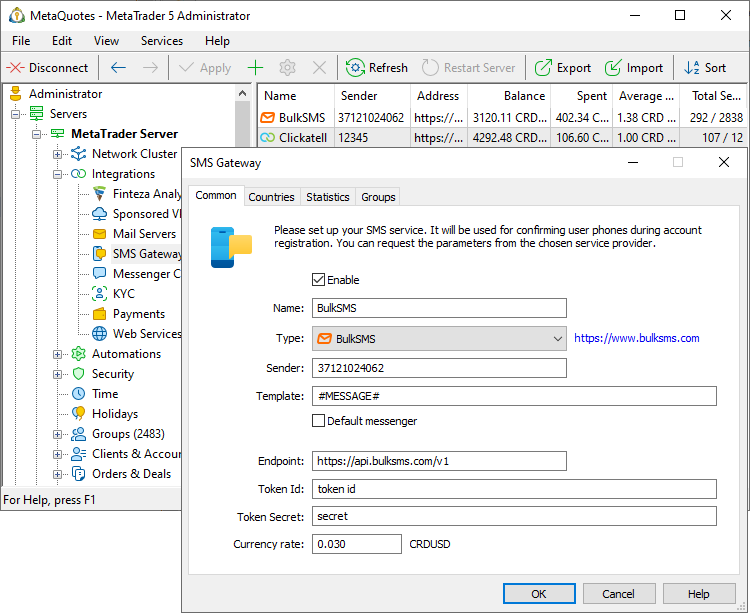
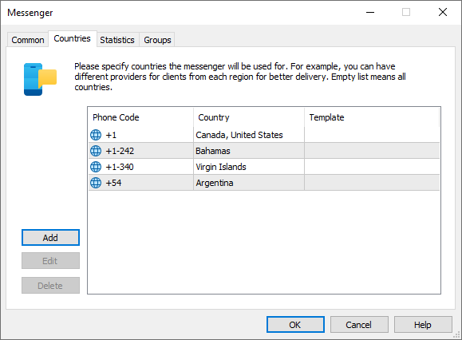
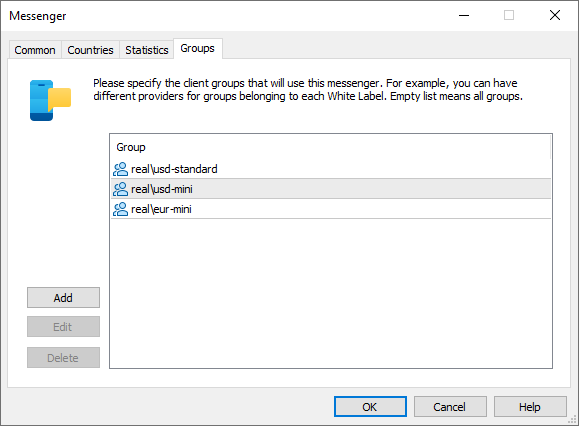
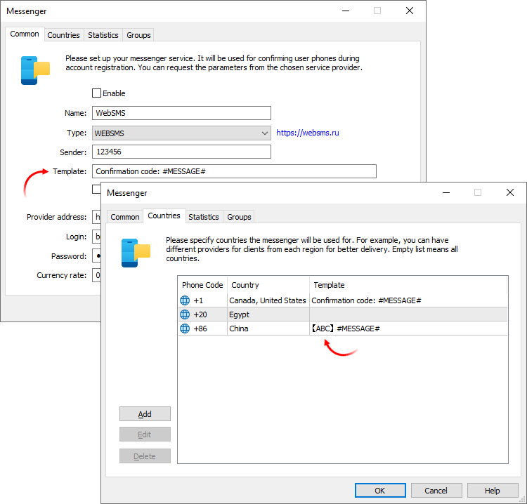
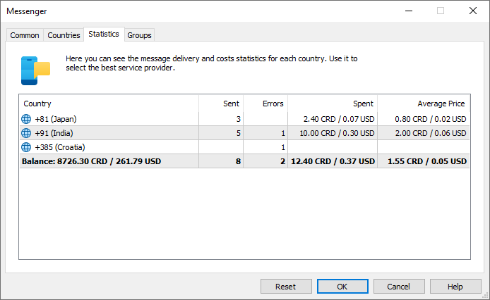

[🏠 Document Start](../../../README.md) / [MetaTrader 5 Trading Platform](../../../MetaTrader-5-Trading-Platform.md) / [Platform Setup](../../Platform-Setup.md) / [Integrations](../Integrations.md) / SMS Gateways

[Previous](Mail-Servers.md) | [Next](SMS-Gateways/BulkSMS.md)

# SMS Gateways (#sms-gateways)

The trading platform features built-in integration with popular SMS providers. Use this functionality to [verify phone numbers (#confirmation)](../Accounts/Account-Allocation-Settings.md#confirmation), which traders specify during account registration from terminals. Configure verification and access wider opportunities in working with potential clients by collecting valid contact information.

## Smart budget saving system (#smart-budget-saving-system)

Various factors affect the delivery of confirmation codes to traders, such as the provider, the trader's country and carrier, roaming, and so on. Codes can be delivered with a delay in some cases. To avoid frequent repeated quote requests, confirmation codes are valid for three hours. If the code is not entered in the field within this time frame, the trader will need to repeat the procedure.

Before sending codes, the system checks whether the specified phone/email was previously confirmed. If the trader has already passed verification from his or her computer in the last 72 hours, an account will be opened without additional confirmation. Thus, there will be no additional burden for traders and no additional costs for brokers.

The system automatically controls the correctness of specified phone numbers on the client terminal side. This prevents the sending of codes to incorrect numbers and thus saves you costs for the SMS provider services.

  * The phone number must be specified in the international format: +[country code][number], for example: +79171113594. The number should be specified without spaces.
  * This must be a mobile phone number, not landline.

## How the messaging provider is selected (#best-provider)

We recommend working with at least two different SMS providers at the same time, in order to ensure successful and fast delivery. How the provider is selected when sending a message:

  * The system checks the client group and country
  * The best provider is selected from the list of providers, which meets the [country (#country)](SMS-Gateways.md#country) and [group (#group)](SMS-Gateways.md#group) conditions, based on the number of successfully delivered messages and message cost
  * If several providers have the same statistics, the one located further up the list is selected
  * If none of the providers is suitable, the default provider is utilized (as set by the "Default messenger" option in common settings)

If sending through the main provider fails, the system will send the message via the next available provider. The system can make up to 3 attempts in total.

The number of confirmations of different phone numbers that a trader can request from one computer is limited for security purposes. When the limit is reached, confirmation codes are no longer sent, and the following messages is printed in the server log: "too many phone confirmation requests from IP".

## Setting Up the Provider (#setting-up-the-provider)

Create a new configuration and set the messaging service connection parameters:

  * Enable — enable/disable provider configuration. If the configuration is disabled, the service will not be used to send messages.
  * Name — configuration name.
  * Type — messaging service provider. Each provider has an individual set of settings. Please request the required settings from the provider.
  * Sender — message sender ID. The value is provided by the service provider.
  * Template — the basic [template (#template)](SMS-Gateways.md#template) for sending messages via this provider.
  * Default messenger — the platform uses this option when [selecting a provider (#best-provider)](SMS-Gateways.md#best-provider) to send a message, if this could not be done based on the group, country or statistics.
  * Rate — exchange rate to convert message sending cost to USD. It is used to display data under the [Statistics (#statistics)](SMS-Gateways.md#statistics) section.

Further settings depend on the provider:

  * [BulkSMS](SMS-Gateways/BulkSMS.md)
  * [Clickatell](SMS-Gateways/Clickatell.md)
  * [WEBSMS](SMS-Gateways/WEBSMS.md)
  * [Twilio](SMS-Gateways/Twilio.md)
  * [CM.com](SMS-Gateways/CM-com.md)
  * [Vonage](SMS-Gateways/Vonage.md)
  * [Foniva](SMS-Gateways/Foniva.md)
  * [Infobip](SMS-Gateways/Infobip.md)
  * [Surfman](SMS-Gateways/Surfman.md)
  * [Voiso](SMS-Gateways/Voiso.md)

### Countries (#country)

Specify the list of countries, for which this messenger will be used. Use of different providers ensures the best delivery conditions for clients from different regions.

If no country is specified, the platform will use this messenger for clients from any country.

[Message templates (#template)](SMS-Gateways.md#template) can be overridden for each specific country.

> When opening a demo account, the country is determined automatically on the client terminal side. When opening a preliminary account, the country is also detected automatically, but the client can specify another country in the registration form.

### Groups (#group)

Specify the list of groups, for which this messenger will be used. Thus you can organize work with your White Label partners. You partners can select providers and pay for their services, as well as send messages on their own behalf and use specific texts.

### Templates (#template)

Templates can be used for messages. The text can be changed depending on the used message provider or the recipient country.

Each country has its own message sending rules: providers can filter messages by specific words, require special formats, etc. For example, in China it is recommended to indicate a [signature](https://support.twilio.com/hc/en-us/articles/360016612253-China-SMS-Template-Pre-approval-Requests) before a message. Please check with your message provider for specific sending policies.

Use templates to customize message sending in accordance with local rules.

For example, a template from the file [main server installation directory]\templates\verify_phone is used for [phone number confirmation (#confirmation)](../Accounts/Account-Allocation-Settings.md#confirmation) during account registration. You can specify in this template a macro for code substitution, without a text: "<!--CONFIRMATION_CODE-->". Further, the required text can be added in the provider settings:

A basic template is set in the general provider settings. It contains the default #MESSAGE# macro which substitutes the source text. In our example, the text "Confirmation code" is added so that the resulting message will look as follows: "Confirmation code: [confirmation code]".

Country-specific templates are set in country settings. These templates have higher priority than basic ones. If a country template is specified, this template will be used. Otherwise a template from the "Common" tab will be used.

### Statistics (#statistics)

During operation, the system collects statistics on delivered messages and related costs.

Data is available for each country to which messages were sent:

  * Sent — the total number of sent messages
  * Errors — number of messages which could not be delivered
  * Spent — the spent amount in the provider's currency and in USD (the conversion rate is specified in [common settings (#rate)](SMS-Gateways.md#rate))
  * Average price — the average price spent for sending one message in the provider's currency and in USD (the conversion rate is specified in [common settings (#rate)](SMS-Gateways.md#rate))

The general statistics for all countries is available below.
