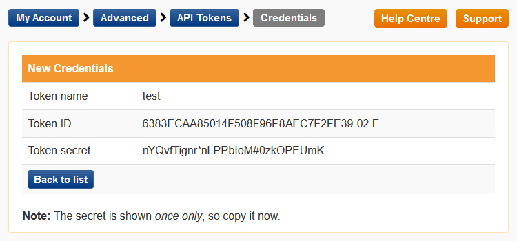
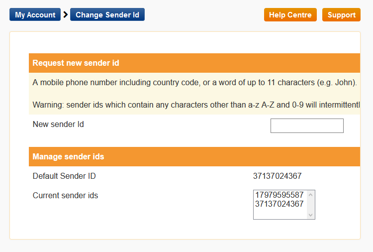

[🏠 Document Start](../../../../README.md) / [MetaTrader 5 Trading Platform](../../../../MetaTrader-5-Trading-Platform.md) / [Platform Setup](../../../Platform-Setup.md) / [Integrations](../../Integrations.md) / [SMS Gateways](../SMS-Gateways.md) / BulkSMS

[Previous](../SMS-Gateways.md) | [Next](Clickatell.md)

# BulkSMS

To set up the provider, [create an SMS gateway configuration](../SMS-Gateways.md) and specify the following parameters in it:

  * Provider address — address for connecting to the service. The default value is https://api.bulksms.com/v1. In most cases, there is no need to change it.
  * Token ID — token for sending messages. It can be obtained at <https://www2.bulksms.com/home/advanced_features/api_tokens/> after you authorize using your BulkSMS account.
  * Token secret — token secret for sending messages.
  * Sender — the name of the sender which will be displayed in the message received by the recipient. The fields can be left blank or it can be filled with the [Sender ID](https://www.bulksms.com/features/sender-id.htm) value.

The token ID and token secret will be available to you at <https://www2.bulksms.com/home/advanced_features/api_tokens/> after you log in using your BulkSMS account.

Sender ID is available in your account:

## Other Settings

All other settings are standard and no different from those of other SMS gateways. You can manage the provider's availability for [countries (#country)](../SMS-Gateways.md#country) and [groups (#group)](../SMS-Gateways.md#group), as well as customize [message templates (#template)](../SMS-Gateways.md#template).
