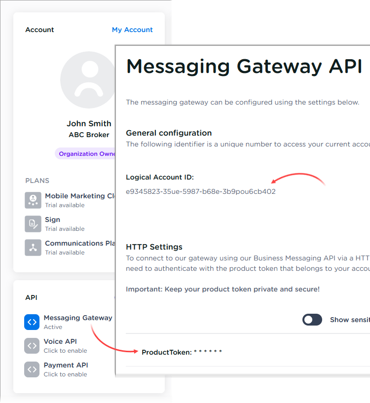
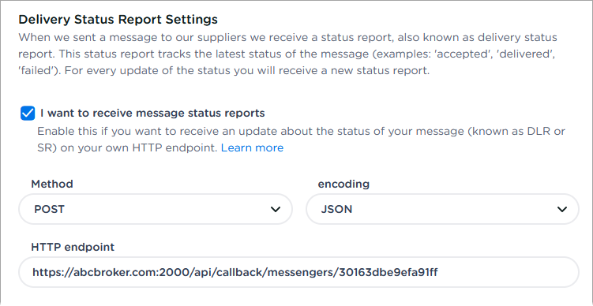

[🏠 Document Start](../../../../README.md) / [MetaTrader 5 Trading Platform](../../../../MetaTrader-5-Trading-Platform.md) / [Platform Setup](../../../Platform-Setup.md) / [Integrations](../../Integrations.md) / [SMS Gateways](../SMS-Gateways.md) / CM.com

[Previous](Twilio.md) | [Next](Vonage.md)

# CM.com

To set up the integration, sign up at CM.com and top up your account with the required amount. From the "Dashboard" section, go to "API\Messaging Gateway".

You will need the "Logical Account ID" and "ProductToken" value from general settings. They should be specified in the corresponding fields of the messenger configuration on the MetaTrader 5 side.

Next, scroll down the page to the "Delivery Status Report Settings" section. Message delivery status notifications are configured in this section. The platform will receive this information automatically, allowing you to view [statistics (#statistics)](../SMS-Gateways.md#statistics) and to analyze delivery efficiency. Also, in case of delivery errors, the platform will try to send a message via [other providers (#best-provider)](../SMS-Gateways.md#best-provider).

Enable the "I want to receive message status report" option, specify "POST" in the "Method" field and specify "JSON" in the "encoding" field. In the "HTTP endpoint" field, copy and paste the "Callback endpoint" value from the messenger configuration on the platform side.

Next, [create an SMS gateway configuration](../SMS-Gateways.md) on the platform side and specify the following parameters:

  * Sender — number/name to be specified as the message sender. Up to 16 digits are allowed for a phone number or up to 11 Latin characters and numbers are allowed for the name. CM.com does not set any requirements for specifying specific values (for example, the phone number assigned to you) and thus you can specify any value. However, some mobile carriers to which messages are sent can set their own requirements. For further details please view [CM.com Documentation](https://www.cm.com/help/110/is-it-possible-to-set-my-own-sender-name-sender-id/).
  * API endpoint — the address of the CM.com server through which messages will be sent. The main server https://gw.cmtelecom.com/v1.0/message is used by default. It is not recommended to change the server unless absolutely necessary. For further details on how to choose a server please view [CM.com Documentation](https://www.cm.com/help/3702/cm-messaging-high-availability/).
  * Product token — the "ProductToken" value from the "Messaging Gateway" section of your profile on the CM.com website.
  * Account — the "Logical Account ID" value from the "Messaging Gateway" section of your profile on the CM.com website.
  * Callback endpoint — the endpoint for callback requests sent by CM.com. In such requests, the provider notifies the platform about the message delivery status; this information is used for generating [statistics (#statistics)](../SMS-Gateways.md#statistics). The endpoint address is generated automatically based on the domain specified under the [Web Services (#web-service)](../Web-Services.md#web-service) section. Copy and paste it to the "HTTP endpoint" field in your profile on the CM.com website.

To receive the message delivery statuses, you need to configure the platform to receive callback requests:

  * Define a domain that will be used to receive requests, and then add it to the [Web Services (#web-service)](../Web-Services.md#web-service) section.
  * Create a DNS record for this domain to link it to a public IP address of your access sever. Next, upload a certificate for it under the [SSL Certificates (#ssl)](../Web-Services.md#ssl) section. The domain specified in the certificate must be the same as the domain used to receive requests.
  * Add the endpoint address from the messenger configuration to the [Web Services (#web-service)](../Web-Services.md#web-service) and specify for it a list of IP addresses from which the provider will send requests. Please request this list from CM.com. At the time of this writing, the provider used the 188.94.184.1/23 range, which however may change over time.

> To view the message delivery statuses, open the account menu on the CM.com website and navigate to the "Message Log" section.

## Other Settings

All other settings are standard and no different from those of other SMS gateways. You can manage the provider's availability for [countries (#country)](../SMS-Gateways.md#country) and [groups (#group)](../SMS-Gateways.md#group), as well as customize [message templates (#template)](../SMS-Gateways.md#template).
