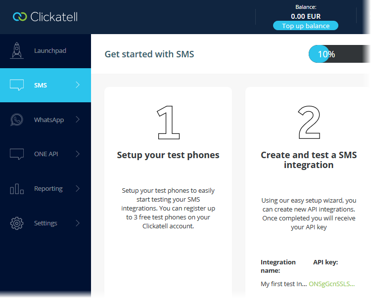
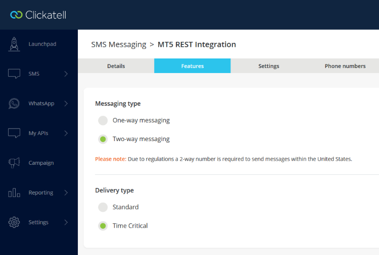

[🏠 Document Start](../../../../README.md) / [MetaTrader 5 Trading Platform](../../../../MetaTrader-5-Trading-Platform.md) / [Platform Setup](../../../Platform-Setup.md) / [Integrations](../../Integrations.md) / [SMS Gateways](../SMS-Gateways.md) / Clickatell

[Previous](BulkSMS.md) | [Next](WEBSMS.md)

# Clickatell

To set up the provider, [create an SMS gateway configuration](../SMS-Gateways.md) and specify the following parameters in it:

  * Provider address — address for connecting to the service. The default address is https://api.clickatell.com/rest. In most cases, there is no need to change it.
  * Authentication token — token for sending messages (or API key for the accounts, which were created after November 2016).
  * Sender — the sender's number which will displayed in the message. This parameter should only be filled if the "[two way messaging](https://www.clickatell.com/articles/digital-marketing/two-way-messaging-b2b-marketing/)" option is enabled for your Clickatell account. When the option is enabled, you will receive a special number from which you will be sending messages and to which you will be able to receive replies. This is the number that should be specified in the "Sender" field.

The operation of Clickatell accounts created after November 2016 is different from earlier accounts: they utilize different API versions:

  * The token for sending messages is called API key instead of Auth token.
  * No message cost data is available for these accounts.
  * The financial state of such accounts cannot be converted to USD, whole data in [statistics (#statistics)](../SMS-Gateways.md#statistics) is represented in the deposit, specified in the Clickatell account.

To receive the API key, log in using your account at the [Clickatell site](https://portal.clickatell.com) and navigate to the SMS section of your profile:

To check whether you need to specify the "Sender" field, open your Clickatell account and navigate to SMS \ Your REST integration \ Features \ Messaging type. You can switch between message sending modes in this section.

## Other Settings

All other settings are standard and no different from those of other SMS gateways. You can manage the provider's availability for [countries (#country)](../SMS-Gateways.md#country) and [groups (#group)](../SMS-Gateways.md#group), as well as customize [message templates (#template)](../SMS-Gateways.md#template).
