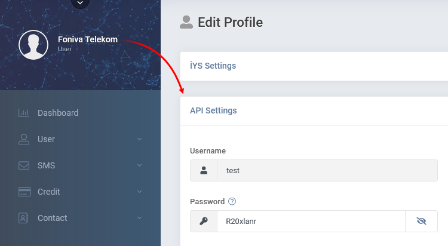

[🏠 Document Start](../../../../README.md) / [MetaTrader 5 Trading Platform](../../../../MetaTrader-5-Trading-Platform.md) / [Platform Setup](../../../Platform-Setup.md) / [Integrations](../../Integrations.md) / [SMS Gateways](../SMS-Gateways.md) / Foniva

[Previous](Vonage.md) | [Next](Infobip.md)

# Foniva

Foniva is a Turkish platform that provides fast and high-quality SMS messaging services to subscribers throughout the country. To connect to the service, request an account on the [provider's website](https://www.foniva.com.tr/).

Then, go to your personal account at <https://sms.foniva.com.tr/login> and specify your login details. Next, click on your account name and go to the "API Settings" section. The section contains data for configuring the provider on the MetaTrader 5 side:

[Create an SMS gateway configuration](../SMS-Gateways.md) on the platform side and specify the following parameters:

  * Sender — the name that will be indicated as the message sender. This is a required field. The name should be discussed with the provider when you open your account.
  * Login — login for connection from the personal account.
  * Password — password for connection from the personal account.
  * Currency rate — Turkish lira to US dollar exchange rate to display cost statistics.

## Other Settings

All other settings are standard and no different from those of other SMS gateways. You can manage the provider's availability for [countries (#country)](../SMS-Gateways.md#country) and [groups (#group)](../SMS-Gateways.md#group), as well as customize [message templates (#template)](../SMS-Gateways.md#template).
