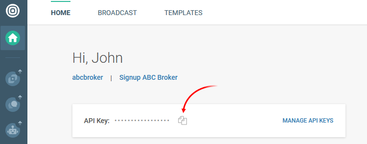

[🏠 Document Start](../../../../README.md) / [MetaTrader 5 Trading Platform](../../../../MetaTrader-5-Trading-Platform.md) / [Platform Setup](../../../Platform-Setup.md) / [Integrations](../../Integrations.md) / [SMS Gateways](../SMS-Gateways.md) / Infobip

[Previous](Foniva.md) | [Next](Surfman.md)

# Infobip

The service offers high speed and delivery reliability through over 700 direct operator connections and 28 data centers around the world.

To connect to the service, request an account on the provider's website. Login to your profile and copy the API key on the main page. Use the <https://portal.infobip.com/settings/accounts/api-keys> section to manage keys.

[Create an SMS gateway configuration](../SMS-Gateways.md) on the platform side and specify the following parameters:

  * Sender — number/name to be specified as the message sender. The field can be left blank.
  * API endpoint — the address of the Infobip server through which messages will be sent. The main server at https://api.infobip.com is used by default. It is not recommended to change the server unless absolutely necessary.
  * API key — your unique 69-character key. Available in your account.
  * Webhook endpoint — leave the field blank. Integration with Infobip comes with standard options for providing message delivery notifications and information about the cost to the platform, without the need to additionally set up webhooks.

## Other Settings

All other settings are standard and no different from those of other SMS gateways. You can manage the provider's availability for [countries (#country)](../SMS-Gateways.md#country) and [groups (#group)](../SMS-Gateways.md#group), as well as customize [message templates (#template)](../SMS-Gateways.md#template).
