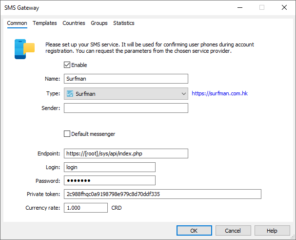
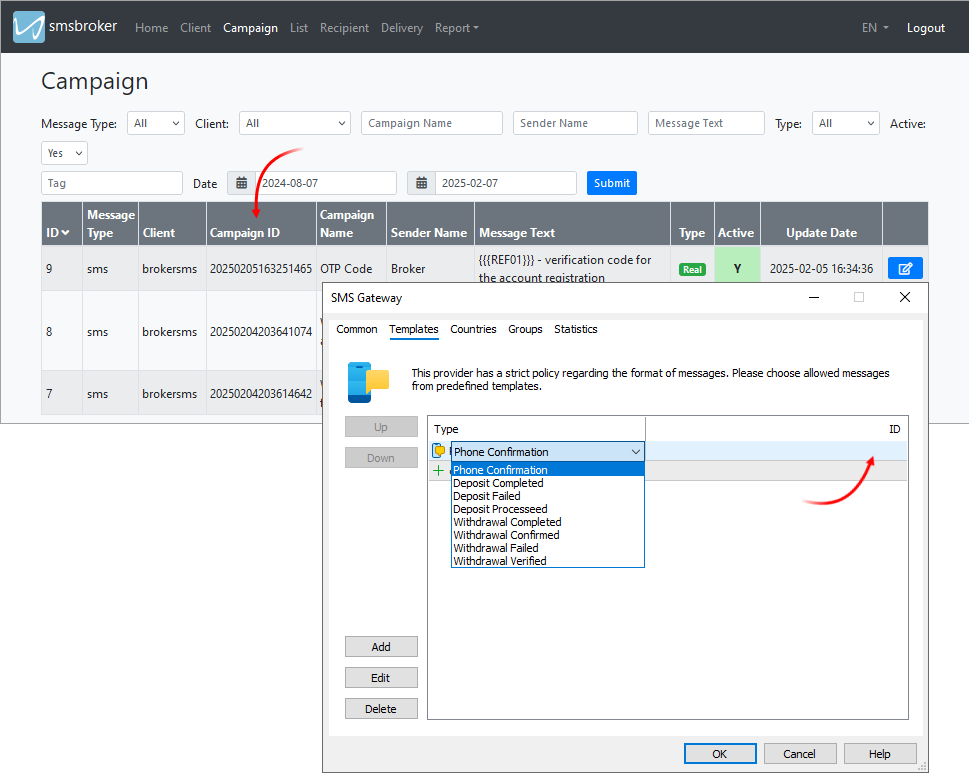

[🏠 Document Start](../../../../README.md) / [MetaTrader 5 Trading Platform](../../../../MetaTrader-5-Trading-Platform.md) / [Platform Setup](../../../Platform-Setup.md) / [Integrations](../../Integrations.md) / [SMS Gateways](../SMS-Gateways.md) / Surfman

[Previous](Infobip.md) | [Next](Voiso.md)

# Surfman (#surfman)

[Surfman](https://surfman.com.hk/index.php) is an SMS messaging provider operating in China. To connect, request an account on the [provider's website](https://surfman.com.hk/contact_us.php). You will be required to complete the KYC procedure. After signing the contract, the provider will send you the necessary credentials for configuring the connection in MetaTrader 5. [Create an SMS gateway configuration](../SMS-Gateways.md) and specify the provided parameters as follows:

  * username — enter in the "Login" field
  * password — enter in the "Password" field
  * API Key — specify in the "Private token" field

There is no need to fill out the "Sender" field as the value is specified for each message template through the Surfman personal account.

## SMS templates (#templates)

The provider does not allow sending messages in free format. All messages must follow a strict format, and their content must be pre-approved. For each SMS verification use case within the platform ([phone verification (#confirmation)](../../Accounts/Account-Allocation-Settings.md#confirmation), [payment status updates](../../Payments.md)), create a template in your Surfman personal account.

The parameter order must strictly follow the assigned numbers. To avoid confusion, we recommend using the following templates as a reference when creating your own:

Action | Template  
---|---  
Phone verification | {{{REF01}}} - verification code for the account registration  
Successful deposit | Deposit to {{{REF02}}} complete: {{{REF04}}} {{{REF05}}}, {{{REF03}}}  
Deposit error | Deposit to {{{REF02}}} failed: {{{REF04}}} {{{REF05}}}, {{{REF03}}}  
Deposit processing | Deposit to {{{REF02}}} processed: {{{REF04}}} {{{REF05}}}, {{{REF03}}}. Waiting for manager confirmation  
Successful withdrawal | Withdrawal from {{{REF02}}} complete: {{{REF04}}} {{{REF05}}}, {{{REF03}}}  
Withdrawal confirmation Sent when a withdrawal request is submitted for processing by the payment system. | Withdrawal from {{{REF02}}} confirmed: {{{REF04}}} {{{REF05}}}, {{{REF03}}}. Processing by the payment system  
Withdrawal error | Withdrawal from {{{REF02}}} failed: {{{REF04}}} {{{REF05}}}, {{{REF03}}}  
Withdrawal verification Sent upon manager approval, allowing the user to proceed with the payment. This is used for providers where all payment details are entered on the payment system's page (e.g., [AstroPay](../../Payments/Payment-Gateways/AstroPay.md)). In such cases, during manual processing, the manager only approves the transaction itself. | Withdrawal from {{{REF02}}} approved: {{{REF04}}} {{{REF05}}}, {{{REF03}}}. Please complete the operation in the platform  
  
After creating and approving the templates, map their identifiers (CampaignId) to the corresponding actions on the platform side under the "Templates" tab.

> If a template is not assigned to a specific action, the corresponding messages will not be sent. If you enable the provider for payment status notifications, ensure that the appropriate templates are configured on the provider's side.

## Other Settings (#other-settings)

All other settings are standard and no different from those of other SMS gateways. You can manage the provider's availability for [countries (#country)](../SMS-Gateways.md#country) and [groups (#group)](../SMS-Gateways.md#group).
