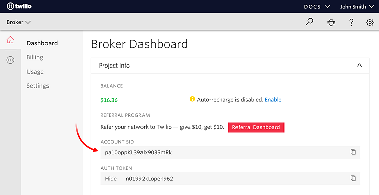

[🏠 Document Start](../../../../README.md) / [MetaTrader 5 Trading Platform](../../../../MetaTrader-5-Trading-Platform.md) / [Platform Setup](../../../Platform-Setup.md) / [Integrations](../../Integrations.md) / [SMS Gateways](../SMS-Gateways.md) / Twilio

[Previous](WEBSMS.md) | [Next](CM-com.md)

# Twilio

To set up the integration, sign up at [Twilio](https://www.twilio.com/) website and purchase the desired service plan. Go to Dashboard and copy "ACCOUNT SID" and "AUTH TOKEN" values:

Next, [create an SMS gateway configuration](../SMS-Gateways.md) and specify the following parameters:

  * Provider address — address for connecting to the service. The default value is https://api.twilio.com/2010-04-01. In most cases, there is no need to change it.
  * Sender — your Twilio number via which the SMS messages are sent.
  * Account SID — your account identifier (ACCOUNT SID) from the Dashboard section of your account in the Twilio website.
  * Authorization Token  — a token for sending SMS messages (AUTH TOKEN) from the Dashboard section of your account in the Twilio website.

## Other Settings

All other settings are standard and no different from those of other SMS gateways. You can manage the provider's availability for [countries (#country)](../SMS-Gateways.md#country) and [groups (#group)](../SMS-Gateways.md#group), as well as customize [message templates (#template)](../SMS-Gateways.md#template).
