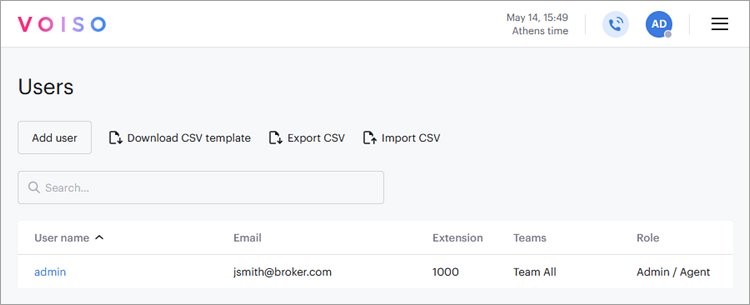
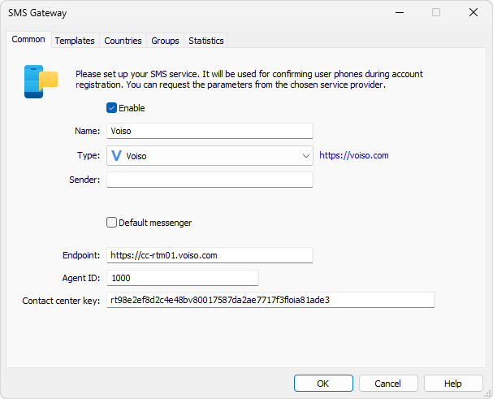
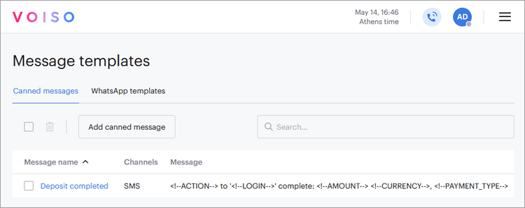
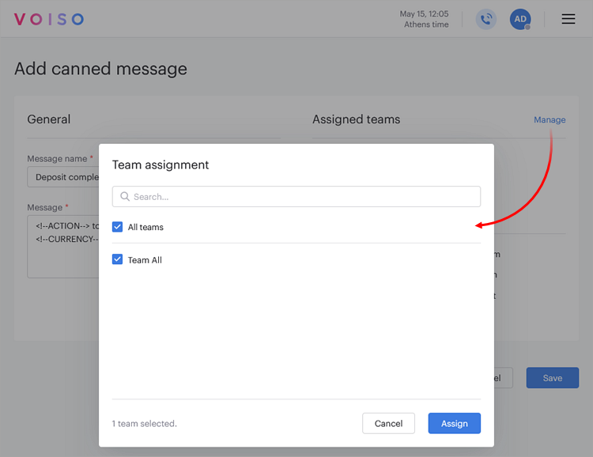
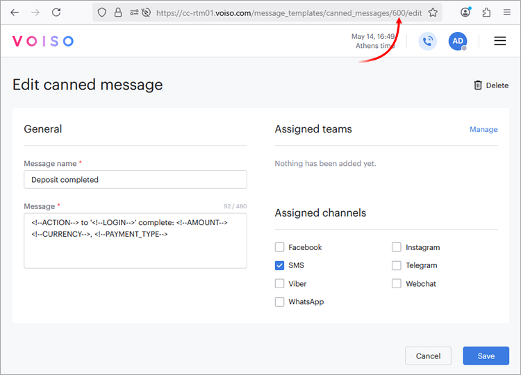
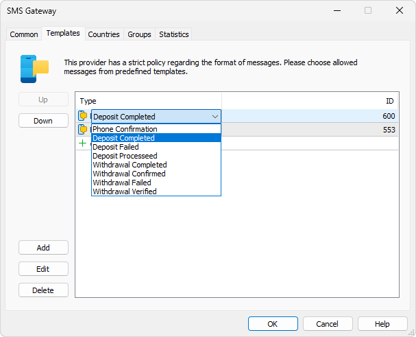

[🏠 Document Start](../../../../README.md) / [MetaTrader 5 Trading Platform](../../../../MetaTrader-5-Trading-Platform.md) / [Platform Setup](../../../Platform-Setup.md) / [Integrations](../../Integrations.md) / [SMS Gateways](../SMS-Gateways.md) / Voiso

[Previous](Surfman.md) | [Next](../Messengers.md)

# Voiso (#voiso)

[Voiso](https://voiso.com/products/omnichannel-contact-center/sms-communication/) is an international SMS messaging provider, offering service across the globe, including China and other Asian countries. To get started, request an account on the [Voiso website](https://voiso.com/book-a-demo/). You will need to complete the KYC process. Once your registration is approved, you will gain access to the [personal account](https://cc-rtm01.voiso.com/) where you can find the necessary credentials for connection.

Navigate to the Users section and copy your account identifier from the 'Extension' column:

Next, [create an SMS gateway configuration](../SMS-Gateways.md) and paste this value into the Agent ID field.

Also, specify the 'Contact center key', which will be provided by Voiso after signing the service agreement.

You do not need to fill in the Sender field. Sender values are configured individually for each message template via the Voiso account. The Endpoint field typically does not require changes either as it is automatically populated with the correct Voiso service address by default.

## SMS templates (#templates)

The provider does not support free-form SMS content. All messages must strictly follow predefined formats and must be approved in advance. For each type of SMS notification in your platform (for example, [phone verification (#confirmation)](../../Accounts/Account-Allocation-Settings.md#confirmation), [payment status](../../Payments.md)), create a template in your Voiso account, under 'Administrator \ Message templates \ Canned messages'.

Click 'Add canned message' and specify a name for the template. Next, grant access to the template to the Voiso user account designated for working with the platform. To do this, click Manage and select the group to which the user account belongs.

Next, enter the content of the template. You can use the following macros in the template if needed:

  * {{CONFIRMATION_CODE}} — verification code generated by platform for phone number confirmation.
  * {{ACTION}} — payment action: Deposit or Withdrawal.
  * {{LOGIN}} — user's account number.
  * {{AMOUNT}} — transaction ammount.
  * {{CURRENCY}} — transaction currency.
  * {{PAYMENT_TYPE}} — type of payment method.

To ensure clarity and consistency, we recommend using the following templates as a basis:

Action | Template  
---|---  
Phone verification | {{CONFIRMATION_CODE}} - verification code for the trading account registration  
Successful deposit | {{ACTION}} to '{{LOGIN}}' complete: {{AMOUNT}} {{CURRENCY}}, {{PAYMENT_TYPE}}  
Deposit error | {{ACTION}} to '{{LOGIN}}' failed: {{AMOUNT}} {{CURRENCY}}, {{PAYMENT_TYPE}}  
Deposit in progress | {{ACTION}} to '{{LOGIN}}' processed: {{AMOUNT}} {{CURRENCY}}, {{PAYMENT_TYPE}}. Waiting for manager confirmation  
Successful withdrawal | {{ACTION}} from '{{LOGIN}}' complete: {{AMOUNT}} {{CURRENCY}}, {{PAYMENT_TYPE}}  
Withdrawal confirmation Sent when a withdrawal request is submitted for processing by the payment system. | {{ACTION}} from '{{LOGIN}}' confirmed: {{AMOUNT}} {{CURRENCY}}, {{PAYMENT_TYPE}}. Processing by the payment system  
Withdrawal error | {{ACTION}} from '{{LOGIN}}' failed: {{AMOUNT}} {{CURRENCY}}, {{PAYMENT_TYPE}}  
Withdrawal verification Sent when a manager approves the withdrawal, allowing the user to proceed with payment. Typically used with payment systems, where details are entered on an external page (for example, as in [AstroPay](../../Payments/Payment-Gateways/AstroPay.md)). In such cases, during manual processing, the manager only approves the fact of the transaction. | {{ACTION}} from '{{LOGIN}}' approved: {{AMOUNT}} {{CURRENCY}}, {{PAYMENT_TYPE}}. Please complete the operation in the platform  
  
After creating a template, open it for editing and copy its identifier from your browser's address bar.

Then, go to the Templates section in the SMS provider settings in MetaTrader 5. Select the appropriate template type and enter the corresponding template ID from your Voiso personal account.

> If a template is not assigned for a specific action, no message will be sent for that event. If you are enabling the provider for payment status notifications, ensure that the appropriate templates are configured on the provider's side.

## Other Settings (#other-settings)

All other settings are standard and consistent with those of other SMS gateways. You can configure the provider's availability for [countries (#country)](../SMS-Gateways.md#country) and [groups (#group)](../SMS-Gateways.md#group).
