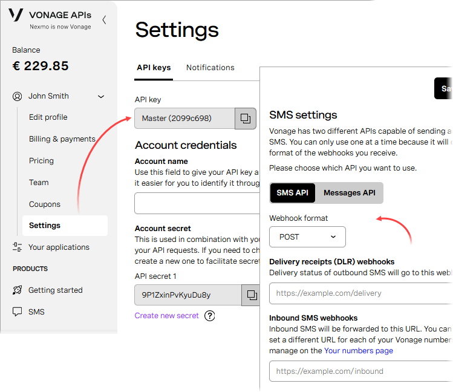

[🏠 Document Start](../../../../README.md) / [MetaTrader 5 Trading Platform](../../../../MetaTrader-5-Trading-Platform.md) / [Platform Setup](../../../Platform-Setup.md) / [Integrations](../../Integrations.md) / [SMS Gateways](../SMS-Gateways.md) / Vonage

[Previous](CM-com.md) | [Next](Foniva.md)

# Vonage

To configure the integration, purchase the "Communications API" service access from the [Vonage](https://www.vonage.com/) website. Once you receive an account, log into the dashboard at <https://dashboard.nexmo.com>. Navigate to "Settings" in your profile.

You will need the "API key" and "API secret" values. They should be specified in the corresponding fields of the messenger configuration on the MetaTrader 5 side.

Message sending settings are provided on the same page, to the right. Select "SMS API" and "POST" value in the "Webhook format" field.

Next, [create an SMS gateway configuration](../SMS-Gateways.md) on the platform side and specify the following parameters:

  * Sender — number/name to be specified as the message sender. Up to 15 digits are allowed for a phone number or up to 11 Latin characters and numbers are allowed for the name. Vonage does not set any requirements for specifying specific values (for example, the phone number assigned to you) and thus you can specify any value. However, some mobile carriers to which messages are sent can set their own requirements. For further details please view [Vonage Documentation](https://developer.nexmo.com/messaging/sms/guides/custom-sender-id).
  * API endpoint — the address of the Vonage server through which messages will be sent. The default server is https://rest.nexmo.com/sms/json. It is not recommended to change the server unless absolutely necessary.
  * API key — the "API key" value from the settings in your Vonage profile.
  * API secret — the "API secret" value from the settings in your Vonage profile.
  * Callback endpoint — the endpoint for callback requests sent by Vonage. In such requests, the provider notifies the platform about the message delivery status; this information is used for generating [statistics (#statistics)](../SMS-Gateways.md#statistics). Also, in case of delivery errors, the platform will try to send a message via [other providers (#best-provider)](../SMS-Gateways.md#best-provider). The endpoint address is generated automatically based on the domain specified under the [Web Service (#web-service)](../Web-Services.md#web-service) section.  
There is no need to configure the endpoint on the Vonage side, while the platform automatically specifies it in every message sending request. However, you need to configure the receiving of callback requests on the platform side, as described below.

To receive the message delivery statuses, you need to configure the platform to receive callback requests:

  * Define a domain that will be used to receive requests, and then add it to the [Web Services (#web-service)](../Web-Services.md#web-service) section.
  * Create a DNS record for this domain to link it to a public IP address of your access sever. Next, upload a certificate for it under the [SSL Certificates (#ssl)](../Web-Services.md#ssl) section. The domain specified in the certificate must be the same as the domain used to receive requests.
  * Add the endpoint address from the messenger configuration to the [Web Services (#web-service)](../Web-Services.md#web-service) and specify for it a list of IP addresses from which the provider will send requests. Please request this list from Vonage. At the time of this writing, the provider used the 169.63.86.164 address, which however may change over time.

## Other Settings

All other settings are standard and no different from those of other SMS gateways. You can manage the provider's availability for [countries (#country)](../SMS-Gateways.md#country) and [groups (#group)](../SMS-Gateways.md#group), as well as customize [message templates (#template)](../SMS-Gateways.md#template).
