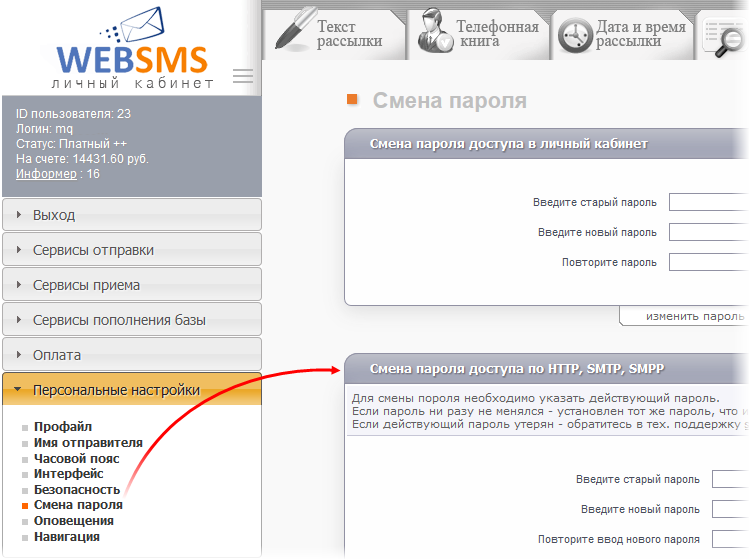

[🏠 Document Start](../../../../README.md) / [MetaTrader 5 Trading Platform](../../../../MetaTrader-5-Trading-Platform.md) / [Platform Setup](../../../Platform-Setup.md) / [Integrations](../../Integrations.md) / [SMS Gateways](../SMS-Gateways.md) / WEBSMS

[Previous](Clickatell.md) | [Next](Twilio.md)

# WEBSMS

To set up the provider, [create an SMS gateway configuration](../SMS-Gateways.md) and specify the following parameters in it:

  * Provider address — address for connecting to the service. The default address is https://cab.websms.ru. In most cases, there is no need to change it.
  * Login — your system account login.
  * Password — password for sending messages via API (not password from your account).
  * Sender — the name of the sender which will be displayed in the message received by the recipient. The specified name must be added to the "[Name List](https://cab.websms.ru/fromname.asp)" of your account. If left blank, the default names from your [personal account](https://cab.websms.ru/fromname.asp) will be used.

To set the password for sending messages via API, log in to your account at the WEBSMS site and navigate to the [Password Change section in your profile](https://www.websms.ru/EditPass.asp).

## Other Settings

All other settings are standard and no different from those of other SMS gateways. You can manage the provider's availability for [countries (#country)](../SMS-Gateways.md#country) and [groups (#group)](../SMS-Gateways.md#group), as well as customize [message templates (#template)](../SMS-Gateways.md#template).
